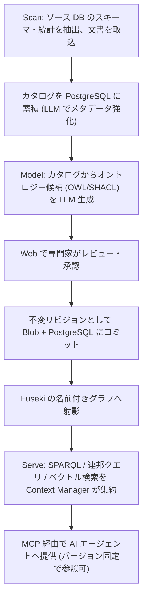

# Ontology Accelerator for Azure

企業のビジネスオントロジー(製品・顧客・ポリシーの機械可読モデル)を AI でドラフト生成し、専門家がレビュー・承認したうえで W3C 標準のナレッジグラフ(RDF/OWL/SPARQL)として保存し、MCP 経由で AI エージェントに提供する Azure ネイティブな OSS です。

AI エージェントに社内の用語・関係・ポリシーを「推測させる」のではなく、**人間が承認した、バージョン管理された、監査可能なコンテキスト**として渡すことを目的としています。

> **オントロジーやナレッジグラフをご存じない方へ**: 専門用語を使わない解説資料を用意しています → **[意味の設計図](https://nomhiro.github.io/ontology-accelerator-for-azure/introduction.html)**
> 何が嬉しいのか、どういう仕組みなのかを、同じ質問を「表」と「グラフ」で比べる対話図つきで説明しています。客先への説明にもそのまま使えます。

> **名称について**: `Ontology Accelerator for Azure` という表示名は**暫定**です。Microsoft および AWS の商標を製品名として使わない方針のため、公開時に変更する可能性があります。

---

## 現在のステータス: Phase 1(MVP「器が動く」)

製品として使える状態ではありません。何が動作確認済みで、何が未実装なのかを以下に正確に示します。

### 動作を確認済み(ローカル)

- `docker compose up` で Fuseki 6.2.0 + PostgreSQL 16 が起動する
- Fuseki の entrypoint が `samples/retail-core.ttl` から TDB2 を構築し、名前空間ごとのデータセット `retail-core` の名前付きグラフ `urn:ontology:graph/retail-core/1.0.0` として読み込む(= 「再構築可能な射影」設計の実装)
- Fuseki は名前空間ごとに分離したデータセット(例: `retail-core`)の `/retail-core/sparql` が SPARQL 1.1 で応答する。データセット単位の物理分離が名前空間の隔離境界であり(`packages/api/tests/test_isolation.py` で検証)、固定の `ds` は予約された空のデータセットで実データは入らない
- Core API 経由の読み取りクエリが通り、更新クエリと `SERVICE` 句はガードで HTTP 400 になる
- Fuseki 側でも `SERVICE` の実行が無効化されている(HTTP 422 / SSRF 対策)。管理 API は無認証で 401
- クエリの**時間**の上限(`SPARQL_QUERY_TIMEOUT_SECONDS`、既定 30 秒)は効く。一方
  **結果件数の上限(`SPARQL_MAX_RESULTS`)は Phase 1 では未強制**で、値は保持され
  Bicep が注入しているが LIMIT を後付けする実装が無い(任意の SPARQL に対する
  安価で正しい強制手段が無いため)。強制は Phase 2 で対応する
- 名前空間 CRUD が PostgreSQL に永続化して動作する(作成時に Fuseki データセットも同時に作る)。削除(`DELETE /namespaces/{name}`)は、公開済みバージョンが Blob に1件でも残っていれば 409 Conflict で拒否する(オントロジーは不変リビジョンであり、レプリカ再作成後に削除済みのはずのデータが Blob から復活することを防ぐため)。
  **既知の制約**: この判定(Blob 一覧の取得 → PostgreSQL の行削除)の間に別リクエストが同じ名前空間へ同時に publish すると削除自体は通ってしまい、その publish が書いた Blob だけが正本(PostgreSQL)に対応する行を失った状態で残る、ごく狭い競合状態(TOCTOU)がある。完全に閉じるにはロックか二段確認が必要で Phase 2 の「監査付き削除」で対応する予定です。Phase 1 では `POST /admin/reconcile` の `orphan_blobs` でこの状態を検出できます(削除は運用者の手動判断に委ねており、自動削除はしません)
- **承認フローは未実装です。** `POST /namespaces/{ns}/versions` は版を `draft` として
  記録し、`approved_by` / `approved_at` は未設定のままにします。Phase 1 には承認の段階が
  存在しないため、`approved` を記録すると「誰も承認していないのに承認済み」というデータに
  なるためです（[ADR-0006](docs/adr/0006-ontology-versioning-and-audit.md) の中核価値に反する）。
  **その帰結として、Phase 1 では未承認の版がそのまま射影され、エージェントが未承認の定義を
  受け取りえます。** 承認 API と、未承認の版を射影するか否かの判断は Phase 2 で扱います
  （[`docs/backlog.md`](docs/backlog.md) の `P1-15` / `P2B-13`）
- lint (ruff) / 型検査 (mypy strict) / テスト (pytest 105 件: unit 72 件 + integration 33 件) / Web ビルド (tsc + vite) / `az bicep build` / shellcheck がすべて通る

### 動作を確認済み(Azure 実環境 / japaneast)

`azd up` を実サブスクリプションで実行し、以下を確認しました。

- `azd up` が成功する(プロビジョニング 5 分 6 秒 + デプロイ 2 分 41 秒)。API / MCP / Fuseki / Web の 4 サービスがデプロイされる
- **Blob(正本)から Fuseki の entrypoint が TDB2 を再構築し、SPARQL を返す** — 「再構築可能な射影」設計が実環境で成立
  (名前付きグラフ `urn:ontology:graph/retail-core/1.0.0`、60 トリプル、OWL クラス 4 件、SHACL NodeShape 2 件)
- Fuseki 側で `SERVICE` 句が HTTP 422 でブロックされる(SSRF 対策)
- Fuseki は internal ingress のため外部から到達できない
- API `/healthz` が応答し、トークン無しの `GET /namespaces` は **401**(`AUTH_MODE=entra` が機能)
- MCP `/mcp` が `tools/list` を返す(`list_namespaces` / `sparql_query`)
- API / MCP の scale-to-zero が機能する(初回アクセスはコールドスタート)

### 未実装・未検証

- **Entra ID の App 登録を伴う認証経路は未検証です。** API がトークンを拒否すること(401)までは確認済みですが、有効なトークンで通す検証は App 登録が必要なため行っていません
- **Scan / Model の機能は存在しません** — オントロジーの自動生成、レビュー・承認フロー、スキーマ発見はいずれも Phase 2 です
- MCP サーバーはツール定義まで。Ontop 連邦クエリ・ベクトル検索・OWL 推論は Phase 3〜4 です
- 名前空間ごとの RBAC は強制されていません(Phase 2)

つまり現時点の価値は、**設計ドキュメントと、その設計が成立することを確認できる最小の骨格**です。

---

## アーキテクチャ


ワークフローは **Scan → Model → Serve** の 3 段です。



設計上の最重要ポイントは、**トリプルストアを「いつでも作り直せる派生物」として扱う**ことです。正本(system of record)は PostgreSQL と Blob 上のバージョン付き TTL であり、Fuseki は起動時に Blob から再構築されます。詳細は [`docs/architecture.md`](docs/architecture.md) と [ADR-0002](docs/adr/0002-triple-store-as-rebuildable-projection.md) を参照してください。

---

## 特徴(設計目標)

- **W3C 標準に忠実** — RDF / OWL / SPARQL 1.1 / SHACL / R2RML をそのまま使います。独自のグラフ表現やクエリ言語を発明しません
- **ストアを持ち込める** — SPARQL 1.1 Protocol をハード境界としているため、`SPARQL_QUERY_ENDPOINT` / `SPARQL_UPDATE_ENDPOINT` / `SPARQL_GSP_ENDPOINT` を差し替えるだけで既存の GraphDB / Stardog / Amazon Neptune などを利用できます。アプリコードはストア実装に依存しません
- **MCP でエージェントに提供** — Model Context Protocol(Streamable HTTP)サーバーを同梱し、Foundry Agent Service などからツールとして接続できます。提供は読み取り専用です
- **azd 一発デプロイ** — リポジトリ自体が Azure Developer CLI テンプレートです。`azd up` を唯一のデプロイ手段とし、`azd down` で完全削除できることを保証します
- **監査可能** — オントロジーは不変リビジョン(コンテンツハッシュ + semver)として保存し、誰が提案・誰が承認・いつ・差分・理由を W3C PROV-O で記録します

上記のうち Phase 1 で**動作するもの**は、RDF / OWL / SPARQL 1.1 によるクエリ、ストアの差し替え、MCP による読み取り提供、`azd up` / `azd down` です。
**未実装のもの**は、SHACL 検証(Phase 2)、R2RML による連邦クエリ(Phase 3)、PROV-O による監査証跡の表現と承認フロー(Phase 2)、LLM によるオントロジー生成(Phase 2)です。
監査イベントの記録自体は Phase 1 で PostgreSQL に永続化されています。各フェーズの区切りは下記の[ロードマップ](#ロードマップ)を参照してください。

---

## クイックスタート

> **ローカル開発と `azd up` はいずれも動作確認済みです**(japaneast の実サブスクリプションで検証)。ただしオントロジーの生成・レビュー機能は未実装のため、デプロイして得られるのはサンプルオントロジーを SPARQL / MCP で参照できる状態までです。

### 前提ツール

| ツール | バージョン |
|---|---|
| Azure CLI | 最新 |
| Azure Developer CLI (`azd`) | 最新 |
| Docker | 最新(Compose v2 を含む) |
| uv | 最新 |
| pnpm | 最新 |
| Node.js | 22 |
| Python | 3.12 |
| just | 最新(タスクランナー) |

Windows 環境では、リポジトリ同梱の [Dev Container](.devcontainer/) を使うと上記が揃った環境が得られます。

### ローカル開発

タスクは `just` にまとめてあります(Windows / Linux / macOS で同じコマンドが使えます)。`just` だけを実行すると一覧が出ます。

`just dev-api` は uvicorn を直接起動するだけで、コンテナ用の `docker-entrypoint.sh` を経由しません。そのため Azure 実行時に注入される環境変数(`AUTH_MODE=entra` の既定値、Entra 経由の PostgreSQL 接続など)がここでは設定されず、そのままでは `just up` で立てたローカルの PostgreSQL に接続できません。**先に `.env` を用意してください。**

```bash
cp .env.example .env   # AUTH_MODE=disabled / POSTGRES_PASSWORD=localdev などローカル専用の値
just setup      # 依存関係を入れる (uv sync --all-packages + pnpm install)
just up         # Fuseki + PostgreSQL + Azurite を起動し、正本 Blob のコンテナを作る
just migrate    # PostgreSQL にテーブルを作る (alembic upgrade head)
just dev-api    # Core API を起動 (http://localhost:8000)
just dev-mcp    # MCP サーバーを起動 (別ターミナル)
just dev-web    # Web を起動 (別ターミナル)
just down       # 停止する (データは残る / just clean でデータも消す)
```

`.env` を用意せずに `just dev-api` を起動すると、`GET /namespaces` は次のいずれかで失敗します。`.env` が無ければまず 401(`AUTH_MODE` の既定 `entra` でトークン必須)、`AUTH_MODE=disabled` だけを指定しても `POSTGRES_PASSWORD` が空だと Entra 経由の接続に切り替わり 500、`just migrate` を実行していなければ `relation "namespaces" does not exist` で 500 になります。`.env.example` と `just migrate` はこれらすべてに対応します。

**`docker compose up` を直接使う場合は、続けて `uv run python scripts/init-local-storage.py` を実行してください。** Azurite には Blob コンテナを自動作成する仕組みがなく(本番は `infra/modules/shared.bicep` の `ontologyContainer` が作ります)、コンテナが無いと**オントロジーの公開(publish)と名前空間の削除が `ContainerNotFound` で失敗します**。名前空間の作成と SPARQL 参照は Blob を触らないため動いてしまい、原因が分かりにくい点に注意してください。`just up` はこの手順を含みます(冪等です)。

Fuseki の SPARQL エンドポイントは名前空間ごとのデータセットに立ちます。`just up` で読み込まれるサンプル(`samples/retail-core.ttl`)は名前空間 `retail-core` として `http://localhost:3030/retail-core/sparql` で応答します(固定の `/ds/sparql` は予約された空のデータセットなので応答はしますが 0 件しか返りません)。動作確認の例:

```bash
curl -s -X POST http://localhost:3030/retail-core/sparql \
  -H 'Content-Type: application/sparql-query' -H 'Accept: text/csv' \
  --data 'PREFIX owl: <http://www.w3.org/2002/07/owl#> SELECT ?c WHERE { ?c a owl:Class }'
```

3030 番や 5432 番を別のプロジェクトで使っている場合は、環境変数 `FUSEKI_PORT` / `POSTGRES_PORT` でホスト側のポートを変更できます。

ローカル開発では `AUTH_MODE=disabled` を指定することで Entra ID 認証をバイパスできます。指定方法は前述の `.env`(`.env.example` をコピーしたもの)です。

### Azure へのデプロイ

```bash
azd auth login
azd up          # just deploy でも同じ
```

`deploymentTier`(`minimal` / `production`)と `graphPersistence`(`ephemeral` / `azureFiles`)を Bicep パラメータで切り替えられます。評価目的であれば既定の `minimal` + `ephemeral` のままで構いません。

#### 初回デプロイ時の注意

- **サンプルオントロジーの投入は `postprovision` フックが自動で行います**(`scripts/postprovision.sh` / `scripts/postprovision.ps1`)。手動で Blob にアップロードする必要はありません
  - `postprovision` は `azd provision` の後・`azd deploy` の前に走るため、**`azd provision` を単体で実行した直後はまだサンプルが見えません**。`azd up`(= provision → deploy)であれば、続く deploy で Fuseki の新しいリビジョンが立ち、entrypoint が Blob から TDB2 を再構築してサンプルが読み込まれます
  - `postprovision` は `az storage blob upload --auth-mode login` で Azure CLI にログインしているユーザー自身の権限を使います。この権限(Storage Blob Data Contributor)の割り当ても他の RBAC ロールと同様に**伝播待ちで初回だけ失敗することがあります**。`azure.yaml` は `continueOnError: true` を指定しているため失敗しても `azd up` 全体は成功扱いになりますが、失敗した場合は数分待ってから `azd provision` を再実行してください
  - **既知の制約**: `postprovision` は正本(Blob)に TTL を置くだけで、PostgreSQL の `namespaces` / `ontology_versions` には行を作りません(設計上の書き込み順序である Blob → PostgreSQL → Fuseki の2段目を経由していません)。そのため同梱サンプルは SPARQL では見えますが、`GET /namespaces` は空配列を返し、`POST /admin/reconcile` は `retail-core` を `orphan_datasets` として恒久的に報告し続け、MCP の `list_namespaces` からも見えません(**AI エージェント経路からは発見できません**)。Task 9 で Entra アプリ登録が完了した後、`postprovision` を Core API 経由の投入に置き換えて解消する予定です
- **Key Vault のロール割り当ては RBAC の伝播待ちで初回に失敗しうる**ため、失敗した場合は数分待って再実行してください
- **CI からサービスプリンシパルでデプロイする場合**は `principalType=ServicePrincipal` を指定してください。`principalId` が空だと Key Vault Secrets Officer の割り当てが作られないため、シークレット書き込み権限を別途付与する必要があります
- `graphPersistence: azureFiles` を選ぶ場合、Azure Files は **SMB (Premium)** でマウントします。NFS はカスタム VNet が必須で `minimal` ティアと両立しないためです。この構成は**単一レプリカ前提**である点に注意してください(詳細は [ADR-0002](docs/adr/0002-triple-store-as-rebuildable-projection.md))
- Static Web Apps は japaneast に対応していないため、Web だけ `webLocation`(既定 `eastasia`)で別リージョンに配置されます

### 自分のオントロジーを追加する

**本来の経路は Core API の publish(`POST /namespaces/{namespace}/versions`)です。** 名前空間の作成(`POST /namespaces`)→ publish の順で、正本(Blob + PostgreSQL)への記録と Fuseki への射影が一貫して行われます。

以下の Blob 直接投入は、Entra ID の App 登録が未完了などで Core API をまだ呼べない場合の **Phase 1 の暫定手段**です(`postprovision` フックが同梱サンプルをこの方法で置いているのもこの理由による)。PostgreSQL には行が作られないため、`GET /namespaces` や MCP の `list_namespaces` からは見えません。

- **Blob のレイアウト**: `<接頭辞><namespace>/<version>.ttl`。接頭辞の既定値は `approved/`(`BLOB_PREFIX` 環境変数、`ontology_core.config.Settings.ontology_blob_prefix`)。例: `approved/retail-core/1.0.0.ttl`
- **名前空間名**: 小文字英数字とハイフンのみ、2〜63 文字、先頭は英数字(`ontology_core.graphs.validate_namespace_name`)。予約名 `ds` は使えません(Fuseki の固定・空データセット用に予約されています)
- **バージョン文字列**: 英数字と `. + -` のみ、1〜64 文字、先頭は英数字(`ontology_core.graphs.validate_version`)。ファイル名としては `<version>.ttl` になります
- 階層が無い Blob(名前空間のディレクトリが無いもの。例: `approved/retail-core.ttl`)は`load-snapshot.sh` が**黙ってスキップ**します。エラーにはならないので、投入したはずのファイルが見えない場合はまずパス形式を確認してください
- 反映には **Fuseki のリビジョン再起動**が必要です(`azd deploy` や ACA のスケールイベント等)。entrypoint が起動時に Blob から TDB2 を再構築する設計のため、Blob に置くだけでは既存レプリカには反映されません

### 削除

```bash
azd down --purge   # just destroy でも同じ
```

`--purge` は論理削除保護のあるリソース(Key Vault 等)も完全に削除します。課金を止めるにはこの手順まで実行してください。

---

## 必要な Azure 権限と Entra ID の前提

- **サブスクリプションに対する権限**: リソースグループの作成とロール割り当てを行うため、`Contributor` に加えて `User Access Administrator`(または `Owner`)相当が必要です。Managed Identity へのロール割り当てを IaC が行います
- **Entra ID App 登録**: 人間の認可コードフロー、およびエージェントの client credentials フローのために App 登録が必要です。テナントで App 登録が禁止されている場合、テナント管理者への依頼が必要になります
- **App 登録権限がない場合**: `AUTH_MODE=disabled` の **ローカル専用 dev モード**を用意しています。認証を完全に無効化するため、**ローカル開発以外では絶対に使用しないでください**。Azure へデプロイした環境でこのモードを有効にしてはいけません
- **既知の制約: 実行時 ID が PostgreSQL の管理者権限を持ちます。** API / MCP / Fuseki が共有する UAMI を PostgreSQL Flexible Server の Entra 管理者として登録しています(`infra/modules/postgres.bicep` の `entraAdministrator` リソース)。これはパスワードレス接続(Entra トークンでの接続)を最短で実現するための構成ですが、最小権限の観点では課題が残ります。**API の実行時 ID が侵害されると、`azure_pg_admin` 権限で DB ごと削除できてしまいます。** Phase 1 の残りタスクとして、API 専用の非管理者ロールを別途作成し、管理者権限から切り離すことを予定しています

## Microsoft Foundry モデルのリージョン可用性

オントロジー帰納に使う LLM は Microsoft Foundry(Azure OpenAI 系)を利用しますが、**Japan East で利用できるモデルは限られます**。モデル用リージョンをアプリ用リージョンと分離できる Bicep パラメータを用意する設計です。デプロイ前に、使用したいモデルが対象リージョンで提供されているかを Azure のリージョン可用性ドキュメントで確認してください。

---

## コスト目安

Japan East の retail 価格(USD)に基づく**見積り**です。実際の課金額は使用状況・為替・価格改定により変動します。単価の出典と計算式は [`docs/cost-estimate.md`](docs/cost-estimate.md) に記載しています。

| 構成 | 月額(見積り) |
|---|---|
| minimal / Phase 1 MVP(Fuseki 0.5 vCPU、AI Search 未デプロイ) | **$39〜49** |
| minimal / Phase 1 MVP(Fuseki 1 vCPU、推奨) | **$51〜61** |
| Phase 3 以降(AI Search Basic 追加) | **$136〜158** |
| production(参考概算) | **$700〜1,200** |
| Microsoft Foundry (LLM) | 従量。中規模スキーマ 1 回の帰納で $1〜5 程度 |

> **最大の見積り不確実性**: Azure Container Apps の idle 単価は active の 1/8 です。Fuseki が常時 active と判定されると vCPU 分が 8 倍になり、1 vCPU 構成で最悪 **月 $105 前後**まで上振れします。Phase 1 のスパイクで idle/active 比率を実測して確定します。

`azd down --purge` で全リソースを削除できるため、評価後にコストを止められます。

---

## ロードマップ

各 Phase は「完了時にできるようになること」で区切っています。

| Phase | 名称 | 完了時にできること |
|---|---|---|
| **Phase 1** | MVP「器が動く」 | `azd up` 一発で ACA + Fuseki + API + MCP + PostgreSQL がデプロイされ、同梱サンプルオントロジーを SPARQL で検索でき、AI エージェントが MCP(`sparql_query` / `list_namespaces`)経由で参照できる。名前空間 CRUD、Entra JWT 検証、SPARQL 攻撃面対策(読み取り専用・`SERVICE` 封鎖・上限)を含む。AI 機能はまだない |
| **Phase 2** | Scan/Model + 運用 | 顧客 DB 接続とスキーマ自動発見(scan-job)、LLM によるオントロジー候補生成(OWL/SHACL)、Web でのレビュー・承認フロー(グラフ可視化含む)、バージョニングと監査証跡、pyshacl による SHACL 検証、名前空間 RBAC の強制。**加えて運用の柱**として、廃止のライフサイクル、責任者、健全性指標、想定質問の SPARQL テスト、OWL 推論器の CI 投入（Phase 4 から前倒し）を含む |
| **Phase 3** | Serve フル「エージェントがフル活用できる」 | Ontop VKG(R2RML 管理 + 実データを実体化しない連邦クエリ)、AI Search 統合(ベクトル/ハイブリッド検索、`search_context` ツール)、Metric Service、Context Manager のオーケストレーション、(任意)Purview コネクタ |
| **Phase 4** | ハードニング「本番品質・OSS 公開」 | reasoner-job(OWL 推論)、production プロファイル(VNet / Private Endpoint / AKS 昇格ガイド)、可観測性・負荷試験、awesome-azd 申請、v0.1.0 リリース |

Phase 2 が**2 本柱**（AI が作れる / 運用し続けられる）である点は当初のロードマップからの変更です。オントロジーが増え続けたときに人の理解が追従できなくなる問題への対処で、根拠は [ADR-0009](docs/adr/0009-ontology-operations.md) に記録しています。

**各 Phase の完了条件と現在の達成状況は [`docs/roadmap.md`](docs/roadmap.md)、残っているタスクは [`docs/backlog.md`](docs/backlog.md) にあります。**

Phase 1 の必須スパイク 3 件のうち、①起動時再構築の所要時間実測は完了（4.6 秒）。②ACA の idle/active 課金比率と③Ontop 配布物のライセンス確認は未実施です。

---

## AWS 版との関係

本プロジェクトは AWS の [Context Ontology Accelerator](https://github.com/aws/context-ontology-accelerator)(Apache-2.0)の**アーキテクチャと概念を参考にした、Azure ネイティブな独立実装**です。**フォークではありません。**

AWS 版は Apache-2.0 で公開されており、フォークすることも法的には許諾されています。独立実装を選んだのはライセンス上の制約ではなく、CDK / Smithy / Neptune への深い結合を Azure 版に持ち込まないための**技術的判断**です。コード・設定・ドキュメント本文・サンプルオントロジー・プロンプト文はいずれも複製していません。この判断のトレードオフ(Apache-2.0 §3 の特許許諾を受けられない点を含む)は [ADR-0008](docs/adr/0008-independent-implementation.md) に記録しています。

## 非提携の明記

**本プロジェクトは Amazon Web Services および Microsoft とは提携・承認・スポンサー関係にありません。AWS, Amazon, Azure, Microsoft は各社の商標です。**

---

## ドキュメント

- [`docs/introduction.html`](docs/introduction.html)（[公開版](https://nomhiro.github.io/ontology-accelerator-for-azure/introduction.html)） — **専門知識のない方向けの解説**。オントロジーとナレッジグラフの価値と仕組み。ローカルではファイルをブラウザで開いてください
- [`docs/roadmap.md`](docs/roadmap.md) — Phase の区切りと各 Phase の完了条件・達成状況
- [`docs/backlog.md`](docs/backlog.md) — **残っているタスクの単一の正本**。状態と優先度、なぜそのタスクが存在するか
- [`docs/architecture.md`](docs/architecture.md) — アーキテクチャ、グラフ永続化設計、Azure サービスマッピング、認証・認可・セキュリティ
- [`docs/cost-estimate.md`](docs/cost-estimate.md) — 月額費用試算と単価の出典・計算式
- [`docs/third-party-licenses.md`](docs/third-party-licenses.md) — 第三者コンポーネントのライセンス
- [`docs/adr/`](docs/adr/) — アーキテクチャ決定記録(ADR-0001〜0009)

## コントリビューション

Issue と Pull Request を歓迎します。[CONTRIBUTING.md](CONTRIBUTING.md) をご覧ください。行動規範は [CODE_OF_CONDUCT.md](CODE_OF_CONDUCT.md) に定めています。

## セキュリティ

脆弱性を発見した場合は、**公開 Issue を作成せず** [SECURITY.md](SECURITY.md) の手順に従って非公開で報告してください。

## ライセンス

[Apache License 2.0](LICENSE)。Copyright 2026 Hiroki Nomura。第三者コンポーネントの帰属表示は [NOTICE](NOTICE) を参照してください。
