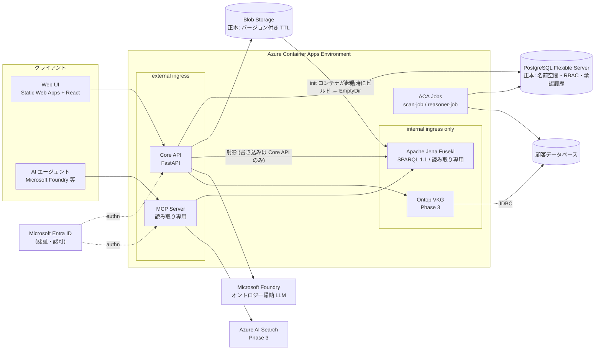
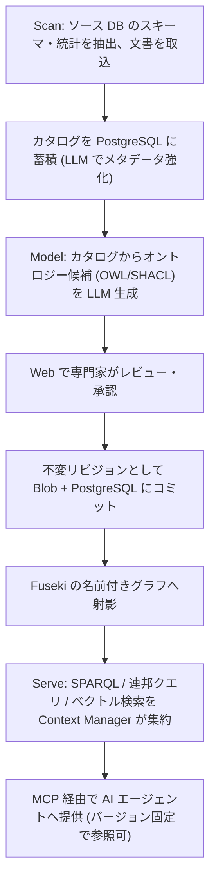

# Ontology Accelerator for Azure

企業のビジネスオントロジー(製品・顧客・ポリシーの機械可読モデル)を AI でドラフト生成し、専門家がレビュー・承認したうえで W3C 標準のナレッジグラフ(RDF/OWL/SPARQL)として保存し、MCP 経由で AI エージェントに提供する Azure ネイティブな OSS です。

AI エージェントに社内の用語・関係・ポリシーを「推測させる」のではなく、**人間が承認した、バージョン管理された、監査可能なコンテキスト**として渡すことを目的としています。

> **名称について**: `Ontology Accelerator for Azure` という表示名は**暫定**です。Microsoft および AWS の商標を製品名として使わない方針のため、公開時に変更する可能性があります。

---

## 現在のステータス: Phase 0(スキャフォールド)

製品として使える状態ではありません。何が動作確認済みで、何が未実装なのかを以下に正確に示します。

### 動作を確認済み(ローカル)

- `docker compose up` で Fuseki 6.2.0 + PostgreSQL 16 が起動する
- init コンテナが `samples/retail-core.ttl` から TDB2 を構築し、名前付きグラフ `urn:ontology:graph/retail-core` として読み込む(= 「再構築可能な射影」設計の実装)
- Fuseki の `/ds/sparql` が SPARQL 1.1 で応答する
- Core API 経由の読み取りクエリが通り、更新クエリと `SERVICE` 句はガードで HTTP 400 になる
- Fuseki 側でも `SERVICE` の実行が無効化されている(HTTP 422 / SSRF 対策)。管理 API は無認証で 401
- 名前空間 CRUD がスタブ実装(メモリ上)で動作する
- lint (ruff) / 型検査 (mypy strict) / テスト (pytest 16 件) / Web ビルド (tsc + vite) / `az bicep build` / shellcheck がすべて通る

### 動作を確認済み(Azure 実環境 / japaneast)

`azd up` を実サブスクリプションで実行し、以下を確認しました。

- `azd up` が成功する(プロビジョニング 5 分 6 秒 + デプロイ 2 分 41 秒)。API / MCP / Fuseki / Web の 4 サービスがデプロイされる
- **Blob(正本)から init コンテナが TDB2 を再構築し、Fuseki が SPARQL を返す** — 「再構築可能な射影」設計が実環境で成立
  (名前付きグラフ `urn:ontology:graph/approved_retail-core`、60 トリプル、OWL クラス 4 件、SHACL NodeShape 2 件)
- Fuseki 側で `SERVICE` 句が HTTP 422 でブロックされる(SSRF 対策)
- Fuseki は internal ingress のため外部から到達できない
- API `/healthz` が応答し、トークン無しの `GET /namespaces` は **401**(`AUTH_MODE=entra` が機能)
- MCP `/mcp` が `tools/list` を返す(`list_namespaces` / `sparql_query`)
- API / MCP の scale-to-zero が機能する(初回アクセスはコールドスタート)

### 未実装・未検証

- **Entra ID の App 登録を伴う認証経路は未検証です。** API がトークンを拒否すること(401)までは確認済みですが、有効なトークンで通す検証は App 登録が必要なため行っていません
- Scan / Model の機能は存在しません(Phase 2)
- **Scan / Model の機能は存在しません** — オントロジーの自動生成、レビュー・承認フロー、スキーマ発見はいずれも Phase 2 です
- MCP サーバーはツール定義まで。Ontop 連邦クエリ・ベクトル検索・OWL 推論は Phase 3〜4 です
- 名前空間ごとの RBAC は強制されていません(Phase 2)

つまり現時点の価値は、**設計ドキュメントと、その設計が成立することを確認できる最小の骨格**です。

---

## アーキテクチャ



ワークフローは **Scan → Model → Serve** の 3 段です。



設計上の最重要ポイントは、**トリプルストアを「いつでも作り直せる派生物」として扱う**ことです。正本(system of record)は PostgreSQL と Blob 上のバージョン付き TTL であり、Fuseki は起動時に Blob から再構築されます。詳細は [`docs/architecture.md`](docs/architecture.md) と [ADR-0002](docs/adr/0002-triple-store-as-rebuildable-projection.md) を参照してください。

---

## 特徴(設計目標)

- **W3C 標準に忠実** — RDF / OWL / SPARQL 1.1 / SHACL / R2RML をそのまま使います。独自のグラフ表現やクエリ言語を発明しません
- **ストアを持ち込める** — SPARQL 1.1 Protocol をハード境界としているため、`SPARQL_ENDPOINT` を差し替えるだけで既存の GraphDB / Stardog / Amazon Neptune などを利用できます。アプリコードはストア実装に依存しません
- **MCP でエージェントに提供** — Model Context Protocol(Streamable HTTP)サーバーを同梱し、Foundry Agent Service などからツールとして接続できます。提供は読み取り専用です
- **azd 一発デプロイ** — リポジトリ自体が Azure Developer CLI テンプレートです。`azd up` を唯一のデプロイ手段とし、`azd down` で完全削除できることを保証します
- **監査可能** — オントロジーは不変リビジョン(コンテンツハッシュ + semver)として保存し、誰が提案・誰が承認・いつ・差分・理由を W3C PROV-O で記録します

これらは**設計目標**であり、Phase 0 の時点ではいずれも未実装です。

---

## クイックスタート

> **ローカル開発の手順は動作確認済みです。**`azd up` による Azure へのデプロイは Phase 0 では未検証です(Bicep の構文検証のみ)。

### 前提ツール

| ツール | バージョン |
|---|---|
| Azure CLI | 最新 |
| Azure Developer CLI (`azd`) | 最新 |
| Docker | 最新(Compose v2 を含む) |
| uv | 最新 |
| pnpm | 最新 |
| Node.js | 22 |
| Python | 3.12 |
| just | 最新(タスクランナー) |

Windows 環境では、リポジトリ同梱の [Dev Container](.devcontainer/) を使うと上記が揃った環境が得られます。

### ローカル開発

タスクは `just` にまとめてあります(Windows / Linux / macOS で同じコマンドが使えます)。`just` だけを実行すると一覧が出ます。

```bash
just setup      # 依存関係を入れる (uv sync --all-packages + pnpm install)
just up         # Fuseki + PostgreSQL を起動 (docker compose up -d --build)
just dev-api    # Core API を起動 (http://localhost:8000)
just dev-mcp    # MCP サーバーを起動 (別ターミナル)
just dev-web    # Web を起動 (別ターミナル)
just down       # 停止する (データは残る / just clean でデータも消す)
```

Fuseki の SPARQL エンドポイントは `http://localhost:3030/ds/sparql` で応答します。動作確認の例:

```bash
curl -s -X POST http://localhost:3030/ds/sparql \
  -H 'Content-Type: application/sparql-query' -H 'Accept: text/csv' \
  --data 'PREFIX owl: <http://www.w3.org/2002/07/owl#> SELECT ?c WHERE { ?c a owl:Class }'
```

3030 番や 5432 番を別のプロジェクトで使っている場合は、環境変数 `FUSEKI_PORT` / `POSTGRES_PORT` でホスト側のポートを変更できます。

ローカル開発では `AUTH_MODE=disabled` を指定することで Entra ID 認証をバイパスできます(後述)。

### Azure へのデプロイ

```bash
azd auth login
azd up          # just deploy でも同じ
```

`deploymentTier`(`minimal` / `production`)と `graphPersistence`(`ephemeral` / `azureFiles`)を Bicep パラメータで切り替えられます。評価目的であれば既定の `minimal` + `ephemeral` のままで構いません。

#### 初回デプロイ時の注意

- **初回 `azd up` の直後は、Fuseki が起動していてもグラフが空になります。** azd は provision → deploy の順に実行するため、provision の時点ではコンテナイメージがまだ存在せずプレースホルダが入ります。続く `azd deploy` が差し替えるのは各コンテナアプリの**メインコンテナのみ**で、init コンテナは更新されません。**`azd provision` をもう一度実行すると init とメインのイメージタグが揃います**(実デプロイで確認済み)
- **サンプルオントロジーの投入は現時点では手動です。** postprovision フックは Phase 1 で実装予定のため、`azd up` 後に以下を実行してください。Blob に置いたうえで Fuseki のリビジョンを再起動すると、init コンテナが TDB2 を作り直してグラフが見えるようになります

  ```bash
  # 1. 正本となる TTL を Blob へ置く (パスの approved/ 配下が読み込み対象)
  az storage blob upload \
    --account-name $(azd env get-value AZURE_STORAGE_ACCOUNT_NAME) \
    --container-name ontologies \
    --name approved/retail-core.ttl \
    --file samples/retail-core.ttl \
    --auth-mode login --overwrite

  # 2. Fuseki を再起動して Blob から射影を作り直す
  REV=$(az containerapp revision list -g <resource-group> -n <fuseki-app> \
    --query "[?properties.active].name | [0]" -o tsv)
  az containerapp revision restart -g <resource-group> -n <fuseki-app> --revision "$REV"
  ```
- **Key Vault のロール割り当ては RBAC の伝播待ちで初回に失敗しうる**ため、失敗した場合は数分待って再実行してください
- **CI からサービスプリンシパルでデプロイする場合**は `principalType=ServicePrincipal` を指定してください。`principalId` が空だと Key Vault Secrets Officer の割り当てが作られないため、シークレット書き込み権限を別途付与する必要があります
- `graphPersistence: azureFiles` を選ぶ場合、Azure Files は **SMB (Premium)** でマウントします。NFS はカスタム VNet が必須で `minimal` ティアと両立しないためです。この構成は**単一レプリカ前提**である点に注意してください(詳細は [ADR-0002](docs/adr/0002-triple-store-as-rebuildable-projection.md))
- Static Web Apps は japaneast に対応していないため、Web だけ `webLocation`(既定 `eastasia`)で別リージョンに配置されます

### 削除

```bash
azd down --purge   # just destroy でも同じ
```

`--purge` は論理削除保護のあるリソース(Key Vault 等)も完全に削除します。課金を止めるにはこの手順まで実行してください。

---

## 必要な Azure 権限と Entra ID の前提

- **サブスクリプションに対する権限**: リソースグループの作成とロール割り当てを行うため、`Contributor` に加えて `User Access Administrator`(または `Owner`)相当が必要です。Managed Identity へのロール割り当てを IaC が行います
- **Entra ID App 登録**: 人間の認可コードフロー、およびエージェントの client credentials フローのために App 登録が必要です。テナントで App 登録が禁止されている場合、テナント管理者への依頼が必要になります
- **App 登録権限がない場合**: `AUTH_MODE=disabled` の **ローカル専用 dev モード**を用意しています。認証を完全に無効化するため、**ローカル開発以外では絶対に使用しないでください**。Azure へデプロイした環境でこのモードを有効にしてはいけません

## Microsoft Foundry モデルのリージョン可用性

オントロジー帰納に使う LLM は Microsoft Foundry(Azure OpenAI 系)を利用しますが、**Japan East で利用できるモデルは限られます**。モデル用リージョンをアプリ用リージョンと分離できる Bicep パラメータを用意する設計です。デプロイ前に、使用したいモデルが対象リージョンで提供されているかを Azure のリージョン可用性ドキュメントで確認してください。

---

## コスト目安

Japan East の retail 価格(USD)に基づく**見積り**です。実際の課金額は使用状況・為替・価格改定により変動します。単価の出典と計算式は [`docs/cost-estimate.md`](docs/cost-estimate.md) に記載しています。

| 構成 | 月額(見積り) |
|---|---|
| minimal / Phase 1 MVP(Fuseki 0.5 vCPU、AI Search 未デプロイ) | **$39〜49** |
| minimal / Phase 1 MVP(Fuseki 1 vCPU、推奨) | **$51〜61** |
| Phase 3 以降(AI Search Basic 追加) | **$136〜158** |
| production(参考概算) | **$700〜1,200** |
| Microsoft Foundry (LLM) | 従量。中規模スキーマ 1 回の帰納で $1〜5 程度 |

> **最大の見積り不確実性**: Azure Container Apps の idle 単価は active の 1/8 です。Fuseki が常時 active と判定されると vCPU 分が 8 倍になり、1 vCPU 構成で最悪 **月 $105 前後**まで上振れします。Phase 1 のスパイクで idle/active 比率を実測して確定します。

`azd down --purge` で全リソースを削除できるため、評価後にコストを止められます。

---

## ロードマップ

各 Phase は「完了時にできるようになること」で区切っています。

| Phase | 名称 | 完了時にできること |
|---|---|---|
| **Phase 1** | MVP「器が動く」 | `azd up` 一発で ACA + Fuseki + API + MCP + PostgreSQL がデプロイされ、同梱サンプルオントロジーを SPARQL で検索でき、AI エージェントが MCP(`sparql_query` / `list_namespaces`)経由で参照できる。名前空間 CRUD、Entra JWT 検証、SPARQL 攻撃面対策(読み取り専用・`SERVICE` 封鎖・上限)を含む。AI 機能はまだない |
| **Phase 2** | Scan/Model「AI がオントロジーを作れる」 | 顧客 DB 接続とスキーマ自動発見(scan-job)、LLM によるオントロジー候補生成(OWL/SHACL)、Web でのレビュー・承認フロー(グラフ可視化含む)、バージョニングと監査証跡、pyshacl による SHACL 検証、名前空間 RBAC の強制。本プロダクトの核心価値 |
| **Phase 3** | Serve フル「エージェントがフル活用できる」 | Ontop VKG(R2RML 管理 + 実データを実体化しない連邦クエリ)、AI Search 統合(ベクトル/ハイブリッド検索、`search_context` ツール)、Metric Service、Context Manager のオーケストレーション、(任意)Purview コネクタ |
| **Phase 4** | ハードニング「本番品質・OSS 公開」 | reasoner-job(OWL 推論)、production プロファイル(VNet / Private Endpoint / AKS 昇格ガイド)、可観測性・負荷試験、awesome-azd 申請、v0.1.0 リリース |

Phase 1 には必須スパイクが 3 件あります: ①起動時再構築の所要時間実測と射影ループの検証、②ACA の idle/active 課金比率の実測、③Ontop 配布物のライセンス確認。

---

## AWS 版との関係

本プロジェクトは AWS の [Context Ontology Accelerator](https://github.com/aws/context-ontology-accelerator)(Apache-2.0)の**アーキテクチャと概念を参考にした、Azure ネイティブな独立実装**です。**フォークではありません。**

AWS 版は Apache-2.0 で公開されており、フォークすることも法的には許諾されています。独立実装を選んだのはライセンス上の制約ではなく、CDK / Smithy / Neptune への深い結合を Azure 版に持ち込まないための**技術的判断**です。コード・設定・ドキュメント本文・サンプルオントロジー・プロンプト文はいずれも複製していません。この判断のトレードオフ(Apache-2.0 §3 の特許許諾を受けられない点を含む)は [ADR-0008](docs/adr/0008-independent-implementation.md) に記録しています。

## 非提携の明記

**本プロジェクトは Amazon Web Services および Microsoft とは提携・承認・スポンサー関係にありません。AWS, Amazon, Azure, Microsoft は各社の商標です。**

---

## ドキュメント

- [`docs/architecture.md`](docs/architecture.md) — アーキテクチャ、グラフ永続化設計、Azure サービスマッピング、認証・認可・セキュリティ
- [`docs/cost-estimate.md`](docs/cost-estimate.md) — 月額費用試算と単価の出典・計算式
- [`docs/third-party-licenses.md`](docs/third-party-licenses.md) — 第三者コンポーネントのライセンス
- [`docs/adr/`](docs/adr/) — アーキテクチャ決定記録(ADR-0001〜0008)

## コントリビューション

Issue と Pull Request を歓迎します。[CONTRIBUTING.md](CONTRIBUTING.md) をご覧ください。行動規範は [CODE_OF_CONDUCT.md](CODE_OF_CONDUCT.md) に定めています。

## セキュリティ

脆弱性を発見した場合は、**公開 Issue を作成せず** [SECURITY.md](SECURITY.md) の手順に従って非公開で報告してください。

## ライセンス

[Apache License 2.0](LICENSE)。Copyright 2026 Hiroki Nomura。第三者コンポーネントの帰属表示は [NOTICE](NOTICE) を参照してください。
