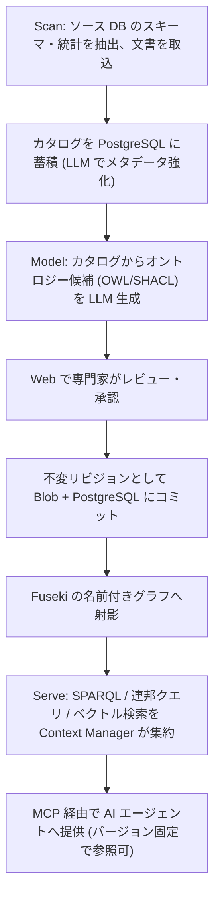

# Ontology Accelerator for Azure

企業のビジネスオントロジー(製品・顧客・ポリシーの機械可読モデル)を AI でドラフト生成し、専門家がレビュー・承認したうえで W3C 標準のナレッジグラフ(RDF/OWL/SPARQL)として保存し、MCP 経由で AI エージェントに提供する Azure ネイティブな OSS です。

AI エージェントに社内の用語・関係・ポリシーを「推測させる」のではなく、**人間が承認した、バージョン管理された、監査可能なコンテキスト**として渡すことを目的としています。

> **オントロジーやナレッジグラフをご存じない方へ**: 専門用語を使わない解説資料を用意しています → **[意味の設計図](https://nomhiro.github.io/ontology-accelerator-for-azure/introduction.html)**
> 何が嬉しいのか、どういう仕組みなのかを、同じ質問を「表」と「グラフ」で比べる対話図つきで説明しています。客先への説明にもそのまま使えます。

> **名称について**: `Ontology Accelerator for Azure` という表示名は**暫定**です。Microsoft および AWS の商標を製品名として使わない方針のため、公開時に変更する可能性があります。

---

## 現在のステータス: Phase 1(MVP「器が動く」)

製品として使える状態ではありません。何が動作確認済みで、何が未実装なのかを以下に正確に示します。

### 動作を確認済み(ローカル)

- `docker compose up` で Fuseki 6.2.0 + PostgreSQL 16 が起動する
- Fuseki の entrypoint が `samples/retail-core.ttl` から TDB2 を構築し、名前空間ごとのデータセット `retail-core` の名前付きグラフ `urn:ontology:graph/retail-core/1.0.0`(かつ既定グラフにも同じ内容)として読み込む(= 「再構築可能な射影」設計の実装)
- Fuseki は名前空間ごとに分離したデータセット(例: `retail-core`)の `/retail-core/sparql` が SPARQL 1.1 で応答する。データセット単位の物理分離が名前空間の隔離境界であり(`packages/api/tests/test_isolation.py` で検証)、固定の `ds` は予約された空のデータセットで実データは入らない
- Core API 経由の読み取りクエリが通り、更新クエリと `SERVICE` 句はガードで HTTP 400 になる
- Fuseki 側でも `SERVICE` の実行が無効化されている(HTTP 422 / SSRF 対策)。管理 API は無認証で 401
- クエリの**時間**の上限(`SPARQL_QUERY_TIMEOUT_SECONDS`、既定 30 秒)も
  **結果件数の上限(`SPARQL_MAX_RESULTS`、既定 10,000)も効きます**
  ([ADR-0025](docs/adr/0025-result-limit-enforcement.md)、`P2A-08`)。
  件数の上限は**クエリに `LIMIT` を後付けするのではなく、API の境界で応答の行数を
  切り、切り詰めたことを必ず知らせます**(下記「結果件数の上限は切り詰めて知らせます」)
- 名前空間 CRUD が PostgreSQL に永続化して動作する(作成時に Fuseki データセットも同時に作る)。削除(`DELETE /namespaces/{namespace}`)は、公開済みバージョンが Blob に1件でも残っていれば 409 Conflict で拒否する(オントロジーは不変リビジョンであり、レプリカ再作成後に削除済みのはずのデータが Blob から復活することを防ぐため)。**使わなくなった名前空間は削除ではなく退役させる**(`POST /namespaces/{namespace}/retire`。[ADR-0032](docs/adr/0032-namespace-retirement.md))。
  **この判定と行の削除の間に同時 publish が割り込む競合は閉じました**([ADR-0024](docs/adr/0024-namespace-delete-locking.md)、`P2B-12`)。削除と publish が**同じ行ロック**(`SELECT ... FOR UPDATE`)を取ります。削除は **Blob の検査より前**に、publish は **Blob への書き込みより前**に取るので、どちらが先でも「Blob に TTL があって PostgreSQL には何も無い」状態(= レプリカ再作成で名前空間が復活する状態)になりません。**`DELETE` 文が暗黙に取る行ロックでは遅すぎます** — その時点では既に Blob に TTL が書かれています。「後から Blob を再検査する」でも窓は閉じません(publish が Blob を書く前に削除が commit してしまう順序が残ります)。
  なお**公開済みオントロジーを含む名前空間の退役**(409 を返している側)は未決のままです(`P2B-19`)。不変条件「公開済みの版は削除しない」との関係を決める必要があります
- **最小の承認フローが動作します(ADR-0010)。** `POST /namespaces/{ns}/versions` は版を
  `draft` として記録するだけで、Fuseki には一切射影しません。承認は別の操作です。
  ```
  POST /namespaces/{ns}/versions/{v}/submit    draft → in-review(名前付きグラフへ射影)
  POST /namespaces/{ns}/versions/{v}/approve   in-review → approved(既定グラフ + 名前付きグラフへ射影。
                                                前の approved は自動で superseded)
  POST /namespaces/{ns}/versions/{v}/reject    in-review → draft(reason 必須。名前付きグラフから外す)
  ```
  射影先は状態で分かれます(詳細は下記「自分のオントロジーを追加する」を参照)。
  **エージェント(`GRAPH` 句なしのクエリ)は常に承認済みの現行版だけを見ます。**
  レビュアは `GRAPH` 句で審査中(`in-review`)の版を検証できます。
  `draft` は Blob と PostgreSQL にのみ存在し、Fuseki には一切現れません。
- **名前空間ごとの権限が強制されます(ADR-0014)。** 認証済みであることは
  「何をしてよいか」を意味しません。名前空間ごとにロールを付与し、API が強制します。

  ```
  data-analyst  <  data-steward  <  maintainer  <  owner        (上位は下位を含む)
  ```

  | 操作 | 必要なロール |
  |---|---|
  | SPARQL 読み取り / 版の一覧 / 決定記録 / 監査照会 / 意味的差分 / SHACL 検証 / 廃止の検査 / 用語の責任者の参照 / 用語ごとの参照の集約 / 健全性指標 / 想定質問の参照と試行 / 領域間マッピングの参照 | `data-analyst` |
  | `publish` / `submit` | `data-steward` |
  | `approve` / `reject` | `maintainer` |
  | 用語の責任者の付与・取り消し | `maintainer` |
  | アクセスログの照会・削除 / 領域間マッピングの宣言・取り消し | `owner` |
  | 名前空間の削除・退役 / ロールの付与・取り消し | `owner` |
  | 名前空間の作成 / `POST /admin/reconcile` | `platform-admin`(Entra アプリロール) |

  **付与が 1 件も無い名前空間は「誰も権限を持たない」として扱います。**
  「付与が無ければ全員に許可」のような暗黙のフォールバックは作りません
  (「強制していない」を「強制している」と誤認させるため)。名前空間を作った主体は
  同じトランザクションで自動的に `owner` になります。
- **四眼原則が名前空間ごとに設定できます。既定は有効です。**
  有効な名前空間では、**その版を `publish` した主体はその版を `approve` できません**
  (HTTP 409)。`platform-admin` もここは飛び越えられません — 管理者が自分の提案を
  自分で承認できてしまうと、四眼原則が「管理者以外への制約」に成り下がるためです。
  **同梱サンプルの名前空間だけは `require_two_person_approval: false` で作られます**
  (`azd up` の `postdeploy` が 1 主体で publish → submit → approve するため)。
  **実運用の名前空間では有効のままにしてください。**
- lint (ruff) / 型検査 (mypy strict) / テスト (pytest 883 件) / Web ビルド (tsc + vite) / `az bicep build` / shellcheck がすべて通る

### 動作を確認済み(Azure 実環境 / japaneast)

`azd up` を実サブスクリプションで実行し、以下を確認しました。

- `azd up` が成功する(プロビジョニング 5 分 6 秒 + デプロイ 2 分 41 秒)。API / MCP / Fuseki / Web の 4 サービスがデプロイされる
- **Blob(正本)から Fuseki の entrypoint が TDB2 を再構築し、SPARQL を返す** — 「再構築可能な射影」設計が実環境で成立
  (名前付きグラフ `urn:ontology:graph/retail-core/1.0.0`、60 トリプル、OWL クラス 4 件、SHACL NodeShape 2 件。
  `postdeploy` が Core API 経由で承認まで行うため、既定グラフにも同じ内容が入る)
- Fuseki 側で `SERVICE` 句が HTTP 422 でブロックされる(SSRF 対策)
- Fuseki は internal ingress のため外部から到達できない
- API `/healthz` が応答し、トークン無しの `GET /namespaces` は **401**(`AUTH_MODE=entra` が機能)
- MCP `/mcp` が `tools/list` を返す(`list_namespaces` / `sparql_query` / `version_decisions` / `term_owner` / `term_mappings`)
- **MCP のツール呼び出しが実際の Entra トークンで Core API まで通る(ADR-0012)。** トークン無し・不正なトークンは MCP 側の検証で拒否され、理由がエージェントに返る。検証手順は `scripts/verify-mcp-auth.sh`
- API / MCP の scale-to-zero が機能する(初回アクセスはコールドスタート)

### 未実装・未検証

- **Scan / Model の機能は存在しません** — オントロジーの自動生成、スキーマ発見は Phase 2 です
- **ロールの付与は API のみです。** Web の管理画面はまだありません(`PUT /namespaces/{ns}/roles`)。
  また、責任者(オーナーシップとエスカレーション、`P2B-04`)は RBAC とは別のレイヤで未実装です
- MCP サーバーはツール定義まで。Ontop 連邦クエリとベクトル検索は Phase 3 です(**OWL 推論は CI に入っています** — 下記「OWL 推論器で論理的矛盾を検出する」)

つまり現時点の価値は、**設計ドキュメントと、その設計が成立することを確認できる最小の骨格**です。

---

## アーキテクチャ


ワークフローは **Scan → Model → Serve** の 3 段です。



設計上の最重要ポイントは、**トリプルストアを「いつでも作り直せる派生物」として扱う**ことです。正本(system of record)は PostgreSQL と Blob 上のバージョン付き TTL であり、Fuseki は起動時に Blob から再構築されます。詳細は [`docs/architecture.md`](docs/architecture.md) と [ADR-0002](docs/adr/0002-triple-store-as-rebuildable-projection.md) を参照してください。

---

## 特徴(設計目標)

- **W3C 標準に忠実** — RDF / OWL / SPARQL 1.1 / SHACL / R2RML をそのまま使います。独自のグラフ表現やクエリ言語を発明しません
- **ストアを持ち込める** — SPARQL 1.1 Protocol をハード境界としているため、`SPARQL_QUERY_ENDPOINT` / `SPARQL_UPDATE_ENDPOINT` / `SPARQL_GSP_ENDPOINT` を差し替えるだけで既存の GraphDB / Stardog / Amazon Neptune などを利用できます。アプリコードはストア実装に依存しません
- **MCP でエージェントに提供** — Model Context Protocol(Streamable HTTP)サーバーを同梱し、Foundry Agent Service などからツールとして接続できます。提供は読み取り専用です
- **azd 一発デプロイ** — リポジトリ自体が Azure Developer CLI テンプレートです。`azd up` を唯一のデプロイ手段とし、`azd down` で完全削除できることを保証します
- **監査可能** — オントロジーは不変リビジョン(コンテンツハッシュ + semver)として保存し、誰が提案・誰が承認・いつ・差分・理由を記録し、`GET /namespaces/{namespace}/provenance` が W3C PROV-O の Turtle として書き出します

現時点で**動作するもの**は、RDF / OWL / SPARQL 1.1 によるクエリ、ストアの差し替え、MCP による読み取り提供、`azd up` / `azd down`、submit/approve/reject による承認フロー、SHACL 検証、名前空間ごとの RBAC と四眼原則の強制、用語単位の責任者、監査の照会、意味的差分、廃止のライフサイクル、コンテキストのアクセスログ、保持ポリシー、健全性指標、監査証跡の PROV-O 書き出し（Turtle / JSON-LD）、そして主体の種別（人間 / サービスプリンシパル）の記録です。
**未実装のもの**は、R2RML による連邦クエリ(Phase 3)、LLM によるオントロジー生成(Phase 2)です。
PROV-O の書き出しは**測った事実だけを標準語彙で主張します**。**`prov:wasDerivedFrom` が出るのは、`publish` に `base_version` を渡した版だけ**です — **承認の順序は派生ではない**ため、渡されなかった版には辺を出さず `ont:editedFromRecorded false` を出します([ADR-0026](docs/adr/0026-provenance-export.md) 決定2、[ADR-0027](docs/adr/0027-revision-lineage.md))。各フェーズの区切りは下記の[ロードマップ](#ロードマップ)を参照してください。

---

## クイックスタート

> **ローカル開発と `azd up` はいずれも動作確認済みです**(japaneast の実サブスクリプションで検証)。ただしオントロジーの生成・レビュー機能は未実装のため、デプロイして得られるのはサンプルオントロジーを SPARQL / MCP で参照できる状態までです。

### 前提ツール

| ツール | バージョン |
|---|---|
| Azure CLI | 最新 |
| Azure Developer CLI (`azd`) | 最新 |
| Docker | 最新(Compose v2 を含む) |
| uv | 最新 |
| pnpm | 最新 |
| Node.js | 22 |
| Python | 3.12 |
| just | 最新(タスクランナー) |

Windows 環境では、リポジトリ同梱の [Dev Container](.devcontainer/) を使うと上記が揃った環境が得られます。

### ローカル開発

タスクは `just` にまとめてあります(Windows / Linux / macOS で同じコマンドが使えます)。`just` だけを実行すると一覧が出ます。

`just dev-api` は uvicorn を直接起動するだけで、コンテナ用の `docker-entrypoint.sh` を経由しません。そのため Azure 実行時に注入される環境変数(`AUTH_MODE=entra` の既定値、Entra 経由の PostgreSQL 接続など)がここでは設定されず、そのままでは `just up` で立てたローカルの PostgreSQL に接続できません。**先に `.env` を用意してください。**

```bash
cp .env.example .env   # AUTH_MODE=disabled / POSTGRES_PASSWORD=localdev などローカル専用の値
just setup      # 依存関係を入れる (uv sync --all-packages + pnpm install)
just up         # Fuseki + PostgreSQL + Azurite を起動し、正本 Blob のコンテナを作る
just migrate    # PostgreSQL にテーブルを作る (alembic upgrade head)
just dev-api    # Core API を起動 (http://localhost:8000)
just dev-mcp    # MCP サーバーを起動 (別ターミナル)
just dev-web    # Web を起動 (別ターミナル)
just down       # 停止する (データは残る / just clean でデータも消す)
```

`.env` を用意せずに `just dev-api` を起動すると、`GET /namespaces` は次のいずれかで失敗します。`.env` が無ければまず 401(`AUTH_MODE` の既定 `entra` でトークン必須)、`AUTH_MODE=disabled` だけを指定しても `POSTGRES_PASSWORD` が空だと Entra 経由の接続に切り替わり 500、`just migrate` を実行していなければ `relation "namespaces" does not exist` で 500 になります。`.env.example` と `just migrate` はこれらすべてに対応します。

**`docker compose up` を直接使う場合は、続けて `uv run python scripts/init-local-storage.py` を実行してください。** Azurite には Blob コンテナを自動作成する仕組みがなく(本番は `infra/modules/shared.bicep` の `ontologyContainer` が作ります)、コンテナが無いと**オントロジーの公開(publish)と名前空間の削除が `ContainerNotFound` で失敗します**。名前空間の作成と SPARQL 参照は Blob を触らないため動いてしまい、原因が分かりにくい点に注意してください。`just up` はこの手順を含みます(冪等です)。

Fuseki の SPARQL エンドポイントは名前空間ごとのデータセットに立ちます。`just up` で読み込まれるサンプル(`samples/retail-core.ttl`)は名前空間 `retail-core` として `http://localhost:3030/retail-core/sparql` で応答します(固定の `/ds/sparql` は予約された空のデータセットなので応答はしますが 0 件しか返りません)。動作確認の例:

```bash
curl -s -X POST http://localhost:3030/retail-core/sparql \
  -H 'Content-Type: application/sparql-query' -H 'Accept: text/csv' \
  --data 'PREFIX owl: <http://www.w3.org/2002/07/owl#> SELECT ?c WHERE { ?c a owl:Class }'
```

3030 番や 5432 番を別のプロジェクトで使っている場合は、環境変数 `FUSEKI_PORT` / `POSTGRES_PORT` でホスト側のポートを変更できます。

ローカル開発では `AUTH_MODE=disabled` を指定することで Entra ID 認証をバイパスできます。指定方法は前述の `.env`(`.env.example` をコピーしたもの)です。

### Azure へのデプロイ

```bash
azd auth login
azd up          # just deploy でも同じ
```

`deploymentTier`(`minimal` / `production`)と `graphPersistence`(`ephemeral` / `azureFiles`)を Bicep パラメータで切り替えられます。評価目的であれば既定の `minimal` + `ephemeral` のままで構いません。

#### 初回デプロイ時の注意

- **サンプルオントロジーの投入は `postdeploy` フックが自動で行います**(`scripts/postdeploy.sh` / `scripts/postdeploy.ps1`)。手動で Blob にアップロードする必要はありません
  - **同梱サンプルは Core API 経由で投入されます。** `azd up` の `postdeploy` フックが、名前空間の作成 → publish → submit → approve を API に対して実行します。そのため PostgreSQL に行が入り、`GET /namespaces` と MCP の `list_namespaces` から**発見できます**(Azure 実機で検証済み)。フックが `postprovision` ではなく `postdeploy` なのは、`postprovision` の時点ではコンテナのイメージがまだプレースホルダで API が起動していないためです
- **Key Vault のロール割り当ては RBAC の伝播待ちで初回に失敗しうる**ため、失敗した場合は数分待って再実行してください
- **CI からサービスプリンシパルでデプロイする場合**は `principalType=ServicePrincipal` を指定してください。`principalId` が空だと Key Vault Secrets Officer の割り当てが作られないため、シークレット書き込み権限を別途付与する必要があります
- `graphPersistence: azureFiles` を選ぶ場合、Azure Files は **SMB (Premium)** でマウントします。NFS はカスタム VNet が必須で `minimal` ティアと両立しないためです。この構成は**単一レプリカ前提**である点に注意してください(詳細は [ADR-0002](docs/adr/0002-triple-store-as-rebuildable-projection.md))
- Static Web Apps は japaneast に対応していないため、Web だけ `webLocation`(既定 `eastasia`)で別リージョンに配置されます

### 自分のオントロジーを追加する

**経路は Core API の publish → submit → approve です。** 名前空間の作成(`POST /namespaces`)の後、以下の順で呼びます(ADR-0010)。

```
POST /namespaces/{ns}/versions                    正本(Blob + PostgreSQL)に draft として記録する。Fuseki には一切射影しない
                                                    201=新規作成 / 200=同一内容の再投入(冪等)
POST /namespaces/{ns}/versions/{v}/submit          draft → in-review。名前付きグラフへ射影する(GRAPH 句を書けばレビュアが見える)
POST /namespaces/{ns}/versions/{v}/approve         in-review → approved。既定グラフ + 名前付きグラフへ射影する。
                                                    同じ名前空間の前の approved 版は自動で superseded になる
POST /namespaces/{ns}/versions/{v}/reject          in-review → draft(body に reason が必須)。名前付きグラフから外す
GET  /namespaces/{ns}/versions/{v}/decisions      この版の決定記録(誰が・いつ・なぜ)を起きた順に返す
POST /namespaces/{ns}/versions/{v}/validate       この版を SHACL で検証する(状態は変えない)
```

**同時編集は `base_version` で検出します(P1-13)。** `POST /namespaces/{ns}/versions` の body に、編集の基準にした版を渡してください。名前空間の最新版と一致しなければ **409** を返します(HTTP の `If-Match` に相当します)。

```json
{ "turtle": "...", "base_version": "1.2.0" }
```

渡さないと検査しません。**人が編集する経路では必ず渡してください。** 渡さない場合、2 人が同じ版から編集して公開すると、版番号は自動採番で衝突しないため、**後の版が前の変更を静かに消します**。最初の公開では渡しません(まだ基準が無いため)。

同じ本文の再送(タイムアウト後のリトライ)は、`base_version` が古くても 409 になりません。内容ハッシュによる冪等判定が基準バージョンの検査より先にあるためです。

**`base_version` は競合検出だけでなく、系譜の記録にも使われます**([ADR-0027](docs/adr/0027-revision-lineage.md)、`P2A-15`)。渡すと `edited_from` に保存され、PROV-O の書き出しで `prov:wasDerivedFrom` として出ます。**渡さなければ「何から編集したか分からない」として記録されます** — このシステムは承認の順序から親を推測しません(推測して書いた値は、後から事実と区別できません)。名前空間の**最初の版**は、先行する版が無いことが確かなので「先行版なし」として記録されます。

**エージェント(`GRAPH` 句を書かないクエリ)は常に承認済みの現行版だけを見ます。** `draft` は Blob と PostgreSQL にのみ存在し、Fuseki には一切現れません。レビュアは `GRAPH` 句で `in-review` の版を検証してから approve してください。

**この操作には権限が必要です([ADR-0014](docs/adr/0014-namespace-rbac.md))。** `publish` / `submit` は `data-steward` 以上、`approve` / `reject` は `maintainer` 以上です。足りなければ **403** を返します。

**四眼原則が有効な名前空間では、その版を `publish` した主体は `approve` できません。** その場合は **409** を返します。403 と分けているのは**運用者が取るべき対処が違う**ためです — 権限不足はロールを付与すれば解決しますが、四眼原則違反は「別の人に承認してもらう」しかありません。同じ 403 に混ぜると、ロールを足して解決しようとして解決しません。

提案者は「その版を `publish` した主体」で判定します。`submit` は「レビューに出す」という事務的な操作でありうる(他人の `draft` を代わりに submit することは自然に起こる)ため、内容の責任は publish 側にあります。

```bash
# 名前空間ごとのロールを付与する(owner が必要)
curl -X PUT "$API/namespaces/retail-core/roles" \
  -H "Authorization: Bearer $TOKEN" -H 'Content-Type: application/json' \
  -d '{"principal_id": "<Entra のオブジェクト ID>", "role": "maintainer"}'

# 付与を一覧する
curl "$API/namespaces/retail-core/roles" -H "Authorization: Bearer $TOKEN"

# 取り消す(最後の owner は取り消せない。409)
curl -X DELETE "$API/namespaces/retail-core/roles/<オブジェクト ID>" \
  -H "Authorization: Bearer $TOKEN"
```

**`principal_id` は Entra のオブジェクト ID です。** UPN や表示名ではありません(UPN は変わりうるし、ゲストの `#EXT#` 形式は書き換えの罠があります)。

#### MCP から Core API への認証

**エージェントは Core API 向けのアクセストークンを取得し、それを MCP へ渡します。** MCP と Core API は同一のアプリ登録(同一オーディエンス)を共有しているため、トークン交換は要りません([ADR-0012](docs/adr/0012-mcp-to-core-api-authentication.md))。

```
Authorization: Bearer <api://<appId>/.default のアクセストークン>
```

MCP は受け取ったトークンを**自分で検証してから** Core API へそのまま転送します。ヘッダの存在を識別子の主張として扱いません。転送するのは `Authorization` だけで、`Cookie` などは転送しません。

この設計により、**監査イベントの `actor` が実際のエージェントを指します。** MCP のマネージド ID で Core API を呼ぶ実装にすると、Core API から見た呼び出し元が常に MCP になり、「誰の問い合わせに対してどのバージョンを返したか」が記録できなくなります(ADR-0006 の帰属が壊れます)。

`AUTH_MODE=disabled`(ローカル開発専用)では検証も転送も行いません。

#### 結果件数の上限は切り詰めて知らせます

**`SPARQL_MAX_RESULTS`(既定 10,000)を超える結果は切り詰めます。エラーにはしません。**
エージェントは「全部は取れなかった」ことを知ったうえで続けられるべきです
([ADR-0025](docs/adr/0025-result-limit-enforcement.md))。

| 層 | 切り詰めたことの伝え方 |
|---|---|
| Core API | ヘッダ `X-Ontology-Result-Truncated: true` / `X-Ontology-Result-Limit` / `X-Ontology-Result-Total-Rows` |
| MCP | **本文**の `result_truncated` / `result_limit` / `result_total_rows` |

**本文をヘッダと分けるのは、エージェントがヘッダを見ないからです**(廃止済み用語の
警告と同じ理由・同じ形。[ADR-0017](docs/adr/0017-deprecation-lifecycle.md) 決定3)。
**切り詰めた結果を「全部です」として返すのがいちばん避けたい形です** — エージェントは
「該当は 10,000 件で全部見た」と信じて回答を作ります。

**クエリに `LIMIT` を後付けはしません。** 既存の `LIMIT` / `OFFSET`、副問い合わせ、
集約との相互作用で**意味が変わる**ためです(`CONSTRUCT` の `LIMIT` は解の数であって
トリプル数ではありません)。任意の SPARQL を書き換える実装は、
[ADR-0001](docs/adr/0001-rdf-store-selection.md) が名前空間の隔離で避けた形と同じです。

**ストア側では止められません。** Fuseki 6.2.0 / Jena ARQ 6.2.0 に行数の上限は
ありません。実測した結果です。

| 調べたもの | 結果 |
|---|---|
| ARQ のコンテキスト記号 | `queryTimeout` / `updateTimeout` / `httpQueryTimeout` のみ |
| `fuseki:queryLimit`(語彙に**存在する**) | **効かない**(12 行のデータに `queryLimit 5` を設定しても 12 行返った) |
| その読み手 | `fuseki-server.jar` 内で参照するのは語彙の定義クラスだけ。**実装に読み手がいない** |

そのため **API の境界が唯一の強制点**です。**ストアの応答全体は一度メモリに載ります** —
上限は「エージェントに渡す量」を抑えるもので、API のメモリは守りません。そこは
時間の上限(30 秒)が事実上の防波堤です。

**アクセスログには切り詰める前の行数を記録します。** 「エージェントに何行渡したか」
ではなく「**何行返ろうとしたか**」でなければ、上限に張り付いているクエリを
見つけられません。

**`CONSTRUCT` と `DESCRIBE` は使えます**([ADR-0034](docs/adr/0034-construct-describe.md)、
`P2A-14`)。**同じエンドポイント**が `text/turtle` を返します — それが
SPARQL 1.1 Protocol の振る舞いで、URL を分けるとクライアントがクエリを送る前に
形を判定しなければならなくなります。

```bash
curl -X POST "$API/namespaces/retail-core/sparql" \
  -H "Authorization: Bearer $TOKEN" -H 'Content-Type: application/json' \
  -d '{"query": "CONSTRUCT { ?s ?p ?o } WHERE { ?s ?p ?o }"}'
# -> Content-Type: text/turtle
```

**トリプル数の上限は行数とは別です**(`SPARQL_MAX_TRIPLES`、既定 50,000)。
1 行が何トリプルにもなるので、行数の上限を流用すると実質の上限が変わります。

**上限を超えたら切り詰めずに 413 で断ります。** 行数(上記)とは**意図的に違う
判断**です — 理由は 1 つで十分に強いものです。

> **RDF には封筒が無い。**

`SELECT` の結果は JSON の封筒(`head` / `results`)なので「切り詰めた」と書く
場所がありますが、**Turtle にはありません**。トリプルを足せば**利用者のグラフに
こちらが作った主張を混ぜる**ことになります。ヘッダに書く手はありますが、
**エージェントはヘッダを見ません**(ADR-0017 決定3)。つまり
**切り詰めた RDF は、切り詰めたと言えないまま完全な RDF として届きます**。
413 の本文には実際のトリプル数が入るので、どれだけ絞ればよいか分かります。

**アクセスログは行とトリプルを混ぜません。** `CONSTRUCT` / `DESCRIBE` では
`returned_row_count` が `null`(行の概念が無い)で、`returned_triple_count` に
トリプル数が入ります。**`0` を書きません** — 「0 行返した」と「行という概念が
無い」は違います。

**502 の原因は測り直して訂正しました。** 以前は「`Accept` が食い違って JSON の
解析に失敗する」と書いていましたが、実測すると **Fuseki は `CONSTRUCT` に対して
`Accept` に関わらず Turtle を返します**。原因は `response.json()` を呼んでいた
ことでした。`Accept: text/turtle` を送るのは**プロトコルとしての正しさ**であり、
持ち込みストアが `Accept` を尊重するかもしれないので続けています。

#### SHACL 検証は承認を止めます

**`approve` は SHACL 検証を行い、違反があれば 422 で拒否します**（[ADR-0005](docs/adr/0005-reasoner-boundary.md) 決定1・[ADR-0009](docs/adr/0009-ontology-operations.md) 決定1）。SHACL 適合性は形式的に決定可能なので、機械が確定的に判定してブロックします。検証は状態遷移より前に行うため、拒否されたときに状態は変わりません。

**`approve` が状態を変える前に行う検査は 3 つあります。** いずれも「形式的に決定可能なものは機械が確定的に判定する」に対応し、**すべて正本の TTL に対して行います**（トリプルストアには問い合わせません — その時点でその版はまだ射影されていないためです）。

| # | 検査 | 落ちたとき |
|---|---|---|
| 1 | **SHACL 検証**（`P2A-05`） | 422 |
| 2 | **廃止のライフサイクル**（[ADR-0017](docs/adr/0017-deprecation-lifecycle.md)） | 422 |
| 3 | **想定質問**（[ADR-0022](docs/adr/0022-competency-question-sets.md)。下記「想定質問は名前空間の受け入れ基準になり、承認を止めます」） | 422 |

**いずれも「確かめられなかった」場合は 502 です。** 「制約を満たしている」と「確かめられなかった」を混同すると、壊れた定義を承認してしまいます。

**`publish` は止めません。** `draft` は編集途中でありうるためです（publish と approve の分離は [ADR-0010](docs/adr/0010-approval-and-projection.md) 決定1）。レビュー中に違反を確認するには `POST /namespaces/{ns}/versions/{v}/validate` を呼んでください（状態を変えずに報告だけ返します）。

検証は 2 段階です。

1. **shapes 自体**を SHACL-SHACL で検証します。`sh:targetClass` がリテラルを指しているような shape は**どのノードにも当たらない**ため、データ検証では「違反ゼロ」になります。制約を書いたつもりが何も検査していない状態を、この段階が捕まえます
2. **データ**を shapes で検証します。ADR-0005 の本題です

**制約名のタイプミス（`sh:minCoun` など）は検出できません。** SHACL の処理系は知らない述語を無視する仕様のためで、既知の限界としてテストに固定しています。

**「検証できなかった」は違反として扱いません。** Blob へ到達できない場合などは 502 を返します。「制約を満たしている」と「確かめられなかった」を混同すると、壊れた定義を承認してしまいます。

外部の実データへの適用（定義と実データの乖離検出）は Phase 3 です。Ontop 経由の連邦クエリが前提になります。

#### OWL 推論器で論理的矛盾を検出する — ただし「矛盾がない」とは言いません

**CI が ELK(OWL 2 EL 推論器)でオントロジーの論理的整合性を検査します**([ADR-0021](docs/adr/0021-owl-reasoning-in-ci.md))。矛盾・充足不能クラス・読み込み失敗があれば CI が落ちます。

```bash
just check-reasoning                          # samples/ をすべて検査する
just check-reasoning samples/retail-core.ttl
```

```
推論器: ELK 0.6.0 / プロファイル: OWL 2 EL
  samples/retail-core.ttl (公理 56 件)
    矛盾は検出されませんでした (見逃しがありえます)
    充足不能クラスはありませんでした (見逃しがありえます)
    不完全さの理由: Potential incompleteness due to occurrences of DataProperty
    ...
    宣言されていない語彙の使用 25 件 (詳細は .reasoner-report.json)
```

**「矛盾は検出されませんでした」であって「矛盾がありません」ではありません。** ELK は OWL 2 EL の推論器で、**扱えない公理を無視します**。無視すると制約が減るので導出も減ります。つまり**検出したものは本物ですが、見逃しがあります**(健全だが不完全)。

**そして ELK 0.6.0 はデータプロパティを扱えません。** `DataProperty` / `DataPropertyDomain` / `DataPropertyRange` / `FunctionalDataProperty` があると整合性の判定そのものを諦めます。**属性を 1 つも持たない業務用オントロジーは無い**ので、**結論が不完全になるのは例外ではなく通常の状態です**(同梱サンプルも該当します)。だから結論には必ず完全性を添えます。

**OWL 2 EL プロファイルへの適合を見ても、不完全性は分かりません。** 実測で両方向にずれました。

| 入力 | OWL 2 EL の逸脱 | 結論は完全か |
|---|---|---|
| データプロパティ 1 個だけ | **0 件** | **不完全** |
| `rdfs:subClassOf` の左辺に `owl:unionOf` | **1 件** | **完全** |

| 事象 | CI を止めるか |
|---|---|
| 読み込めなかった / 矛盾が検出された / 充足不能クラスが検出された | **止めます** |
| 結論が不完全だった / OWL 2 EL プロファイルの逸脱 | 止めません(報告します) |

**不完全さでは止めません。** データプロパティ 1 個で該当するため、止める設計にすると実用的なオントロジーが全部落ちます。EL の外を書くのは OWL 2 DL として正当な選択であり、CI が禁じることではありません。

**推論は `approve` の同期パスには入れません**([ADR-0005](docs/adr/0005-reasoner-boundary.md) 決定3)。実行時間が予測しづらいためです。承認時に止めるのは SHACL 検証と廃止の検査です。

**HermiT(LGPL-3.0)は配布物に同梱しません**(ADR-0005 決定4)。完全な OWL 2 DL 推論が必要な場合の選択肢ですが、Apache-2.0 の配布物としての単純さを優先します。**同梱していないことは CI が jar の中身を見て機械的に検査します。**

#### SPARQL エンドポイントは推論しません — 階層はプロパティパスで辿ってください

**推論器は CI にしかいません。** トリプルストアには承認された TTL がそのまま載っているだけで、**OWL の含意は展開されていません**([ADR-0028](docs/adr/0028-no-entailment-projection.md)、`P2B-15`)。

```turtle
ex:Premium  rdfs:subClassOf ex:Customer .
ex:Customer rdfs:subClassOf ex:Party .
```

この定義に対して `SELECT ?s WHERE { ?s rdfs:subClassOf ex:Party }` は **`ex:Customer` しか返しません**。`ex:Premium` は OWL の意味論では `ex:Party` の部分クラスですが、**そのトリプルは書かれていません**。

**階層を辿るにはプロパティパスを使ってください。**

| 知りたいこと | 書き方 |
|---|---|
| ある用語の下位クラス全部 | `?s rdfs:subClassOf+ ex:Party` |
| ある個体が属するクラス全部 | `ex:alice rdf:type/rdfs:subClassOf* ?c` |
| 上位の概念全部(SKOS) | `ex:x skos:broader+ ?c` |

プロパティパスは推論ではなく**グラフの到達可能性**なので、**返ってきた経路はすべて誰かが承認した公理です**。MCP の `sparql_query` のツール説明にも同じ案内が入っています(エージェントは README を読まないため)。

**プロパティパスで届かない含意もあります。** `owl:someValuesFrom` を通じた含意、`owl:equivalentClass` の対称性、互いに素なクラスからの帰結はパスでは辿れません。

**導出された含意を射影しない理由は 4 つあり、どれか 1 つでも致命的です**(ADR-0028 決定1)。

| # | 理由 |
|---|---|
| a | **ELK の結論は実用的なオントロジーではほぼ常に不完全**なので、載るのは中途半端な部分閉包になる。エージェントには「導出されなかった」と「計算されなかった」を区別する手段が無い |
| b | **ローダは Blob の `.ttl` だけを読み、推論器を走らせない。** 導出トリプルはレプリカの再作成で静かに消え、`reconcile` も気づけない(不変条件1) |
| c | **主張と導出が区別できなくなる。** 「誰が承認した定義に基づく答えか」を説明できることがこの製品の中核価値です |
| d | **不変リビジョンの中身が推論器の版で変わる。** ELK 0.6.0 → 0.7.0 で同じ版の意味が変わります(不変条件7) |

**クエリ時推論(Jena の `ja:InfModel`)も有効にしません。** 最大の理由は「**少しだけ推論する」は「推論しない」より危険**だからです — 一部の含意が返ると、エージェントは「このエンドポイントは推論する」と結論し、返らなかった含意を「成り立たない」と読みます。

#### 想定質問（Competency Questions）で「目的を果たしているか」を判定する

**「このオントロジーは○○に答えられなければならない」を SPARQL として書き、CI で回します**（[ADR-0009](docs/adr/0009-ontology-operations.md) 決定6）。品質スコア型の評価は採りません — 点数が下がった理由が行動に結びつかないからです。想定質問なら、落ちたときに何を直すべきかが自明です。

```yaml
# samples/retail-core.questions.yaml
questions:
  - id: cq-01-order-to-customer
    question: 注文から、その注文を出した顧客へ辿れるか
    expect: ask_true
    sparql: |
      PREFIX rdfs: <http://www.w3.org/2000/01/rdf-schema#>
      PREFIX retail: <https://example.com/ontology/retail#>
      ASK { ?p rdfs:domain retail:Order ; rdfs:range retail:Customer . }
```

```bash
just check-questions                                    # 同梱サンプルに対して
just check-questions my.questions.yaml my-namespace     # 自分の名前空間に対して
```

**判定モードが 3 つあるのは、スキーマだけのオントロジーには行を返す質問が書けないからです。**

| `expect` | 意味 | 主な用途 |
|---|---|---|
| `ask_true` | ASK が true | **語彙の表現力**。「その問いに答えるための語彙と関係が存在するか」 |
| `non_empty` | SELECT が 1 行以上 | **データ検索**。実データがある場合（Ontop 連携後） |
| `empty` | SELECT が 0 行 | **規約の遵守**。「ラベルの無いクラスが無いこと」 |

`empty` は決定1 の「合意済みの規約（命名規則、必須項目）はテストとして機械が実行する」をそのまま満たします。想定質問と規約チェックを同じ仕組みで書けます。

**想定質問は読み取り専用に強制されます。** SPARQL Update と `SERVICE` 句は読み込み時に拒否されます。

##### 想定質問は名前空間の受け入れ基準になり、承認を止めます

**デプロイ済みの名前空間に質問集合を紐づけられます**([ADR-0022](docs/adr/0022-competency-question-sets.md)、`P2B-14`)。答えられない版は `approve` が **422** で拒否します(ADR-0009 決定1: 合意済みの規約はブロッキング)。

```bash
# 基準を定める(owner が必要。理由は必須)
curl -X POST "$API/namespaces/retail-core/questions" -H "Authorization: Bearer $TOKEN"   -H 'Content-Type: application/json'   -d "$(jq -Rn --rawfile c samples/retail-core.questions.yaml         '{content: $c, reason: "初版の受け入れ基準"}')"

# 承認前に試す(状態は変えない)
curl -X POST "$API/namespaces/retail-core/versions/2.0.0/questions/run"   -H "Authorization: Bearer $TOKEN"

# 基準がいつ・誰に・なぜ変えられたかの履歴
curl "$API/namespaces/retail-core/questions/revisions" -H "Authorization: Bearer $TOKEN"
```

**受け入れ基準を書き換えられるなら、通ったことは保証になりません。** これが設計の中心です。

- **質問集合は名前空間ごとに 1 系列で、版ごとには持ちません。** 版ごとにすると**新しい版が自分の合格条件を自分で書き換えられます**(四眼原則と同じ論点です)
- **改訂は不変です。** 古い改訂は消えず、`reason` が必須で、すべて監査に残ります。**改訂で減った質問の id が監査の記録に出ます**
- **書き込みは `owner`、読み取りは `data-analyst` です。** `approve` は `maintainer` 以上なので、承認する主体より 1 段上に置いています
- **そして「審査される側が基準を書き換えた」承認は止まります**([ADR-0029](docs/adr/0029-criteria-authorship.md)、`P2B-16`)。ロールは階層なので `owner` は基準も書けますが、**その版を書いた主体が publish 後に基準を書き換えていると `approve` が 422 になります**

**四眼原則が塞いでいなかった穴は「著者が基準を緩め、同僚が承認する」でした。** 四眼原則(ADR-0014 決定4)は「publish した主体は approve できない」なので、一人が全部やる形は止まります。しかし**審査される成果物の著者が合格条件を書く**ことは止まっていませんでした。

| 経路 | 四眼原則 | 基準の出自の検査 |
|---|---|---|
| 著者が版を書き、基準を緩め、自分で承認 | **止める** | — |
| **著者が版を書き、基準を緩め、同僚が承認** | 止めない | **止める** |
| 基準を先に定めた責任者が、他人の版を承認 | 止めない | 止めない(**正常な統制です**) |

**3 つ目は止めてはいけません。** 名前空間の責任者が基準を定め、他人の成果物をその基準で審査するのは統制のあるべき姿です。**時刻の境界(版を publish した時刻)がこの 2 つを分けます。**

**止まったときは、別の主体が基準を改訂し直してください**(内容が同じでもかまいません)。改訂は不変で `reason` が必須なので、「別の主体が基準を確認した」という行為が記録に残ります。**基準を消させるのではなく、基準に別の主体の署名を付けさせる**設計です。

**この検査は `require_two_person_approval` に従います。** 新しいスイッチは作りません — 片方だけ切って「四眼原則を有効にしたつもり」になれる状態を作らないためです。**四眼原則が無効な名前空間では止まりませんが、事実は見えます**(`POST .../questions/run` の `criteria_self_revised`)。

**`platform-admin` もこれを飛び越えられません。** 管理者が飛び越えられるなら、四眼原則が「管理者以外への制約」に成り下がります。

**「基準が緩くなったか」は判定しません。** 緩めたのか締めたのかを機械的に決めるには改訂前後で同じ版を評価して比べる必要があり、その評価自体が未評価になりえます。**測れないものを条件に入れません** — 規則は「審査される側が基準を書かない」であって、方向は問いません。

**評価は正本の TTL に対して行い、トリプルストアには問い合わせません。** `approve` の時点でその版は**まだ射影されていない**ので、ストアに問うと「既定グラフに載った後の検査」になって意味を失います。承認をストアの可用性に依存させるのは、「射影の失敗は正本への書き込みを失敗させない」という不変条件の逆向きでもあります。同梱サンプルの 11 件を rdflib と Fuseki の両方で評価し、同じ 11/11 になることを確認しています。

**質問集合が無い名前空間の承認はブロックしません。** 「基準を定めていない」は「基準を満たしていない」ではありません。ブロックすると、この機能を入れた瞬間に既存のすべての名前空間が承認不能になります。**定めていないことは健全性指標の `competency_question_count` で見えます**(`0` に意味がある唯一の項目です)。

**「評価していない」は合格になりません。** 予算(30 秒)を超えた質問は `not_evaluated` に並び、承認は **502** で止まります(基準を満たしていない **422** とは別物です — 運用者が取るべき対処が違います)。

**行数は数えません。** 判定に必要なのは存在の有無だけなので、報告は「1 行以上」「0 行」です。実測で 216,000 行の直積を全部読むと 9.68 秒、先頭 1 行なら 0.000 秒でした。**数えたふりをしません。**

#### 「なぜそう決めたか」を記録して読み出す

**publish / submit / approve の body に `reason` を渡してください。** `audit_events` に記録され、`GET /namespaces/{ns}/versions/{v}/decisions` で起きた順に読み出せます（[ADR-0009](docs/adr/0009-ontology-operations.md) 決定7）。

```json
{ "turtle": "...", "reason": "顧客区分の定義を営業部の合意に合わせた" }
```

**理由は任意ですが、人が操作する経路では必ず書いてください。** 「誰が承認した定義に基づく答えかを説明できること」がこの製品の中核価値です（[ADR-0006](docs/adr/0006-ontology-versioning-and-audit.md)）。理由が空の監査は説明になりません。`reject` だけは最初から必須です。

**エージェントは MCP の `version_decisions` ツールで同じ記録を読めます。** `sparql_query` が返すのは定義そのもので、その定義を誰が承認したか・なぜそう決めたかは含まれません。答えの根拠を示す必要があるときに使います。

`superseded`（別の版の承認による自動遷移）の理由はシステムが書きます。**`diff`（意味的差分）は `approve` の記録に入ります**（下記「意味的差分を見る」）。最初の承認では基準が無いため `null` です。

#### オントロジーを縮める(廃止のライフサイクル)

**用語を削除することはできません。** 現行の承認済み版にあった用語を消した版は、`approve` が **422** で拒否します（[ADR-0009](docs/adr/0009-ontology-operations.md) 決定3・[ADR-0017](docs/adr/0017-deprecation-lifecycle.md)）。追加しかできないオントロジーは必ず腐るため、**縮める手段は用意されていますが、それは削除ではなく廃止です。**

```turtle
# 正しい縮め方: 残したまま廃止し、後継を示す
ex:Customer a owl:Class ;
    rdfs:label "顧客" ;
    owl:deprecated true ;
    dcterms:isReplacedBy ex:Party .
```

**後継が無い廃止も正当です**（間違って作った用語、統合されずに消える概念）。その場合は理由を書いてください。**後継か理由のどちらかが必要**で、両方は要りません。

```turtle
ex:Bogus a owl:Class ;
    owl:deprecated true ;
    rdfs:comment "誤って作成したため廃止。後継はありません" .
```

承認前に検査できます。

```bash
curl "$API/namespaces/retail-core/versions/2.0.0/deprecations" \
  -H "Authorization: Bearer $TOKEN"
```

```json
{ "base_version": "1.0.0", "blocking": false,
  "problems": [ { "kind": "references-deprecated",
                  "term": "https://example.com/ontology/retail#Order",
                  "blocking": false, "message": "...",
                  "referenced": "https://example.com/ontology/retail#Customer" } ] }
```

**ブロックするのは 2 つだけです。**

| 検査 | 扱い | 従う手段 |
|---|---|---|
| `removed`（IRI の削除） | **422 で拒否** | 削除せず `owl:deprecated` を立てる |
| `no-successor-or-reason`（後継も理由も無い廃止） | **422 で拒否** | どちらかを書く |
| `references-deprecated`（生きている用語が廃止済みを参照） | **報告のみ** | 後継へ張り替える（そのままでも承認できます） |

**最後をブロックしないのは、SHACL の形状やマッピングが廃止された用語を正当に参照するから**です。旧データを検証する形状や旧→新のマッピングを禁止してしまうためです。`dcterms:replaces` と `rdfs:seeAlso` による参照は歴史的参照として最初から問題に数えません。

**クエリの結果に廃止済みの用語が現れたら警告します。** 置き場所は層によって違います。

- **Core API**: `X-Ontology-Deprecated-Terms` **レスポンスヘッダ**。本文は標準の SPARQL Results JSON のままです（[ADR-0001](docs/adr/0001-rdf-store-selection.md) の「SPARQL 1.1 Protocol をハード境界にする」を守るため、本文に独自のキーを混ぜません）
- **MCP**: ツール結果の**本文**に `deprecation_warnings` が付きます。**エージェントはヘッダを見ない**ので、ここで届かなければ廃止された用語を自信を持って使ってしまいます

**廃止された用語は引き続き引けます。** 廃止は「もう使うな」であって「無かったことにする」ではありません。過去のデータを解釈するために IRI は残り続けます（SNOMED CT や GO が IRI を削除・再利用しないのと同じ理由です）。

#### 意味的差分を見る

**承認すると、前の `approved` 版との意味的差分が `audit_events.diff` に記録されます**（[ADR-0016](docs/adr/0016-semantic-diff.md)）。承認前にレビューするための口も別にあります。

```bash
# 現在の approved 版との差分(状態は変わりません。data-analyst で読めます)
curl "$API/namespaces/retail-core/versions/2.0.0/diff" -H "Authorization: Bearer $TOKEN"

# 基準を明示する
curl -G "$API/namespaces/retail-core/versions/2.0.0/diff" \
  --data-urlencode "base=1.0.0" -H "Authorization: Bearer $TOKEN"
```

```json
{ "namespace": "retail-core", "version": "2.0.0", "base_version": "1.0.0",
  "diff": { "empty": false, "triple_status": "exact",
            "added_terms": ["https://example.com/ontology/retail#Shipment"],
            "removed_terms": [], "deprecated_terms": [],
            "modified_terms": ["https://example.com/ontology/retail#Product"],
            "has_removed_terms": false, "truncated": false } }
```

**接頭辞・トリプルの順序・空白ノードのラベルの違いは差分になりません。** テキスト差分ではこれが守れないため、rdflib の正規化を使っています。

**`removed_terms` と `deprecated_terms` は別物です。** [ADR-0009](docs/adr/0009-ontology-operations.md) 決定3 は「オントロジーは縮められなければならない。ただし IRI を削除も再利用もしない」と定めています。**廃止（`owl:deprecated true` を付ける）が正しい縮め方で、削除は規律違反です。** `has_removed_terms` が `true` なら規律違反が起きています。

**削除は承認をブロックします**（[ADR-0017](docs/adr/0017-deprecation-lifecycle.md)）。差分自体は報告に留まりますが、`approve` は 422 で拒否します。詳しくは上の「オントロジーを縮める」を参照してください。

**`triple_status` を必ず見てください。** 空白ノードが 300 個を超える版では、トリプル単位の差分と `modified_terms` が得られません（`skipped-too-many-blank-nodes` になり、`modified_terms` は `null`）。**「差分が無い」と「計算できなかった」を混同しないため**に、空の一覧を返さずに `null` にしています。`added_terms` / `removed_terms` は空白ノードの数に関係なく常に厳密です。

正規化のコストは空白ノードの数だけで決まります（トリプル総数はほとんど効きません）。実測で 2 グラフの差分が 300 個で 2〜4.5 秒、500 個で 8 秒、1,000 個で 42 秒です。SHACL の property shape は 1 つずつ空白ノードを作ります。

**監査に保存されるのは要約です。** 版は Blob に不変で残るため、厳密な差分はいつでも再計算できます（監査行に全トリプルを積むと行が非有界に育ちます）。用語の一覧は 50 件で切り、切った場合は `truncated` が `true` になります。

#### 健全性を測る

**`GET /namespaces/{ns}/health` が健全性の項目を返します**（[ADR-0020](docs/adr/0020-health-metrics.md)、[ADR-0009](docs/adr/0009-ontology-operations.md) 決定5）。同 ADR の言葉で言えば「**測っていないものは、致命的になるまで見えない**」。

```bash
curl "$API/namespaces/retail-core/health" -H "Authorization: Bearer $TOKEN"
# 用語 IRI の一覧も欲しいとき
curl -G "$API/namespaces/retail-core/health" \
  --data-urlencode "include_terms=true" -H "Authorization: Bearer $TOKEN"
```

```json
{ "namespace": "retail-core", "current_version": "2.0.0",
  "term_count": 42,
  "unreferenced_window_days": 90, "unreferenced_count": 7, "unreferenced_ratio": 0.166,
  "without_owner_count": 12,
  "approval_age_days": 5,
  "shacl_violation_count": 0,
  "unprojected_version_count": 0,
  "competency_question_count": 11,
  "disputed_mapping_count": 0,
  "deprecated_target_mapping_count": 2, "unknown_target_mapping_count": 5,
  "unavailable": [], "truncated": false }
```

| 項目 | 意味 | 原資料 |
|---|---|---|
| `term_count` | その名前空間が発行した用語の数 | **正本の TTL** |
| `unreferenced_count` / `_ratio` | 一定期間エージェントに渡っていない用語 | アクセスログ（上記） |
| `without_owner_count` | 責任者が未設定の用語 | 用語の責任者（上記） |
| `approval_age_days` | 現行版が承認されてからの日数 | `approved_at` |
| `shacl_violation_count` | SHACL 違反の件数 | SHACL 検証 |
| `unprojected_version_count` | 射影が済んでいない版 | `projected_at` |
| `competency_question_count` | 受け入れ基準の質問の件数 | 想定質問の集合（上記） |
| `disputed_mapping_count` | 相手側と述語が食い違っているマッピングの数 | 領域間マッピング（上記） |
| `deprecated_target_mapping_count` | **廃止された用語**を指している自分のマッピングの数 | マッピングの先の生死（上記） |
| `unknown_target_mapping_count` | 先の生死を**調べられなかった**マッピングの数 | 同上 |

**`null` は「測れなかった」で、`0` ではありません。** どの項目がなぜ測れなかったかは `unavailable` に並びます。**健全性指標が障害時に「健全」と言うのは、目的に正面から反します。**

**`competency_question_count` だけは `0` に意味があります** — 「受け入れ基準を定めていない」です（[ADR-0022](docs/adr/0022-competency-question-sets.md) 決定7）。定めていない名前空間の承認はブロックしないので、**ここに出ることが唯一それが見える経路です。**

**「全部か無か」にはしません。** 正本の TTL に到達できなくても、PostgreSQL だけで測れる項目（`approval_age_days`、`unprojected_version_count`）はそのまま返ります。Blob の一時的な不調で未射影の版の数まで見えなくなってはいけないからです。

**用語は正本の TTL から数えます。トリプルストアからは数えません。** ストアは再構築可能な射影であって正本ではないため（[ADR-0002](docs/adr/0002-triple-store-as-rebuildable-projection.md)）、**ストアが空のときにストアを数えると「用語数 0、未参照 0 件、責任者未設定 0 件」= 完全に健全という報告になります。**

**`approval_age_days` は版単位です。** このシステムの承認は版単位なので、用語単位の「再承認の古さ」は計算できません。**存在しない粒度をあるように見せないため**、測れる粒度で報告しています。

**`shacl_violation_count` は構造上ほぼ常に 0 です。** `approve` が違反をブロックするためです（上記「SHACL 検証は承認を止めます」）。SHACL 検証を入れる前に承認された版と、shape 自身の問題を拾うために項目として残しています。

**廃止された先を指すマッピングの 2 項目は 1 組です**（[ADR-0037](docs/adr/0037-deprecated-target-metric.md)、`P2B-21`）。`deprecated_target_mapping_count` だけを見ると**「残りのマッピングは健全」と読めます** — 実際には`unknown_target_mapping_count` 件が調べられていません（外部語彙・相手の名前空間を読む権限が無い・相手にまだ承認済み版が無い・対象の名前空間の数の上限・相手の正本が読めなかった、の 5 種）。

**この 2 項目は `null` になりません。** 他の項目と違って「全部か無か」にせず、調べられなかった分を `unknown` として数えます。一覧（`GET /namespaces/{ns}/mappings`）が既にこの形なので、**同じ事実の 2 つの報告が食い違わないようにしています。**

**この 2 項目は呼び出し元の権限に依存します。** 相手の名前空間を読めない主体には `unknown` として数えられます（[ADR-0030](docs/adr/0030-mapping-target-lifecycle.md) 決定1）。**指標のために権限ゲートは外しません** — 外すと、マッピングを 1 件ずつ張って数の増減を見ることで相手の語彙を探れる（存在の oracle）ためです。

**`incoming`（他の名前空間が自分の用語を指しているもの）は数えません。**自分では直せないので、行動に結びつかない数字を健全性の欄に置かないためです。自分の用語を廃止したときに困る相手は、廃止する側の `approve` が報告します（上記「廃止は承認で止まります」）。

**総合スコアは出しません。** 点数が下がった理由が行動に結びつかないためです（[ADR-0009](docs/adr/0009-ontology-operations.md) が却下しています）。項目ごとの生の値を返します。

#### エージェントに何を渡したかを記録する(アクセスログ)

**SPARQL クエリを記録します**([ADR-0018](docs/adr/0018-context-access-log.md)、[ADR-0006](docs/adr/0006-ontology-versioning-and-audit.md) 決定4)。オントロジーの履歴が完全でも、**実際にエージェントへ何が渡ったか**が分からなければ判断の説明は完結しません。

記録は 2 つに分かれます。**用途が違うものを 1 つの表で兼ねていません。**

| 口 | 粒度 | 用途 | 権限 |
|---|---|---|---|
| `GET .../access-log` | クエリ 1 回 = 1 行 | 「いつ・誰に・どの版の何を返したか」 | **`owner`** |
| `GET .../term-access` | 用語 1 件 = 1 行 | 「この用語は最後にいつ参照されたか」 | `data-analyst` |

```bash
# 誰がいつ何を問い合わせたか(owner が必要)
curl -G "$API/namespaces/retail-core/access-log" \
  --data-urlencode "actor=<Entra のオブジェクト ID>" \
  -H "Authorization: Bearer $TOKEN"

# 用語ごとの参照(古い順。data-analyst で読める)
curl "$API/namespaces/retail-core/term-access" -H "Authorization: Bearer $TOKEN"
```

**イベントの照会に `owner` を要求するのは、これが同僚の行動の記録だから**です。監査証跡（`GET .../audit`）を `data-analyst` に開いたのとは判断が違います — あちらは版単位の `decisions` から同じ情報が集められたので、集約を絞る意味がありませんでした。「誰がいつ何を問い合わせたか」は他のどの口からも導出できません。

**集約は個人を特定しません**（用語と時刻と回数だけ）。健全性指標として広く見られるべきなので分析者に開いています。

**`used_graph_clause` が真の行では、`default_graph_version` は読んだ版の全体ではありません。** `GRAPH` 句を明示したクエリは他の版を読みうるためです。どの版かを厳密に知るには SPARQL の解析器が必要になるので、**解析器を持ち込むより「不完全であることを記録する」ほうを選んでいます。**

**参照回数はクエリ 1 回で 1 回**です（同じ用語が結果に何行現れても 1 回）。行数を数えると `LIMIT` の違いで指標が動いてしまいます。

**集約されるのはその名前空間が発行した IRI だけです。** `rdf:type` の参照回数は指標になりませんし、**使われていない外部 IRI を「縮める」ことはできません**。副作用として、この表の行数はその名前空間の用語数で上限が付きます（エージェントの稼働に比例して増えません）。

**記録に失敗してもクエリは失敗しません。** アクセスログは読み取りの副産物であって、読み取りの前提条件ではありません（不変条件3 と同じ向きの判断です）。

##### 保持期間

**`access_events` は運用者が明示的に削除できます。** 監査証跡（`audit_events`）は `DELETE` 権限を剥奪していますが（[ADR-0011](docs/adr/0011-database-privilege-separation.md) 決定2）、アクセスログは性質が違います — 人の決定の記録は緩やかに増えて消す理由がありませんが、機械の参照の記録はエージェントの稼働に比例して無限に伸びます。

```bash
curl -X POST "$API/namespaces/retail-core/access-log/purge" \
  -H "Authorization: Bearer $TOKEN" -H 'Content-Type: application/json' \
  -d '{"before": "2026-06-01T00:00:00Z", "reason": "保持期間 90 日の運用ポリシー"}'
```

**「消せる」を「黙って消える」にはしていません。**

- **自動の削除ジョブはありません。** 運用者が `before` を明示して呼びます（既定値はありません）
- **`reason` は必須です**
- **削除したこと自体が `audit_events` に記録されます。** 監査証跡の側は追記専用なので、**この記録は消えません**
- **`term_access`（集約）は消えません。** 消した瞬間に「90 日参照されていない」が計算不能になるためです

#### 監査証跡を照会する

**`GET /namespaces/{ns}/audit` で名前空間全体の監査を新しい順に読めます**（`data-analyst` が必要）。「先週この名前空間で何が起きたか」「この人が何をしたか」を追うための口です。版単位の `decisions` が「1 つの版の根拠」を起きた順に返すのに対し、こちらは絞り込みとページングつきで名前空間全体を返します。

```bash
# 直近 50 件
curl "$API/namespaces/retail-core/audit" -H "Authorization: Bearer $TOKEN"

# 特定の主体が承認した記録だけ
curl -G "$API/namespaces/retail-core/audit" \
  --data-urlencode "action=approved" \
  --data-urlencode "actor=<Entra のオブジェクト ID>" \
  -H "Authorization: Bearer $TOKEN"

# 期間で絞る(タイムゾーン必須。since は含み、until は含まない)
curl -G "$API/namespaces/retail-core/audit" \
  --data-urlencode "since=2026-09-01T00:00:00Z" \
  --data-urlencode "until=2026-09-08T00:00:00Z" \
  -H "Authorization: Bearer $TOKEN"

# 次のページ(前のレスポンスの next_cursor をそのまま渡す)
curl -G "$API/namespaces/retail-core/audit" \
  --data-urlencode "limit=100" --data-urlencode "cursor=1234" \
  -H "Authorization: Bearer $TOKEN"
```

```json
{ "events": [ { "id": 1234, "action": "approved", "actor": "...", "occurred_at": "...",
                "subject": "retail-core@2.0.0", "reason": "...", "diff": null } ],
  "next_cursor": 1234 }
```

**`next_cursor` が `null` なら最後のページです。** 件数が `limit` ちょうどでもそうなります — 「返った件数が `limit` より少ないから最後」という判定はしないでください。

**ページングの鍵は `id` で、`occurred_at` ではありません。** `occurred_at` は PostgreSQL の `now()`（トランザクション開始時刻）なので、同一トランザクション内で記録された複数のイベントは同じ値になります。時刻でページングすると境界で取りこぼします。`id` は追記専用テーブルの単調増加する主キーなので、照会中に新しいイベントが追記されても既読のページは動きません。

**日時にはタイムゾーンを付けてください**（付いていなければ 422）。素朴に UTC と解釈しないのは、監査の照会で 9 時間ずれた結果を返すのが「何も返らない」よりたちが悪いからです。

**`limit` の上限は 500 です。** `audit_events` は追記専用で無限に伸びるため（[ADR-0011](docs/adr/0011-database-privilege-separation.md) 決定2 で `DELETE` を剥奪しています）、上限が無いと 1 リクエストで全件を読み出せてしまいます。

#### 監査証跡を W3C PROV-O で書き出す

**`GET /namespaces/{ns}/provenance` が同じ監査証跡を PROV-O の Turtle で返します**（`data-analyst` が必要。[ADR-0026](docs/adr/0026-provenance-export.md)）。PROV-O を理解する外部ツールにそのまま渡せます。絞り込みは `/audit` と同じです（`cursor` を除く）。

```bash
curl -G "$API/namespaces/retail-core/provenance" \
  --data-urlencode "since=2026-09-01T00:00:00Z" \
  -H "Authorization: Bearer $TOKEN"
```

```turtle
@prefix ont:  <urn:ontology:prov#> .
@prefix prov: <http://www.w3.org/ns/prov#> .

<urn:ontology:provenance/retail-core> a prov:Bundle ;
    ont:eventCount 2 ;
    ont:truncated false ;
    ont:includes <urn:ontology:activity/41>, <urn:ontology:activity/42> .

<urn:ontology:activity/41> a prov:Activity, ont:Publish ;
    prov:endedAtTime "2026-09-01T03:00:00+00:00"^^xsd:dateTime ;
    prov:generated <urn:ontology:revision/retail-core/2.0.0> ;
    prov:wasAssociatedWith <urn:ontology:agent/...> ;
    ont:action "published" .
```

**`prov:wasDerivedFrom` は、系譜が記録されている版にだけ出ます**（[ADR-0026](docs/adr/0026-provenance-export.md) 決定2、[ADR-0027](docs/adr/0027-revision-lineage.md) 決定5）。**承認の順序は派生ではありません** — 2.0.0 が 1.0.0 より後に承認されたことと、2.0.0 が 1.0.0 を元に書かれたことは別の事実です。承認の順序から派生を出せば、**測っていないことを標準語彙で主張する**ことになります。相互運用性のある形式で嘘を書くと、外部の PROV ツールがそれを著作の系譜として表示し、誰も疑いません。

**系譜を残すには `publish` に `base_version` を渡してください。** 渡さなかった版には辺が出ず、代わりに `ont:editedFromRecorded false`（=「分からない」）が出ます。`ont:editedFromRecorded` は真偽どちらでも出るので、**辺が無い理由が「根だから」なのか「記録していないから」なのかを読み手が区別できます**。

```turtle
# 基準を渡して publish した版
<urn:ontology:revision/retail-core/2.0.0> a prov:Entity ;
    ont:version "2.0.0" ;
    ont:editedFromRecorded true ;
    prov:wasDerivedFrom <urn:ontology:revision/retail-core/1.0.0> .

# 基準を渡さずに publish した版(最初の版を除く)
<urn:ontology:revision/retail-core/3.0.0> a prov:Entity ;
    ont:version "3.0.0" ;
    ont:editedFromRecorded false .
```

**`prov:wasRevisionOf` は使いません。** `wasDerivedFrom` の下位で「改訂である」とより強く主張しますが、記録しているのは「この版を編集するとき基準にした版」であって、両者が改訂の関係にあるとまでは言えません。

**主体の種別は、記録されていて矛盾しないときだけ `prov:Person` / `prov:SoftwareAgent` として出ます**（[ADR-0035](docs/adr/0035-actor-type.md)、`P2A-16`）。**四眼原則を記録する監査証跡で、人間の承認を自動化された行為として見せるのは最悪の誤りです** — だから記録していないものは主張しません。

種別は Entra の `idtyp` クレームから**記録の時点で**保存します（書き出しの時点でEntra へ問い合わせると、監査の書き出しが Entra の可用性に依存します）。値は**3 つ**です。

| 記録 | 意味 | 書き出し |
|---|---|---|
| `user` | 人間である | `prov:Person`（条件付き） |
| `service-principal` | サービスプリンシパルである | `prov:SoftwareAgent`（条件付き） |
| `unknown` | **問うて、分からなかった**（`idtyp` が無かった） | `ont:actorType "unknown"` のみ |
| （列が `NULL`） | **問うていない**（この機能より前の行） | **何も出ません** |

**真偽値ではありません。** `idtyp` は任意クレームで、設定していないテナントでは**サービスプリンシパルのトークンにも付きません**。つまり「クレームが無い」は「人間である」を意味しません。

**`idtyp` を設定するのは `just setup-app-role` です。** 設定しないとこの機能は永久に `unknown` を記録します（設定するのはリソース側、つまりこの API のアプリ登録です — アクセストークンはリソースが所有します）。

```turtle
# 人間の主体（この書き出しに含まれる行為がすべて user のとき）
<urn:ontology:agent/alice-oid> a prov:Agent, prov:Person ;
    ont:principalId "alice-oid" .

# 種別は主体ではなく**行為**に付きます
<urn:ontology:activity/41> a prov:Activity, ont:Publish ;
    ont:actorType "user" .
```

**種別を主体ではなく行為に付けるのは、主体の IRI が主体ごとだからです。** `idtyp` を設定する前と後の行為が同じ書き出しに混ざると、主体に付けた種別は1 つの IRI に複数の値としてぶら下がり「この主体は user でも unknown でもある」と読めてしまいます。**主体のクラス（`prov:Person` など）は、その書き出しに含まれるその主体の行為がすべて一致しているときだけ出ます** — 行為ごとの記録は測った事実ですが、主体のクラスは主体についての主張であり、主張には一致が要ります。

**`cursor` は受けません**（決定1）。RDF は順序を持たないため、カーソルで切り出した断片を RDF として渡す意味が薄いからです。代わりに**切り詰めたことを Turtle の中に書きます**（`ont:truncated`）。件数が多い名前空間は `since` / `until` で期間を区切ってください。

**この書き出しはトリプルストアには射影されません**（決定6）。出自の記録はどの版にも属さないため版の名前付きグラフに混ぜられず、既定グラフを単一の承認済み版に保つ決定（[ADR-0010](docs/adr/0010-approval-and-projection.md) 決定6）とも衝突します。

#### JSON-LD で受け取る

**`Accept: application/ld+json` を付けると、同じグラフが JSON-LD で返ります**（[ADR-0036](docs/adr/0036-jsonld-serialization.md)、`P2A-17`）。`GET /namespaces/{ns}/mappings/export` も同じです。

```bash
curl -G "$API/namespaces/retail-core/provenance" \
  -H "Authorization: Bearer $TOKEN" \
  -H 'Accept: application/ld+json'
```

```json
{
  "@context": {
    "ont": "urn:ontology:prov#",
    "prov": "http://www.w3.org/ns/prov#",
    "rdfs": "http://www.w3.org/2000/01/rdf-schema#",
    "xsd": "http://www.w3.org/2001/XMLSchema#"
  },
  "@graph": [
    {
      "@id": "urn:ontology:activity/41",
      "@type": ["prov:Activity", "ont:Publish"],
      "ont:action": "published",
      "ont:actorType": "user"
    }
  ]
}
```

**同じ 1 つの文書が、JSON パーサからは普通の JSON に見え、RDF ツールからは PROV-O のグラフに見えます。** `jq` で読めて、`rdflib` でも読めます。

**`@context` は文書に埋め込みます。外部の URL を指しません**（決定2）。これが `P2A-17` を保留させていた「`@context` をどこで公開するか」という問題への答えです — **公開しないことで消しました**。外に置く案はいずれも「解決できる URL を名乗っているのに解決できない」形になります。

| 置き場所 | なぜ成り立たないか |
|---|---|
| この API | **認証が要る**。JSON-LD プロセッサは Bearer トークンを持ちません |
| この API（デプロイごとの URL） | 書き出した文書を第三者に渡した時点で壊れます |
| リポジトリの raw URL | 移転・改名で過去の書き出しが読めなくなります |

**既定は Turtle です。`application/ld+json` を明示してください**（決定5）。`application/json` では切り替わりません — 既定で `Accept: application/json` を送る HTTP クライアントは多く、そこで切り替えると**いまこの口を Turtle として使っているクライアントが黙って壊れます**。解釈できない `Accept` でも 406 にはせず Turtle を返します（内容交渉は**足すだけ**です）。

**`application/ld+json;q=0`（明示的な拒否）は尊重します。** 部分文字列一致で判定すると、拒否を肯定として読むことになります。

**キーには接頭辞が付きます**（`ont:action`。決定3）。短い別名（`action`）は作りません — **Turtle の述語名と JSON のキー名という 2 つの語彙**を同期させ続けることになり、情報は 1 つも増えないからです。`jq` からは`jq '.["@graph"][] | .["ont:action"]'` のように読みます。

**2 つの表現は同じグラフから出ます**（決定6）。同型であることをテストが固定しているので、片方だけ直す変更は落ちます。

#### 「この用語は誰に聞けばよいか」を記録して解決する

**用語ごとに責任者を置けます**（[ADR-0015](docs/adr/0015-term-owners.md)、[ADR-0009](docs/adr/0009-ontology-operations.md) 決定4）。`created_by` / `approved_by` は「その時の行為者」であって現在の責任者ではありません。差分レビューのルーティング先と、健全性指標（`P2B-06`）の「責任者が未設定の用語」の原資料になります。

```bash
# 責任者を割り当てる(maintainer が必要。冪等)
curl -X PUT "$API/namespaces/retail-core/term-owners" \
  -H "Authorization: Bearer $TOKEN" -H 'Content-Type: application/json' \
  -d '{"term_iri": "https://example.com/ontology/retail#Product",
       "principal_id": "<Entra のオブジェクト ID>"}'

# 一覧する(data-analyst で読める)
curl "$API/namespaces/retail-core/term-owners" -H "Authorization: Bearer $TOKEN"

# 「この用語は誰に聞けばよいか」を解決する
curl -G "$API/namespaces/retail-core/term-owners/resolve" \
  --data-urlencode "term_iri=https://example.com/ontology/retail#Product" \
  -H "Authorization: Bearer $TOKEN"

# 外す(maintainer が必要。設定が無ければ 404)
curl -X DELETE -G "$API/namespaces/retail-core/term-owners" \
  --data-urlencode "term_iri=https://example.com/ontology/retail#Product" \
  -H "Authorization: Bearer $TOKEN"
```

**責任者は権限ではありません。** 責任者に指定されただけでは何の操作も許されません。名前空間単位の責任者は RBAC の `owner` ロールが担い、用語単位だけがこの仕組みです（権限では表現できない粒度がここにあります）。

**解決には順にフォールバックします。** 用語の責任者 → 名前空間の `owner` → 解決不能。**どれで解決したかは `source` で返ります。**

```json
{ "namespace": "retail-core",
  "term_iri": "https://example.com/ontology/retail#Product",
  "source": "namespace-owners",
  "principal_ids": ["..."] }
```

**`source` を必ず見てください。** `namespace-owners` は「その用語に責任者がいない」という意味です。問い合わせ先が返ってきたことだけで満足すると、責任者が未設定であることを見落とします。

権限に暗黙のフォールバックを作らないと決めた（[ADR-0014](docs/adr/0014-namespace-rbac.md) 決定6）のに、ここではフォールバックする理由は**安全側の向きが逆だから**です。権限は「無いなら拒否」が安全側ですが、ルーティングは「無いなら上位に回す」が安全側です — 誰にも届かない問い合わせは放置され、放置されたことも分かりません。

**用語が実在するかは検査しません。** トリプルストアは再構築可能な射影であって正本ではないため、存在確認は正本への書き込みを射影の可用性に依存させてしまいます。また、まだ承認されていない版で定義される用語に先に責任者を決めておくことは自然に起こります。**その代わり、責任者を外すときに設定が無ければ 404 を返します** — IRI のタイプミスに気づける唯一の経路です。

**`base_iri` 配下でない IRI にも責任者を置けます。** 外部語彙への `skos:closeMatch` を張ったとき、そのマッピングの妥当性について説明責任を負うのは張った側だからです。

**エージェントは MCP の `term_owner` ツールで同じ解決を引けます。** `version_decisions` が「誰が承認したか」（過去の行為者）を返すのに対し、こちらは**現在の責任者**を返します。承認した人が今も担当しているとは限りません。

なお**名前空間全体の監査照会は MCP に出していません。** エージェントが必要とするのは「この定義の根拠」であって「名前空間の全履歴」ではないためです。

#### 領域をまたぐ用語は統合せず、対応関係として記録する

**営業の「優良顧客」と経理の「優良顧客」が違うとき、一つに統合しません**([ADR-0009](docs/adr/0009-ontology-operations.md) 決定8、[ADR-0023](docs/adr/0023-cross-domain-mappings.md))。名前空間を分けたまま、対応関係を明示的な成果物として記録します。**マッピング自体がレビュー対象になるので、意見の相違が消されずに残ります。**

```bash
# 宣言する(owner が必要。理由は必須)
curl -X PUT "$API/namespaces/sales/mappings" -H "Authorization: Bearer $TOKEN"   -H 'Content-Type: application/json' -d '{
    "source_term": "https://example.com/ontology/sales#GoodCustomer",
    "target_term": "https://example.com/ontology/finance#GoodCustomer",
    "predicate": "closeMatch",
    "reason": "顧客区分の粒度が近いが、経理の定義は与信を含む" }'

# 自分が張ったもの / 他の領域から張られたもの
curl "$API/namespaces/sales/mappings" -H "Authorization: Bearer $TOKEN"
curl -G "$API/namespaces/finance/mappings" --data-urlencode "direction=incoming"   -H "Authorization: Bearer $TOKEN"
```

**`owl:equivalentClass` は使えません。** ADR-0009 決定8 は候補に挙げていましたが、**実測して却下しました**。営業と経理の「優良顧客」を、互いに素なクラスの下に置いたまま結んで OWL 推論器(ELK)にかけた結果です。

| 結んだ述語 | ELK の結論 |
|---|---|
| `owl:equivalentClass` | **充足不能クラス 2 件**(**両方**のクラスがインスタンスを持てなくなった) |
| `skos:exactMatch` | 充足不能クラスなし |

**`equivalentClass` はクラスの外延の同一性を主張するので、推論器が一方の制約を他方へ流し込みます。** それは決定8 が避けようとした「統合」そのものです。しかも**この壊れ方は承認では止まりません**(推論器は CI にしかいません)。**マッピングは領域が違うから張るもので、領域が違えば制約が食い違うのが普通**なので、論理的帰結を持つ述語は構造的に危険です。

使えるのは SKOS のマッピング述語 5 つです。

| 述語 | 意味 | 性質 |
|---|---|---|
| `exactMatch` | 高い信頼度で交換可能 | 対称・**推移的** |
| `closeMatch` | 近いが交換可能とは限らない | 対称・**推移的でない** |
| `broadMatch` / `narrowMatch` | 相手の方が広い / 狭い | 互いに逆 |
| `relatedMatch` | 関連がある | 対称 |

**逆向きのマッピングは自動で作りません。** 「営業が経理に `exactMatch` と言っている」と「経理が営業に `exactMatch` と言っている」は**別の事実**です。自動生成すると、**経理が宣言していない主張が経理の名前空間に現れます** — 決定8 の「意見の相違が消されずに記録される」に正面から反します。代わりに `direction=incoming` で両方向から見えます。

**片側だけの主張は異常ではありません**(`reciprocal: false`)。相手がまだ宣言していないだけです。

**両側の述語が食い違ったら、どちらも消さずに両方残します**(`disputed: true`)。

```json
{ "source_term": "...sales#GoodCustomer", "target_term": "...finance#GoodCustomer",
  "predicate": "exactMatch", "reason": "営業から見れば同一である",
  "reciprocal": true, "disputed": true, "counterpart_predicate": "closeMatch" }
```

**自動で片方に寄せる実装は、相違を消す実装です。** 争われている件数は健全性指標の `disputed_mapping_count` に出ます。

**取り消せるのは自分が張ったものだけです。** 相手の主張を消せてしまうと「相違が消されずに記録される」が成立しません。

**用語の実在は宣言のときに検査しません。** 外部語彙(SKOS、schema.org)へのマッピングが正当な主用途で、実在を要求するといちばん使いたい形が使えなくなります。宣言に検査を入れると**書き込みが Blob と他の名前空間の可用性に依存する**うえ、**肝心の事象(宣言の後に廃止される)には効きません**。

**代わりに、読むときに終点の生死が付きます**([ADR-0030](docs/adr/0030-mapping-target-lifecycle.md)、`P2B-18`)。

| `target_status` | 意味 |
|---|---|
| `deprecated` | 相手の現行版で廃止されている。**`target_successor` に張り替え先が入ります** |
| `active` | 相手の現行版にあり、廃止されていない |
| `absent` | **相手の現行版にその IRI がありません**(何も指していないマッピング) |
| `unknown` | **調べていない・調べられなかった。** 理由は `target_status_note` に入ります |

**`unknown` は「問題なし」ではありません。** 理由は 5 つに分かれます — 外部語彙 / **相手の名前空間を読む権限が無い** / 相手にまだ承認済みの版が無い / 正本を読めなかった / 1 回の応答で調べる名前空間の数の上限(10)。

**相手の名前空間を読む権限が無ければ、生死は返りません**(決定1)。`active` とも言いません。不変条件11(権限の既定は拒否)の素直な適用です。**領域をまたいで対応を張るなら、相手の語彙の生死も追えるべき**で、追えないなら追えないと表示します — 権限を足すのは運用の正当な手順であり、システムが勝手に覗く理由にはなりません。`active` と `absent` を区別しているため、**権限で切らないと存在の oracle になります**(IRI を当て推量で宣言して読み返せば、相手の語彙を 1 件ずつ探れてしまいます)。

**廃止する側にも見えます**(決定5)。`GET .../versions/{v}/deprecation` の報告に「この用語を他の名前空間が指しています」が出ます(`mapped-by-others`)。**ただし承認は止めません**(決定6) — 止めると**マッピングを張るだけで相手の廃止を封じられ**、張られた側には従う手段がありません(相手の行は消せないため)。

**廃止された先を指すマッピングは異常ではありません。** 旧用語を指すマッピングを保持したまま後継を指す新しいマッピングを足すのが正しい移行です。だから `target_status` は**警告ではなく事実として**返します。

**エージェントは MCP の `term_mappings` ツールで引けます。** `disputed` が真のときは「両者の見解が一致していない」ことを回答に添えるよう、ツールの説明に書いてあります。**`target_status` についても同じで**、`deprecated` なら後継を使うか廃止されている旨を添え、`absent` を根拠にせず、**`unknown` を「生きている」と扱わない**よう書いてあります。

**トリプルストアには射影していません**([ADR-0023](docs/adr/0023-cross-domain-mappings.md) 決定7、[ADR-0031](docs/adr/0031-mapping-export.md) 決定1)。**代わりに Turtle で書き出せます。**

```bash
curl -G "$API/namespaces/retail-core/mappings/export" \
  -H "Authorization: Bearer $TOKEN"
```

```turtle
# 素の SKOS のトリプル。そのまま引けます。
<https://e.example/sales#Gold> skos:closeMatch <https://e.example/finance#Retired> .

# 記述ノード。reason と終点の生死はここに載ります。
<urn:ontology:mapping/sales-ns/…> a ont:Mapping ;
    rdfs:comment "同じ顧客区分を指している" ;
    ont:declaredIn "sales-ns" ;
    ont:targetStatus "deprecated" ;
    ont:targetSuccessor <https://e.example/finance#KeyAccount> .
```

**素の SKOS トリプルだけを読むと、`reason` と終点の生死は分かりません。** 記述ノード(`ont:Mapping`)に載っています(ADR-0031 決定5)。

**射影しない理由は 4 つあります。**

| # | 理由 |
|---|---|
| a | **ローダは Blob の `.ttl` だけを読み、PostgreSQL を参照しません。** 射影したマッピングはレプリカ再作成で消えます。`reconcile` を拡張する道はありますが、**ローダに DB 依存を入れる**のは「ストアは Blob だけから作り直せる」という前提を変えます |
| b | **マッピングはどの版にも属さない**ので版の名前付きグラフに混ぜられず、既定グラフを単一の承認済み版に保つ決定とも衝突します。専用グラフは**エージェントに `GRAPH` 句の知識を要求します** |
| c | **終点の生死(`target_status`)が伝わりません。** 射影したグラフを引いた側は、その先が廃止されていることも、権限が無くて調べていないことも区別できません — `P2B-18` で 4 状態に分けた労力がこの経路では無駄になります |
| d | **権限の粒度が合いません。** ADR-0030 決定1 は「相手を読めなければ生死を返さない」と決めましたが、射影したグラフは**名前空間のデータセット単位でしか権限を持てません** |

**書き出しは運用者が明示的に取得する行為**で、射影は**エージェントが知らないまま引く静かな事実**です。同じ情報の欠落でも、**誰がそれを引き受けるかが違います**(決定5)。

#### 使わなくなった名前空間は削除ではなく退役させる

**公開済みオントロジーを含む名前空間は削除しません**(不変条件7)。代わりに**退役**させます([ADR-0032](docs/adr/0032-namespace-retirement.md)、`P2B-19`)。

```bash
# 退役させる(owner が必要。reason は必須で監査に残る)
curl -X POST "$API/namespaces/retail-core/retire"   -H "Authorization: Bearer $TOKEN" -H 'Content-Type: application/json'   -d '{"reason": "この領域は finance-core に統合したため使わなくなった"}'

# 戻す
curl -X POST "$API/namespaces/retail-core/unretire"   -H "Authorization: Bearer $TOKEN" -H 'Content-Type: application/json'   -d '{"reason": "やはり参照が必要になった"}'
```

**削除ではありません。** Blob の TTL も PostgreSQL の版と監査もそのまま残ります。**止まるのは射影と内容の増設だけ**です。

| 経路 | 退役中 |
|---|---|
| `publish` / `submit` / `approve` / `reject` | **409** |
| `POST .../sparql` | **409**(**0 行を静かに返しません**) |
| `POST .../questions`(改訂) | **409** |
| `PUT .../mappings`(宣言) | **409** |
| 版の一覧・決定記録・監査・PROV-O・健全性・差分 | 通る |
| ロール・用語の責任者・マッピングの取り消し | 通る(片付け) |

**SPARQL を 409 にしているのが要点です。** 退役はデータセットを消すので、クエリを通すと**空の結果が返ります** — エージェントはそれを「該当なし」と読んで回答を作ります。退役した名前空間への問い合わせと、本当に該当が無いのは別の事実です。

**なぜ退役が必要なのか。** [ADR-0006](docs/adr/0006-ontology-versioning-and-audit.md) の中核価値「誰が承認した定義に基づく答えかを説明できること」は、**その名前空間が使われなくなった後こそ効きます** — 過去の回答の根拠を辿るために監査証跡が要るからです。

**実装の要点**: マニフェスト(`_state.json`)の各版の `projection` を **`skip:retired`** にすることで射影を止めます。`projection` は**ローダが既に従う欄**なので、**ローダを 1 行も変えずに退役が効きます**。マニフェストの `schema` は上げていません — 安全に関わる指示を新しい schema にだけ載せると、**古いローダが無視して事故になります**(`P2B-C1` で実際に踏みました)。

**戻せます。** 正本は無傷なので、戻すのは列を消すだけです。**ただし解除の直後はストアが空です** — `POST /admin/reconcile` を実行するか、次のレプリカ再作成を待ってください(応答の `note` がそれを伝えます)。

**退役した名前空間の名前は再利用できません。** 行が残るためです。これは意図した振る舞いで、同名で作り直せると監査証跡が別のオントロジーの記録と混ざります。

#### `POST /admin/reconcile` の報告の読み方

トリプルストアは正本ではなく**再構築可能な射影**です（[ADR-0002](docs/adr/0002-triple-store-as-rebuildable-projection.md)）。**保持ポリシーの外に出た版の削除（`retention_removed`）もここで行われます**（上記「ストアに載せる版を制御する」）。`reconcile` は正本（PostgreSQL + Blob）を基準にストアの状態を揃えます。**背景では動きません** — 運用者が明示的に叩いたときだけ実行されます（[ADR-0013](docs/adr/0013-reconcile-repairs-observed-divergence.md) 決定6）。

報告の各項目は意味が違います。

| 項目 | 意味 | reconcile の動作 |
|---|---|---|
| `versions_projected` | 書き込み経路が完了していなかった版 | 射影した |
| `graphs_removed` | 射影されているべきでないのに残っていたグラフ | 削除した |
| `missing_graphs` | 射影されているべきなのに無かったグラフ・既定グラフ | 報告した（下記のとおり修復も試みる） |
| `graphs_repaired` | 上記のうち再射影できたもの | 修復した |
| `foreign_graphs` | 自分たちの IRI 接頭辞に一致しないグラフ | **報告のみ**（削除しない） |
| `orphan_datasets` / `orphan_blobs` | 正本に対応が無いデータセット・TTL | **報告のみ**（削除しない） |
| `failures` | 個別に失敗したもの | 続行して報告した |

**`graphs_repaired` が空でないことは成功報告ではありません。** 正常な運用でストアの内容が失われることはないので、空でないなら上流に原因があります（ローダのスキップ、ストアの再作成、手動操作）。`reconcile` はマニフェストも正本から再生成するため、原因がマニフェストの欠落・破損であれば原因自体も直りますが、それ以外（Blob へ到達できない、`GRAPH_IRI_BASE` の食い違い、ローダのクラッシュ）なら**毎回症状だけを消し続けます**。

**`superseded` の版は `reconcile` の対象外です。** ストアに載せるかを決めるのはローダだけ（`SUPERSEDED_RETAIN`）で、`reconcile` は欠落を報告も修復もせず、存在していても削除しません。反映させる手段は再構築です。

#### ストアに載せる版を制御する(保持ポリシー)

**既定では、名前付きグラフに載るのは「承認済みの現行版」と「審査中の版」だけです。** 現行版に置き換わった版（`superseded`）は載りません（[ADR-0019](docs/adr/0019-retention-policy.md)）。

`SUPERSEDED_RETAIN` で**直近 N 版**を残せます。

```bash
azd env set SUPERSEDED_RETAIN 2   # 直近 2 版を名前付きグラフに残す
```

| 状態 | 既定グラフ | 名前付きグラフ |
|---|---|---|
| `approved`（現行版） | 載る | 載る |
| `in-review` | 載らない | 載る |
| `superseded` | 載らない | **直近 `SUPERSEDED_RETAIN` 版だけ** |
| `draft` | 載らない | 載らない |

**「直近」は承認された時刻（`approved_at`）で決めます。** バージョン文字列では並べません — `1.0.0-rc1` や `2026-09` のような版を許しているため、文字列順は「直近」を意味しないからです。

**判断は API 側で行い、マニフェスト（`_state.json`）の `projection` で運びます。** ローダは判断済みの結果を解釈するだけで、状態を再判定しません。**判断が 2 か所にあると、片方だけ直して食い違います。**

```json
{ "schema": 2, "current": "3.0.0", "retain_superseded": 1,
  "versions": [
    { "version": "3.0.0", "status": "approved",   "projection": "named default" },
    { "version": "2.0.0", "status": "superseded", "projection": "named" },
    { "version": "1.0.0", "status": "superseded", "projection": "skip:superseded-beyond-retain" } ] }
```

**保持ポリシーの外に出た版は `POST /admin/reconcile` が外します。** `approve` は外しません — 正本への書き込みの成否を射影の操作に依存させないためです（不変条件3）。`reconcile` の報告では `retention_removed` に出ます（`graphs_removed`（正本に無い残留）とは意味が違うので分けています）。

> **`SUPERSEDED_RETAIN` の挙動を修正しました（2026-09-10）。** 以前は名前が「N 版保持」なのに実装は真偽値で、**`0` 以外にすると全部載っていました**。現在は個数として効きます。`0` 以外にしていた場合、載っていた版のうち直近 N 版を超えるものは `reconcile` で外れます（報告に出るので黙っては消えません）。

#### Blob のレイアウト

正本 TTL とは別に、名前空間ごとに承認状態のマニフェストを Blob に置きます(ADR-0010 決定7)。`load-snapshot.sh` はこのマニフェストだけを見て、どの版をどこへ読み込むか(名前付きグラフのみ/既定グラフにも)を決めます。PostgreSQL は一切参照しません。

```
<接頭辞><namespace>/<version>.ttl        正本 TTL。接頭辞の既定値は `versions/`
<接頭辞><namespace>/_state.json          承認状態マニフェスト(current・各版の status)
```

例: `versions/retail-core/1.0.0.ttl` と `versions/retail-core/_state.json`。接頭辞は `BLOB_PREFIX` 環境変数(`ontology_core.config.Settings.ontology_blob_prefix`)で変更できます。

以下の Blob 直接投入は、**Core API を使わずに正本へ直接置く場合の参考**です。この方法では PostgreSQL に行が作られないため、`GET /namespaces` や MCP の `list_namespaces` からは見えません(SPARQL では見えます)。**通常は Core API の publish → submit → approve を使ってください**(同梱サンプルの投入もそちらに移行済みです)。

- **名前空間名**: 小文字英数字とハイフンのみ、2〜63 文字、先頭は英数字(`ontology_core.graphs.validate_namespace_name`)。予約名 `ds` は使えません(Fuseki の固定・空データセット用に予約されています)
- **バージョン文字列**: 英数字と `. + -` のみ、1〜64 文字、先頭は英数字(`ontology_core.graphs.validate_version`)。ファイル名としては `<version>.ttl` になります
- 階層が無い Blob(名前空間のディレクトリが無いもの。例: `versions/retail-core.ttl`)は `load-snapshot.sh` が**黙ってスキップ**します。エラーにはならないので、投入したはずのファイルが見えない場合はまずパス形式を確認してください
- **`_state.json` を書かないと、その名前空間は `load-snapshot.sh` に丸ごとスキップされます。** マニフェストが無い名前空間を「未承認も含めて全部読み込む」と推測することはしません(それが元の Critical でした)。同梱サンプルは `postdeploy` が Core API 経由で承認するため、API がマニフェストを書きます
- 反映には **Fuseki のリビジョン再起動**が必要です(`azd deploy` や ACA のスケールイベント等)。entrypoint が起動時に Blob から TDB2 を再構築する設計のため、Blob に置くだけでは既存レプリカには反映されません

### 削除

```bash
azd down --purge   # just destroy でも同じ
```

`--purge` は論理削除保護のあるリソース(Key Vault 等)も完全に削除します。課金を止めるにはこの手順まで実行してください。

---

## 必要な Azure 権限と Entra ID の前提

- **サブスクリプションに対する権限**: リソースグループの作成とロール割り当てを行うため、`Contributor` に加えて `User Access Administrator`(または `Owner`)相当が必要です。Managed Identity へのロール割り当てを IaC が行います
- **Entra ID App 登録**: 人間の認可コードフロー、およびエージェントの client credentials フローのために App 登録が必要です。テナントで App 登録が禁止されている場合、テナント管理者への依頼が必要になります
- **`platform-admin` アプリロールが必要です([ADR-0014](docs/adr/0014-namespace-rbac.md) 決定2・3)。** 名前空間の作成と `POST /admin/reconcile` はこのロールを要求します。**`azd up` の `postdeploy` は同梱サンプルの名前空間を作るため、これが無いと 403 で止まります。**

  ```bash
  # アプリロールを定義し、az にログイン中の主体に割り当てる(冪等)
  just setup-app-role
  # 何をするかだけ見る
  just setup-app-role --dry-run
  # エージェントのサービスプリンシパルに割り当てる
  just setup-app-role --principal-id <オブジェクト ID>
  # `idtyp` 任意クレームの設定を飛ばす(アプリ登録の書き込み権限が無いとき)
  just setup-app-role --skip-optional-claims
  ```

  `ENTRA_API_AUDIENCE` を azd 環境から拾います。別のアプリ登録を対象にするときは `--app-id <appId>` を渡してください。

  **同時に `idtyp` 任意クレームも設定します**([ADR-0035](docs/adr/0035-actor-type.md) 決定7、`P2A-16`)。これが無いと、監査証跡は**人間とサービスプリンシパルを永久に区別できません**(すべて `unknown` として記録されます)。`idtyp` は任意クレームで、**リソース側**(この API のアプリ登録)が設定しなければ発行されません — アクセストークンはリソースが所有するためです。**既存の任意クレームは 1 件も落としません**(`optionalClaims` は複合プロパティで、部分更新すると丸ごと消えます)。

  **人間側(`idtyp: "user"`)が実際に出るかは実機で未確認です**(`P2A-18`)。`include_user_token` 追加プロパティが v2.0 のアクセストークンに効くことを Entra の文書から確定できませんでした。効かない場合、人間は `unknown` のまま記録されます — **偽の主張はしませんが `prov:Person` は出ません**。

  **`azd provision` の前に自動で確認します。** `preprovision` が発行済みトークンの `roles` クレームを見て、`platform-admin` が無ければ**プロビジョニングを始めずに止めます**(そこまで進んでから `postdeploy` で 403 になると、約 11 分と課金を無駄にするためです)。**確認できなかったときは止めません** — 「権限が無い」と「確認できなかった」は違い、後者でデプロイを止めると確認の仕組み自体が障害になります。

  手元のトークンで確認するには次を実行してください。

  ```bash
  az account get-access-token --scope "api://$ENTRA_API_AUDIENCE/.default" \
    --query accessToken -o tsv | uv run python scripts/check-platform-admin.py
  ```

  **ロールはトークンの `roles` クレームで届きます。** 割り当て直後は既存のトークンに反映されないため、取り直してください(反映には数分かかることがあります)。`AUTH_MODE=disabled`(ローカル開発)では `Principal.local_dev()` が `platform-admin` を持つので開発は止まりません。

  **アプリ登録は `azd down` では消えません。** ARM のリソースではなくテナントに残る永続的な成果物なので、Bicep からは作れず、この手順が別に必要になります。

  **名前空間を作った主体は自動的にその名前空間の `owner` になります。** そのため運用者は作成後、追加の付与なしに publish / approve まで行えます(同梱サンプルは四眼原則を無効で作るため approve も通ります)。
- **App 登録権限がない場合**: `AUTH_MODE=disabled` の **ローカル専用 dev モード**を用意しています。認証を完全に無効化するため、**ローカル開発以外では絶対に使用しないでください**。Azure へデプロイした環境でこのモードを有効にしてはいけません
- **PostgreSQL の権限分離([ADR-0011](docs/adr/0011-database-privilege-separation.md))**: API / MCP / Fuseki が共有する UAMI は PostgreSQL の Entra 管理者ではなく、テーブルの所有権も DDL 権限も持たない非管理者ロールです。侵害されても `azure_pg_admin` 権限は奪われず、`audit_events`(監査証跡)の `DELETE` もできません(追記専用)。テーブルの所有者は専用ロール `ontology_owner`(`NOLOGIN`)で、Entra 管理者は**デプロイを実行する運用者**(`azd up` を実行するユーザー、または CI のサービスプリンシパル)が務めます
  - **無人の CI/CD では動きません。** マイグレーション(`alembic upgrade head`)は `postdeploy` フックで運用者自身が `ontology_owner` として実行します。運用者のマシンから PostgreSQL に届くよう、`postdeploy` が一時的なファイアウォール規則を作って最後に削除します(常時開けたままにはしません)。`publicNetworkAccess: Disabled` の `production` プロファイルでこの経路は成立しないため、VNet 内で実行されるマイグレーション経路は Phase 4 で設計します
  - **API 起動時にテーブルが無い窓があります。** マイグレーションが `postdeploy`(deploy の後)に移ったため、API コンテナは一時的にテーブルが無い状態で起動しえます。`/healthz` は DB を触らないため起動確認自体は通りますが、DB を触るエンドポイントは `postdeploy` 完了までエラーを返します
  - **複数の運用者でマイグレーションを実行する場合**、それぞれの Entra 管理者に `GRANT ontology_owner TO "<運用者>"` が必要です(`scripts/bootstrap-db.py` は現在ログイン中の運用者自身にしか付与しません)

## Microsoft Foundry モデルのリージョン可用性

オントロジー帰納に使う LLM は Microsoft Foundry(Azure OpenAI 系)を利用しますが、**Japan East で利用できるモデルは限られます**。モデル用リージョンをアプリ用リージョンと分離できる Bicep パラメータを用意する設計です。デプロイ前に、使用したいモデルが対象リージョンで提供されているかを Azure のリージョン可用性ドキュメントで確認してください。

---

## コスト目安

Japan East の retail 価格(USD)に基づく**見積り**です。実際の課金額は使用状況・為替・価格改定により変動します。単価の出典と計算式は [`docs/cost-estimate.md`](docs/cost-estimate.md) に記載しています。

| 構成 | 月額(見積り) |
|---|---|
| minimal / Phase 1 MVP(Fuseki 0.5 vCPU、AI Search 未デプロイ) | **$39〜49** |
| minimal / Phase 1 MVP(Fuseki 1 vCPU、推奨) | **$51〜61** |
| Phase 3 以降(AI Search Basic 追加) | **$136〜158** |
| production(参考概算) | **$700〜1,200** |
| Microsoft Foundry (LLM) | 従量。中規模スキーマ 1 回の帰納で $1〜5 程度 |

> **idle 課金は実測で確認済みです**（2026-09-09）。Azure Container Apps の idle 単価は active の 1/8 で、Fuseki が常時 active と判定されると 1 vCPU 構成で最悪 月 $105 前後まで上振れする懸念がありました。**実測の結果、Fuseki は待機時に idle の条件（0.01 vCPU 未満・受信 1,000 B/s 未満・リクエスト 0・レプリカ数が `minReplicas` と一致）を約 4 倍の余裕で満たしており、この上振れは起きません。** 判定条件・実測データ・その限界は [`docs/cost-estimate.md`](docs/cost-estimate.md) に記載しています。なお **idle 割引は vCPU にしか効きません**（メモリは active と同単価）。

`azd down --purge` で全リソースを削除できるため、評価後にコストを止められます。

---

## ロードマップ

各 Phase は「完了時にできるようになること」で区切っています。

| Phase | 名称 | 完了時にできること |
|---|---|---|
| **Phase 1** | MVP「器が動く」 | `azd up` 一発で ACA + Fuseki + API + MCP + PostgreSQL がデプロイされ、同梱サンプルオントロジーを SPARQL で検索でき、AI エージェントが MCP(`sparql_query` / `list_namespaces`)経由で参照できる。名前空間 CRUD、Entra JWT 検証、SPARQL 攻撃面対策(読み取り専用・`SERVICE` 封鎖・上限)を含む。AI 機能はまだない |
| **Phase 2** | Scan/Model + 運用 | 顧客 DB 接続とスキーマ自動発見(scan-job)、LLM によるオントロジー候補生成(OWL/SHACL)、Web でのレビュー・承認フロー(グラフ可視化含む)、バージョニングと監査証跡、pyshacl による SHACL 検証、名前空間 RBAC の強制。**加えて運用の柱**として、廃止のライフサイクル、責任者、健全性指標、想定質問の SPARQL テスト、OWL 推論器の CI 投入（Phase 4 から前倒し）を含む |
| **Phase 3** | Serve フル「エージェントがフル活用できる」 | Ontop VKG(R2RML 管理 + 実データを実体化しない連邦クエリ)、AI Search 統合(ベクトル/ハイブリッド検索、`search_context` ツール)、Metric Service、Context Manager のオーケストレーション、(任意)Purview コネクタ |
| **Phase 4** | ハードニング「本番品質・OSS 公開」 | production プロファイル(VNet / Private Endpoint / AKS 昇格ガイド)、可観測性・負荷試験、awesome-azd 申請、v0.1.0 リリース |

Phase 2 が**2 本柱**（AI が作れる / 運用し続けられる）である点は当初のロードマップからの変更です。オントロジーが増え続けたときに人の理解が追従できなくなる問題への対処で、根拠は [ADR-0009](docs/adr/0009-ontology-operations.md) に記録しています。

**各 Phase の完了条件と現在の達成状況は [`docs/roadmap.md`](docs/roadmap.md)、残っているタスクは [`docs/backlog.md`](docs/backlog.md) にあります。**

Phase 1 の必須スパイク 3 件は**すべて完了しました**。①起動時再構築の所要時間 4.6 秒、②ACA の idle/active 課金比率（Fuseki は待機時に idle の条件を満たす。上記）、③Ontop 配布物のライセンス（公式イメージに JDBC ドライバは同梱されておらず、懸念していたリスクは存在しなかった。[結論](docs/third-party-licenses.md)）。

---

## AWS 版との関係

本プロジェクトは AWS の [Context Ontology Accelerator](https://github.com/aws/context-ontology-accelerator)(Apache-2.0)の**アーキテクチャと概念を参考にした、Azure ネイティブな独立実装**です。**フォークではありません。**

AWS 版は Apache-2.0 で公開されており、フォークすることも法的には許諾されています。独立実装を選んだのはライセンス上の制約ではなく、CDK / Smithy / Neptune への深い結合を Azure 版に持ち込まないための**技術的判断**です。コード・設定・ドキュメント本文・サンプルオントロジー・プロンプト文はいずれも複製していません。この判断のトレードオフ(Apache-2.0 §3 の特許許諾を受けられない点を含む)は [ADR-0008](docs/adr/0008-independent-implementation.md) に記録しています。

## 非提携の明記

**本プロジェクトは Amazon Web Services および Microsoft とは提携・承認・スポンサー関係にありません。AWS, Amazon, Azure, Microsoft は各社の商標です。**

---

## ドキュメント

- [`docs/introduction.html`](docs/introduction.html)（[公開版](https://nomhiro.github.io/ontology-accelerator-for-azure/introduction.html)） — **専門知識のない方向けの解説**。オントロジーとナレッジグラフの価値と仕組み。ローカルではファイルをブラウザで開いてください
- [`docs/roadmap.md`](docs/roadmap.md) — Phase の区切りと各 Phase の完了条件・達成状況
- [`docs/backlog.md`](docs/backlog.md) — **残っているタスクの単一の正本**。状態と優先度、なぜそのタスクが存在するか
- [`docs/architecture.md`](docs/architecture.md) — アーキテクチャ、グラフ永続化設計、Azure サービスマッピング、認証・認可・セキュリティ
- [`docs/cost-estimate.md`](docs/cost-estimate.md) — 月額費用試算と単価の出典・計算式
- [`docs/third-party-licenses.md`](docs/third-party-licenses.md) — 第三者コンポーネントのライセンス
- [`docs/adr/`](docs/adr/) — アーキテクチャ決定記録(ADR-0001〜0025)。**却下した代替案とその理由**を残しています

## コントリビューション

Issue と Pull Request を歓迎します。[CONTRIBUTING.md](CONTRIBUTING.md) をご覧ください。行動規範は [CODE_OF_CONDUCT.md](CODE_OF_CONDUCT.md) に定めています。

## セキュリティ

脆弱性を発見した場合は、**公開 Issue を作成せず** [SECURITY.md](SECURITY.md) の手順に従って非公開で報告してください。

## ライセンス

[Apache License 2.0](LICENSE)。Copyright 2026 Hiroki Nomura。第三者コンポーネントの帰属表示は [NOTICE](NOTICE) を参照してください。
