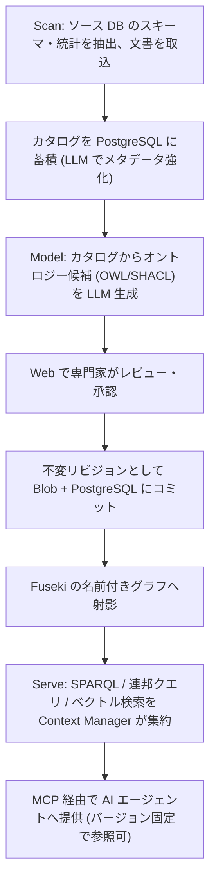

# Ontology Accelerator for Azure

企業のビジネスオントロジー(製品・顧客・ポリシーの機械可読モデル)を AI でドラフト生成し、専門家がレビュー・承認したうえで W3C 標準のナレッジグラフ(RDF/OWL/SPARQL)として保存し、MCP 経由で AI エージェントに提供する Azure ネイティブな OSS です。

AI エージェントに社内の用語・関係・ポリシーを「推測させる」のではなく、**人間が承認した、バージョン管理された、監査可能なコンテキスト**として渡すことを目的としています。

> **オントロジーやナレッジグラフをご存じない方へ**: 専門用語を使わない解説資料を用意しています → **[意味の設計図](https://nomhiro.github.io/ontology-accelerator-for-azure/introduction.html)**
> 何が嬉しいのか、どういう仕組みなのかを、同じ質問を「表」と「グラフ」で比べる対話図つきで説明しています。客先への説明にもそのまま使えます。

> **名称について**: `Ontology Accelerator for Azure` という表示名は**暫定**です。Microsoft および AWS の商標を製品名として使わない方針のため、公開時に変更する可能性があります。

---

## 現在のステータス: Phase 1(MVP「器が動く」)

製品として使える状態ではありません。何が動作確認済みで、何が未実装なのかを以下に正確に示します。

### 動作を確認済み(ローカル)

- `docker compose up` で Fuseki 6.2.0 + PostgreSQL 16 が起動する
- Fuseki の entrypoint が `samples/retail-core.ttl` から TDB2 を構築し、名前空間ごとのデータセット `retail-core` の名前付きグラフ `urn:ontology:graph/retail-core/1.0.0`(かつ既定グラフにも同じ内容)として読み込む(= 「再構築可能な射影」設計の実装)
- Fuseki は名前空間ごとに分離したデータセット(例: `retail-core`)の `/retail-core/sparql` が SPARQL 1.1 で応答する。データセット単位の物理分離が名前空間の隔離境界であり(`packages/api/tests/test_isolation.py` で検証)、固定の `ds` は予約された空のデータセットで実データは入らない
- Core API 経由の読み取りクエリが通り、更新クエリと `SERVICE` 句はガードで HTTP 400 になる
- Fuseki 側でも `SERVICE` の実行が無効化されている(HTTP 422 / SSRF 対策)。管理 API は無認証で 401
- クエリの**時間**の上限(`SPARQL_QUERY_TIMEOUT_SECONDS`、既定 30 秒)は効く。一方
  **結果件数の上限(`SPARQL_MAX_RESULTS`)は Phase 1 では未強制**で、値は保持され
  Bicep が注入しているが LIMIT を後付けする実装が無い(任意の SPARQL に対する
  安価で正しい強制手段が無いため)。強制は Phase 2 で対応する
- 名前空間 CRUD が PostgreSQL に永続化して動作する(作成時に Fuseki データセットも同時に作る)。削除(`DELETE /namespaces/{name}`)は、公開済みバージョンが Blob に1件でも残っていれば 409 Conflict で拒否する(オントロジーは不変リビジョンであり、レプリカ再作成後に削除済みのはずのデータが Blob から復活することを防ぐため)。
  **既知の制約**: この判定(Blob 一覧の取得 → PostgreSQL の行削除)の間に別リクエストが同じ名前空間へ同時に publish すると削除自体は通ってしまい、その publish が書いた Blob だけが正本(PostgreSQL)に対応する行を失った状態で残る、ごく狭い競合状態(TOCTOU)がある。完全に閉じるにはロックか二段確認が必要で Phase 2 の「監査付き削除」で対応する予定です。Phase 1 では `POST /admin/reconcile` の `orphan_blobs` でこの状態を検出できます(削除は運用者の手動判断に委ねており、自動削除はしません)
- **最小の承認フローが動作します(ADR-0010)。** `POST /namespaces/{ns}/versions` は版を
  `draft` として記録するだけで、Fuseki には一切射影しません。承認は別の操作です。
  ```
  POST /namespaces/{ns}/versions/{v}/submit    draft → in-review(名前付きグラフへ射影)
  POST /namespaces/{ns}/versions/{v}/approve   in-review → approved(既定グラフ + 名前付きグラフへ射影。
                                                前の approved は自動で superseded)
  POST /namespaces/{ns}/versions/{v}/reject    in-review → draft(reason 必須。名前付きグラフから外す)
  ```
  射影先は状態で分かれます(詳細は下記「自分のオントロジーを追加する」を参照)。
  **エージェント(`GRAPH` 句なしのクエリ)は常に承認済みの現行版だけを見ます。**
  レビュアは `GRAPH` 句で審査中(`in-review`)の版を検証できます。
  `draft` は Blob と PostgreSQL にのみ存在し、Fuseki には一切現れません。
- **名前空間ごとの権限が強制されます(ADR-0014)。** 認証済みであることは
  「何をしてよいか」を意味しません。名前空間ごとにロールを付与し、API が強制します。

  ```
  data-analyst  <  data-steward  <  maintainer  <  owner        (上位は下位を含む)
  ```

  | 操作 | 必要なロール |
  |---|---|
  | SPARQL 読み取り / 版の一覧 / 決定記録 / 監査照会 / 意味的差分 / SHACL 検証 / 廃止の検査 / 用語の責任者の参照 | `data-analyst` |
  | `publish` / `submit` | `data-steward` |
  | `approve` / `reject` | `maintainer` |
  | 用語の責任者の付与・取り消し | `maintainer` |
  | 名前空間の削除 / ロールの付与・取り消し | `owner` |
  | 名前空間の作成 / `POST /admin/reconcile` | `platform-admin`(Entra アプリロール) |

  **付与が 1 件も無い名前空間は「誰も権限を持たない」として扱います。**
  「付与が無ければ全員に許可」のような暗黙のフォールバックは作りません
  (「強制していない」を「強制している」と誤認させるため)。名前空間を作った主体は
  同じトランザクションで自動的に `owner` になります。
- **四眼原則が名前空間ごとに設定できます。既定は有効です。**
  有効な名前空間では、**その版を `publish` した主体はその版を `approve` できません**
  (HTTP 409)。`platform-admin` もここは飛び越えられません — 管理者が自分の提案を
  自分で承認できてしまうと、四眼原則が「管理者以外への制約」に成り下がるためです。
  **同梱サンプルの名前空間だけは `require_two_person_approval: false` で作られます**
  (`azd up` の `postdeploy` が 1 主体で publish → submit → approve するため)。
  **実運用の名前空間では有効のままにしてください。**
- lint (ruff) / 型検査 (mypy strict) / テスト (pytest 416 件) / Web ビルド (tsc + vite) / `az bicep build` / shellcheck がすべて通る

### 動作を確認済み(Azure 実環境 / japaneast)

`azd up` を実サブスクリプションで実行し、以下を確認しました。

- `azd up` が成功する(プロビジョニング 5 分 6 秒 + デプロイ 2 分 41 秒)。API / MCP / Fuseki / Web の 4 サービスがデプロイされる
- **Blob(正本)から Fuseki の entrypoint が TDB2 を再構築し、SPARQL を返す** — 「再構築可能な射影」設計が実環境で成立
  (名前付きグラフ `urn:ontology:graph/retail-core/1.0.0`、60 トリプル、OWL クラス 4 件、SHACL NodeShape 2 件。
  `postdeploy` が Core API 経由で承認まで行うため、既定グラフにも同じ内容が入る)
- Fuseki 側で `SERVICE` 句が HTTP 422 でブロックされる(SSRF 対策)
- Fuseki は internal ingress のため外部から到達できない
- API `/healthz` が応答し、トークン無しの `GET /namespaces` は **401**(`AUTH_MODE=entra` が機能)
- MCP `/mcp` が `tools/list` を返す(`list_namespaces` / `sparql_query` / `version_decisions` / `term_owner`)
- **MCP のツール呼び出しが実際の Entra トークンで Core API まで通る(ADR-0012)。** トークン無し・不正なトークンは MCP 側の検証で拒否され、理由がエージェントに返る。検証手順は `scripts/verify-mcp-auth.sh`
- API / MCP の scale-to-zero が機能する(初回アクセスはコールドスタート)

### 未実装・未検証

- **Scan / Model の機能は存在しません** — オントロジーの自動生成、スキーマ発見は Phase 2 です
- **ロールの付与は API のみです。** Web の管理画面はまだありません(`PUT /namespaces/{ns}/roles`)。
  また、責任者(オーナーシップとエスカレーション、`P2B-04`)は RBAC とは別のレイヤで未実装です
- MCP サーバーはツール定義まで。Ontop 連邦クエリ・ベクトル検索・OWL 推論は Phase 3〜4 です

つまり現時点の価値は、**設計ドキュメントと、その設計が成立することを確認できる最小の骨格**です。

---

## アーキテクチャ


ワークフローは **Scan → Model → Serve** の 3 段です。



設計上の最重要ポイントは、**トリプルストアを「いつでも作り直せる派生物」として扱う**ことです。正本(system of record)は PostgreSQL と Blob 上のバージョン付き TTL であり、Fuseki は起動時に Blob から再構築されます。詳細は [`docs/architecture.md`](docs/architecture.md) と [ADR-0002](docs/adr/0002-triple-store-as-rebuildable-projection.md) を参照してください。

---

## 特徴(設計目標)

- **W3C 標準に忠実** — RDF / OWL / SPARQL 1.1 / SHACL / R2RML をそのまま使います。独自のグラフ表現やクエリ言語を発明しません
- **ストアを持ち込める** — SPARQL 1.1 Protocol をハード境界としているため、`SPARQL_QUERY_ENDPOINT` / `SPARQL_UPDATE_ENDPOINT` / `SPARQL_GSP_ENDPOINT` を差し替えるだけで既存の GraphDB / Stardog / Amazon Neptune などを利用できます。アプリコードはストア実装に依存しません
- **MCP でエージェントに提供** — Model Context Protocol(Streamable HTTP)サーバーを同梱し、Foundry Agent Service などからツールとして接続できます。提供は読み取り専用です
- **azd 一発デプロイ** — リポジトリ自体が Azure Developer CLI テンプレートです。`azd up` を唯一のデプロイ手段とし、`azd down` で完全削除できることを保証します
- **監査可能** — オントロジーは不変リビジョン(コンテンツハッシュ + semver)として保存し、誰が提案・誰が承認・いつ・差分・理由を W3C PROV-O で記録します

現時点で**動作するもの**は、RDF / OWL / SPARQL 1.1 によるクエリ、ストアの差し替え、MCP による読み取り提供、`azd up` / `azd down`、submit/approve/reject による承認フロー、SHACL 検証、名前空間ごとの RBAC と四眼原則の強制、用語単位の責任者、監査の照会、意味的差分、そして廃止のライフサイクルです。
**未実装のもの**は、R2RML による連邦クエリ(Phase 3)、PROV-O による監査証跡の標準語彙での表現(`P2A-07`)、LLM によるオントロジー生成(Phase 2)、アクセスログと健全性指標(`P2B-05` / `P2B-06`)、保持ポリシー(`P2B-02`)です。
監査イベントの記録自体は Phase 1 で PostgreSQL に永続化されています。各フェーズの区切りは下記の[ロードマップ](#ロードマップ)を参照してください。

---

## クイックスタート

> **ローカル開発と `azd up` はいずれも動作確認済みです**(japaneast の実サブスクリプションで検証)。ただしオントロジーの生成・レビュー機能は未実装のため、デプロイして得られるのはサンプルオントロジーを SPARQL / MCP で参照できる状態までです。

### 前提ツール

| ツール | バージョン |
|---|---|
| Azure CLI | 最新 |
| Azure Developer CLI (`azd`) | 最新 |
| Docker | 最新(Compose v2 を含む) |
| uv | 最新 |
| pnpm | 最新 |
| Node.js | 22 |
| Python | 3.12 |
| just | 最新(タスクランナー) |

Windows 環境では、リポジトリ同梱の [Dev Container](.devcontainer/) を使うと上記が揃った環境が得られます。

### ローカル開発

タスクは `just` にまとめてあります(Windows / Linux / macOS で同じコマンドが使えます)。`just` だけを実行すると一覧が出ます。

`just dev-api` は uvicorn を直接起動するだけで、コンテナ用の `docker-entrypoint.sh` を経由しません。そのため Azure 実行時に注入される環境変数(`AUTH_MODE=entra` の既定値、Entra 経由の PostgreSQL 接続など)がここでは設定されず、そのままでは `just up` で立てたローカルの PostgreSQL に接続できません。**先に `.env` を用意してください。**

```bash
cp .env.example .env   # AUTH_MODE=disabled / POSTGRES_PASSWORD=localdev などローカル専用の値
just setup      # 依存関係を入れる (uv sync --all-packages + pnpm install)
just up         # Fuseki + PostgreSQL + Azurite を起動し、正本 Blob のコンテナを作る
just migrate    # PostgreSQL にテーブルを作る (alembic upgrade head)
just dev-api    # Core API を起動 (http://localhost:8000)
just dev-mcp    # MCP サーバーを起動 (別ターミナル)
just dev-web    # Web を起動 (別ターミナル)
just down       # 停止する (データは残る / just clean でデータも消す)
```

`.env` を用意せずに `just dev-api` を起動すると、`GET /namespaces` は次のいずれかで失敗します。`.env` が無ければまず 401(`AUTH_MODE` の既定 `entra` でトークン必須)、`AUTH_MODE=disabled` だけを指定しても `POSTGRES_PASSWORD` が空だと Entra 経由の接続に切り替わり 500、`just migrate` を実行していなければ `relation "namespaces" does not exist` で 500 になります。`.env.example` と `just migrate` はこれらすべてに対応します。

**`docker compose up` を直接使う場合は、続けて `uv run python scripts/init-local-storage.py` を実行してください。** Azurite には Blob コンテナを自動作成する仕組みがなく(本番は `infra/modules/shared.bicep` の `ontologyContainer` が作ります)、コンテナが無いと**オントロジーの公開(publish)と名前空間の削除が `ContainerNotFound` で失敗します**。名前空間の作成と SPARQL 参照は Blob を触らないため動いてしまい、原因が分かりにくい点に注意してください。`just up` はこの手順を含みます(冪等です)。

Fuseki の SPARQL エンドポイントは名前空間ごとのデータセットに立ちます。`just up` で読み込まれるサンプル(`samples/retail-core.ttl`)は名前空間 `retail-core` として `http://localhost:3030/retail-core/sparql` で応答します(固定の `/ds/sparql` は予約された空のデータセットなので応答はしますが 0 件しか返りません)。動作確認の例:

```bash
curl -s -X POST http://localhost:3030/retail-core/sparql \
  -H 'Content-Type: application/sparql-query' -H 'Accept: text/csv' \
  --data 'PREFIX owl: <http://www.w3.org/2002/07/owl#> SELECT ?c WHERE { ?c a owl:Class }'
```

3030 番や 5432 番を別のプロジェクトで使っている場合は、環境変数 `FUSEKI_PORT` / `POSTGRES_PORT` でホスト側のポートを変更できます。

ローカル開発では `AUTH_MODE=disabled` を指定することで Entra ID 認証をバイパスできます。指定方法は前述の `.env`(`.env.example` をコピーしたもの)です。

### Azure へのデプロイ

```bash
azd auth login
azd up          # just deploy でも同じ
```

`deploymentTier`(`minimal` / `production`)と `graphPersistence`(`ephemeral` / `azureFiles`)を Bicep パラメータで切り替えられます。評価目的であれば既定の `minimal` + `ephemeral` のままで構いません。

#### 初回デプロイ時の注意

- **サンプルオントロジーの投入は `postdeploy` フックが自動で行います**(`scripts/postdeploy.sh` / `scripts/postdeploy.ps1`)。手動で Blob にアップロードする必要はありません
  - **同梱サンプルは Core API 経由で投入されます。** `azd up` の `postdeploy` フックが、名前空間の作成 → publish → submit → approve を API に対して実行します。そのため PostgreSQL に行が入り、`GET /namespaces` と MCP の `list_namespaces` から**発見できます**(Azure 実機で検証済み)。フックが `postprovision` ではなく `postdeploy` なのは、`postprovision` の時点ではコンテナのイメージがまだプレースホルダで API が起動していないためです
- **Key Vault のロール割り当ては RBAC の伝播待ちで初回に失敗しうる**ため、失敗した場合は数分待って再実行してください
- **CI からサービスプリンシパルでデプロイする場合**は `principalType=ServicePrincipal` を指定してください。`principalId` が空だと Key Vault Secrets Officer の割り当てが作られないため、シークレット書き込み権限を別途付与する必要があります
- `graphPersistence: azureFiles` を選ぶ場合、Azure Files は **SMB (Premium)** でマウントします。NFS はカスタム VNet が必須で `minimal` ティアと両立しないためです。この構成は**単一レプリカ前提**である点に注意してください(詳細は [ADR-0002](docs/adr/0002-triple-store-as-rebuildable-projection.md))
- Static Web Apps は japaneast に対応していないため、Web だけ `webLocation`(既定 `eastasia`)で別リージョンに配置されます

### 自分のオントロジーを追加する

**経路は Core API の publish → submit → approve です。** 名前空間の作成(`POST /namespaces`)の後、以下の順で呼びます(ADR-0010)。

```
POST /namespaces/{ns}/versions                    正本(Blob + PostgreSQL)に draft として記録する。Fuseki には一切射影しない
                                                    201=新規作成 / 200=同一内容の再投入(冪等)
POST /namespaces/{ns}/versions/{v}/submit          draft → in-review。名前付きグラフへ射影する(GRAPH 句を書けばレビュアが見える)
POST /namespaces/{ns}/versions/{v}/approve         in-review → approved。既定グラフ + 名前付きグラフへ射影する。
                                                    同じ名前空間の前の approved 版は自動で superseded になる
POST /namespaces/{ns}/versions/{v}/reject          in-review → draft(body に reason が必須)。名前付きグラフから外す
GET  /namespaces/{ns}/versions/{v}/decisions      この版の決定記録(誰が・いつ・なぜ)を起きた順に返す
POST /namespaces/{ns}/versions/{v}/validate       この版を SHACL で検証する(状態は変えない)
```

**同時編集は `base_version` で検出します(P1-13)。** `POST /namespaces/{ns}/versions` の body に、編集の基準にした版を渡してください。名前空間の最新版と一致しなければ **409** を返します(HTTP の `If-Match` に相当します)。

```json
{ "turtle": "...", "base_version": "1.2.0" }
```

渡さないと検査しません。**人が編集する経路では必ず渡してください。** 渡さない場合、2 人が同じ版から編集して公開すると、版番号は自動採番で衝突しないため、**後の版が前の変更を静かに消します**。最初の公開では渡しません(まだ基準が無いため)。

同じ本文の再送(タイムアウト後のリトライ)は、`base_version` が古くても 409 になりません。内容ハッシュによる冪等判定が基準バージョンの検査より先にあるためです。

**エージェント(`GRAPH` 句を書かないクエリ)は常に承認済みの現行版だけを見ます。** `draft` は Blob と PostgreSQL にのみ存在し、Fuseki には一切現れません。レビュアは `GRAPH` 句で `in-review` の版を検証してから approve してください。

**この操作には権限が必要です([ADR-0014](docs/adr/0014-namespace-rbac.md))。** `publish` / `submit` は `data-steward` 以上、`approve` / `reject` は `maintainer` 以上です。足りなければ **403** を返します。

**四眼原則が有効な名前空間では、その版を `publish` した主体は `approve` できません。** その場合は **409** を返します。403 と分けているのは**運用者が取るべき対処が違う**ためです — 権限不足はロールを付与すれば解決しますが、四眼原則違反は「別の人に承認してもらう」しかありません。同じ 403 に混ぜると、ロールを足して解決しようとして解決しません。

提案者は「その版を `publish` した主体」で判定します。`submit` は「レビューに出す」という事務的な操作でありうる(他人の `draft` を代わりに submit することは自然に起こる)ため、内容の責任は publish 側にあります。

```bash
# 名前空間ごとのロールを付与する(owner が必要)
curl -X PUT "$API/namespaces/retail-core/roles" \
  -H "Authorization: Bearer $TOKEN" -H 'Content-Type: application/json' \
  -d '{"principal_id": "<Entra のオブジェクト ID>", "role": "maintainer"}'

# 付与を一覧する
curl "$API/namespaces/retail-core/roles" -H "Authorization: Bearer $TOKEN"

# 取り消す(最後の owner は取り消せない。409)
curl -X DELETE "$API/namespaces/retail-core/roles/<オブジェクト ID>" \
  -H "Authorization: Bearer $TOKEN"
```

**`principal_id` は Entra のオブジェクト ID です。** UPN や表示名ではありません(UPN は変わりうるし、ゲストの `#EXT#` 形式は書き換えの罠があります)。

#### MCP から Core API への認証

**エージェントは Core API 向けのアクセストークンを取得し、それを MCP へ渡します。** MCP と Core API は同一のアプリ登録(同一オーディエンス)を共有しているため、トークン交換は要りません([ADR-0012](docs/adr/0012-mcp-to-core-api-authentication.md))。

```
Authorization: Bearer <api://<appId>/.default のアクセストークン>
```

MCP は受け取ったトークンを**自分で検証してから** Core API へそのまま転送します。ヘッダの存在を識別子の主張として扱いません。転送するのは `Authorization` だけで、`Cookie` などは転送しません。

この設計により、**監査イベントの `actor` が実際のエージェントを指します。** MCP のマネージド ID で Core API を呼ぶ実装にすると、Core API から見た呼び出し元が常に MCP になり、「誰の問い合わせに対してどのバージョンを返したか」が記録できなくなります(ADR-0006 の帰属が壊れます)。

`AUTH_MODE=disabled`(ローカル開発専用)では検証も転送も行いません。

#### SHACL 検証は承認を止めます

**`approve` は SHACL 検証を行い、違反があれば 422 で拒否します**（[ADR-0005](docs/adr/0005-reasoner-boundary.md) 決定1・[ADR-0009](docs/adr/0009-ontology-operations.md) 決定1）。SHACL 適合性は形式的に決定可能なので、機械が確定的に判定してブロックします。検証は状態遷移より前に行うため、拒否されたときに状態は変わりません。

**`publish` は止めません。** `draft` は編集途中でありうるためです（publish と approve の分離は [ADR-0010](docs/adr/0010-approval-and-projection.md) 決定1）。レビュー中に違反を確認するには `POST /namespaces/{ns}/versions/{v}/validate` を呼んでください（状態を変えずに報告だけ返します）。

検証は 2 段階です。

1. **shapes 自体**を SHACL-SHACL で検証します。`sh:targetClass` がリテラルを指しているような shape は**どのノードにも当たらない**ため、データ検証では「違反ゼロ」になります。制約を書いたつもりが何も検査していない状態を、この段階が捕まえます
2. **データ**を shapes で検証します。ADR-0005 の本題です

**制約名のタイプミス（`sh:minCoun` など）は検出できません。** SHACL の処理系は知らない述語を無視する仕様のためで、既知の限界としてテストに固定しています。

**「検証できなかった」は違反として扱いません。** Blob へ到達できない場合などは 502 を返します。「制約を満たしている」と「確かめられなかった」を混同すると、壊れた定義を承認してしまいます。

外部の実データへの適用（定義と実データの乖離検出）は Phase 3 です。Ontop 経由の連邦クエリが前提になります。

#### 想定質問（Competency Questions）で「目的を果たしているか」を判定する

**「このオントロジーは○○に答えられなければならない」を SPARQL として書き、CI で回します**（[ADR-0009](docs/adr/0009-ontology-operations.md) 決定6）。品質スコア型の評価は採りません — 点数が下がった理由が行動に結びつかないからです。想定質問なら、落ちたときに何を直すべきかが自明です。

```yaml
# samples/retail-core.questions.yaml
questions:
  - id: cq-01-order-to-customer
    question: 注文から、その注文を出した顧客へ辿れるか
    expect: ask_true
    sparql: |
      PREFIX rdfs: <http://www.w3.org/2000/01/rdf-schema#>
      PREFIX retail: <https://example.com/ontology/retail#>
      ASK { ?p rdfs:domain retail:Order ; rdfs:range retail:Customer . }
```

```bash
just check-questions                                    # 同梱サンプルに対して
just check-questions my.questions.yaml my-namespace     # 自分の名前空間に対して
```

**判定モードが 3 つあるのは、スキーマだけのオントロジーには行を返す質問が書けないからです。**

| `expect` | 意味 | 主な用途 |
|---|---|---|
| `ask_true` | ASK が true | **語彙の表現力**。「その問いに答えるための語彙と関係が存在するか」 |
| `non_empty` | SELECT が 1 行以上 | **データ検索**。実データがある場合（Ontop 連携後） |
| `empty` | SELECT が 0 行 | **規約の遵守**。「ラベルの無いクラスが無いこと」 |

`empty` は決定1 の「合意済みの規約（命名規則、必須項目）はテストとして機械が実行する」をそのまま満たします。想定質問と規約チェックを同じ仕組みで書けます。

**想定質問は読み取り専用に強制されます。** SPARQL Update と `SERVICE` 句はファイルの読み込み時に拒否されます。

現時点ではリポジトリ内の質問ファイルを CI で回すところまでです。デプロイ済みの名前空間に質問を紐づける仕組み（承認をブロックするかを含む）は Phase 2 の `P2B-14` です。

#### 「なぜそう決めたか」を記録して読み出す

**publish / submit / approve の body に `reason` を渡してください。** `audit_events` に記録され、`GET /namespaces/{ns}/versions/{v}/decisions` で起きた順に読み出せます（[ADR-0009](docs/adr/0009-ontology-operations.md) 決定7）。

```json
{ "turtle": "...", "reason": "顧客区分の定義を営業部の合意に合わせた" }
```

**理由は任意ですが、人が操作する経路では必ず書いてください。** 「誰が承認した定義に基づく答えかを説明できること」がこの製品の中核価値です（[ADR-0006](docs/adr/0006-ontology-versioning-and-audit.md)）。理由が空の監査は説明になりません。`reject` だけは最初から必須です。

**エージェントは MCP の `version_decisions` ツールで同じ記録を読めます。** `sparql_query` が返すのは定義そのもので、その定義を誰が承認したか・なぜそう決めたかは含まれません。答えの根拠を示す必要があるときに使います。

`superseded`（別の版の承認による自動遷移）の理由はシステムが書きます。**`diff`（意味的差分）は `approve` の記録に入ります**（下記「意味的差分を見る」）。最初の承認では基準が無いため `null` です。

#### オントロジーを縮める(廃止のライフサイクル)

**用語を削除することはできません。** 現行の承認済み版にあった用語を消した版は、`approve` が **422** で拒否します（[ADR-0009](docs/adr/0009-ontology-operations.md) 決定3・[ADR-0017](docs/adr/0017-deprecation-lifecycle.md)）。追加しかできないオントロジーは必ず腐るため、**縮める手段は用意されていますが、それは削除ではなく廃止です。**

```turtle
# 正しい縮め方: 残したまま廃止し、後継を示す
ex:Customer a owl:Class ;
    rdfs:label "顧客" ;
    owl:deprecated true ;
    dcterms:isReplacedBy ex:Party .
```

**後継が無い廃止も正当です**（間違って作った用語、統合されずに消える概念）。その場合は理由を書いてください。**後継か理由のどちらかが必要**で、両方は要りません。

```turtle
ex:Bogus a owl:Class ;
    owl:deprecated true ;
    rdfs:comment "誤って作成したため廃止。後継はありません" .
```

承認前に検査できます。

```bash
curl "$API/namespaces/retail-core/versions/2.0.0/deprecations" \
  -H "Authorization: Bearer $TOKEN"
```

```json
{ "base_version": "1.0.0", "blocking": false,
  "problems": [ { "kind": "references-deprecated",
                  "term": "https://example.com/ontology/retail#Order",
                  "blocking": false, "message": "...",
                  "referenced": "https://example.com/ontology/retail#Customer" } ] }
```

**ブロックするのは 2 つだけです。**

| 検査 | 扱い | 従う手段 |
|---|---|---|
| `removed`（IRI の削除） | **422 で拒否** | 削除せず `owl:deprecated` を立てる |
| `no-successor-or-reason`（後継も理由も無い廃止） | **422 で拒否** | どちらかを書く |
| `references-deprecated`（生きている用語が廃止済みを参照） | **報告のみ** | 後継へ張り替える（そのままでも承認できます） |

**最後をブロックしないのは、SHACL の形状やマッピングが廃止された用語を正当に参照するから**です。旧データを検証する形状や旧→新のマッピングを禁止してしまうためです。`dcterms:replaces` と `rdfs:seeAlso` による参照は歴史的参照として最初から問題に数えません。

**クエリの結果に廃止済みの用語が現れたら警告します。** 置き場所は層によって違います。

- **Core API**: `X-Ontology-Deprecated-Terms` **レスポンスヘッダ**。本文は標準の SPARQL Results JSON のままです（[ADR-0001](docs/adr/0001-rdf-store-selection.md) の「SPARQL 1.1 Protocol をハード境界にする」を守るため、本文に独自のキーを混ぜません）
- **MCP**: ツール結果の**本文**に `deprecation_warnings` が付きます。**エージェントはヘッダを見ない**ので、ここで届かなければ廃止された用語を自信を持って使ってしまいます

**廃止された用語は引き続き引けます。** 廃止は「もう使うな」であって「無かったことにする」ではありません。過去のデータを解釈するために IRI は残り続けます（SNOMED CT や GO が IRI を削除・再利用しないのと同じ理由です）。

#### 意味的差分を見る

**承認すると、前の `approved` 版との意味的差分が `audit_events.diff` に記録されます**（[ADR-0016](docs/adr/0016-semantic-diff.md)）。承認前にレビューするための口も別にあります。

```bash
# 現在の approved 版との差分(状態は変わりません。data-analyst で読めます)
curl "$API/namespaces/retail-core/versions/2.0.0/diff" -H "Authorization: Bearer $TOKEN"

# 基準を明示する
curl -G "$API/namespaces/retail-core/versions/2.0.0/diff" \
  --data-urlencode "base=1.0.0" -H "Authorization: Bearer $TOKEN"
```

```json
{ "namespace": "retail-core", "version": "2.0.0", "base_version": "1.0.0",
  "diff": { "empty": false, "triple_status": "exact",
            "added_terms": ["https://example.com/ontology/retail#Shipment"],
            "removed_terms": [], "deprecated_terms": [],
            "modified_terms": ["https://example.com/ontology/retail#Product"],
            "has_removed_terms": false, "truncated": false } }
```

**接頭辞・トリプルの順序・空白ノードのラベルの違いは差分になりません。** テキスト差分ではこれが守れないため、rdflib の正規化を使っています。

**`removed_terms` と `deprecated_terms` は別物です。** [ADR-0009](docs/adr/0009-ontology-operations.md) 決定3 は「オントロジーは縮められなければならない。ただし IRI を削除も再利用もしない」と定めています。**廃止（`owl:deprecated true` を付ける）が正しい縮め方で、削除は規律違反です。** `has_removed_terms` が `true` なら規律違反が起きています。

**削除は承認をブロックします**（[ADR-0017](docs/adr/0017-deprecation-lifecycle.md)）。差分自体は報告に留まりますが、`approve` は 422 で拒否します。詳しくは上の「オントロジーを縮める」を参照してください。

**`triple_status` を必ず見てください。** 空白ノードが 300 個を超える版では、トリプル単位の差分と `modified_terms` が得られません（`skipped-too-many-blank-nodes` になり、`modified_terms` は `null`）。**「差分が無い」と「計算できなかった」を混同しないため**に、空の一覧を返さずに `null` にしています。`added_terms` / `removed_terms` は空白ノードの数に関係なく常に厳密です。

正規化のコストは空白ノードの数だけで決まります（トリプル総数はほとんど効きません）。実測で 2 グラフの差分が 300 個で 2〜4.5 秒、500 個で 8 秒、1,000 個で 42 秒です。SHACL の property shape は 1 つずつ空白ノードを作ります。

**監査に保存されるのは要約です。** 版は Blob に不変で残るため、厳密な差分はいつでも再計算できます（監査行に全トリプルを積むと行が非有界に育ちます）。用語の一覧は 50 件で切り、切った場合は `truncated` が `true` になります。

#### 監査証跡を照会する

**`GET /namespaces/{ns}/audit` で名前空間全体の監査を新しい順に読めます**（`data-analyst` が必要）。「先週この名前空間で何が起きたか」「この人が何をしたか」を追うための口です。版単位の `decisions` が「1 つの版の根拠」を起きた順に返すのに対し、こちらは絞り込みとページングつきで名前空間全体を返します。

```bash
# 直近 50 件
curl "$API/namespaces/retail-core/audit" -H "Authorization: Bearer $TOKEN"

# 特定の主体が承認した記録だけ
curl -G "$API/namespaces/retail-core/audit" \
  --data-urlencode "action=approved" \
  --data-urlencode "actor=<Entra のオブジェクト ID>" \
  -H "Authorization: Bearer $TOKEN"

# 期間で絞る(タイムゾーン必須。since は含み、until は含まない)
curl -G "$API/namespaces/retail-core/audit" \
  --data-urlencode "since=2026-09-01T00:00:00Z" \
  --data-urlencode "until=2026-09-08T00:00:00Z" \
  -H "Authorization: Bearer $TOKEN"

# 次のページ(前のレスポンスの next_cursor をそのまま渡す)
curl -G "$API/namespaces/retail-core/audit" \
  --data-urlencode "limit=100" --data-urlencode "cursor=1234" \
  -H "Authorization: Bearer $TOKEN"
```

```json
{ "events": [ { "action": "approved", "actor": "...", "occurred_at": "...",
                "subject": "retail-core@2.0.0", "reason": "...", "diff": null } ],
  "next_cursor": 1234 }
```

**`next_cursor` が `null` なら最後のページです。** 件数が `limit` ちょうどでもそうなります — 「返った件数が `limit` より少ないから最後」という判定はしないでください。

**ページングの鍵は `id` で、`occurred_at` ではありません。** `occurred_at` は PostgreSQL の `now()`（トランザクション開始時刻）なので、同一トランザクション内で記録された複数のイベントは同じ値になります。時刻でページングすると境界で取りこぼします。`id` は追記専用テーブルの単調増加する主キーなので、照会中に新しいイベントが追記されても既読のページは動きません。

**日時にはタイムゾーンを付けてください**（付いていなければ 422）。素朴に UTC と解釈しないのは、監査の照会で 9 時間ずれた結果を返すのが「何も返らない」よりたちが悪いからです。

**`limit` の上限は 500 です。** `audit_events` は追記専用で無限に伸びるため（[ADR-0011](docs/adr/0011-database-privilege-separation.md) 決定2 で `DELETE` を剥奪しています）、上限が無いと 1 リクエストで全件を読み出せてしまいます。

#### 「この用語は誰に聞けばよいか」を記録して解決する

**用語ごとに責任者を置けます**（[ADR-0015](docs/adr/0015-term-owners.md)、[ADR-0009](docs/adr/0009-ontology-operations.md) 決定4）。`created_by` / `approved_by` は「その時の行為者」であって現在の責任者ではありません。差分レビューのルーティング先と、健全性指標（`P2B-06`）の「責任者が未設定の用語」の原資料になります。

```bash
# 責任者を割り当てる(maintainer が必要。冪等)
curl -X PUT "$API/namespaces/retail-core/term-owners" \
  -H "Authorization: Bearer $TOKEN" -H 'Content-Type: application/json' \
  -d '{"term_iri": "https://example.com/ontology/retail#Product",
       "principal_id": "<Entra のオブジェクト ID>"}'

# 一覧する(data-analyst で読める)
curl "$API/namespaces/retail-core/term-owners" -H "Authorization: Bearer $TOKEN"

# 「この用語は誰に聞けばよいか」を解決する
curl -G "$API/namespaces/retail-core/term-owners/resolve" \
  --data-urlencode "term_iri=https://example.com/ontology/retail#Product" \
  -H "Authorization: Bearer $TOKEN"

# 外す(maintainer が必要。設定が無ければ 404)
curl -X DELETE -G "$API/namespaces/retail-core/term-owners" \
  --data-urlencode "term_iri=https://example.com/ontology/retail#Product" \
  -H "Authorization: Bearer $TOKEN"
```

**責任者は権限ではありません。** 責任者に指定されただけでは何の操作も許されません。名前空間単位の責任者は RBAC の `owner` ロールが担い、用語単位だけがこの仕組みです（権限では表現できない粒度がここにあります）。

**解決には順にフォールバックします。** 用語の責任者 → 名前空間の `owner` → 解決不能。**どれで解決したかは `source` で返ります。**

```json
{ "namespace": "retail-core",
  "term_iri": "https://example.com/ontology/retail#Product",
  "source": "namespace-owners",
  "principal_ids": ["..."] }
```

**`source` を必ず見てください。** `namespace-owners` は「その用語に責任者がいない」という意味です。問い合わせ先が返ってきたことだけで満足すると、責任者が未設定であることを見落とします。

権限に暗黙のフォールバックを作らないと決めた（[ADR-0014](docs/adr/0014-namespace-rbac.md) 決定6）のに、ここではフォールバックする理由は**安全側の向きが逆だから**です。権限は「無いなら拒否」が安全側ですが、ルーティングは「無いなら上位に回す」が安全側です — 誰にも届かない問い合わせは放置され、放置されたことも分かりません。

**用語が実在するかは検査しません。** トリプルストアは再構築可能な射影であって正本ではないため、存在確認は正本への書き込みを射影の可用性に依存させてしまいます。また、まだ承認されていない版で定義される用語に先に責任者を決めておくことは自然に起こります。**その代わり、責任者を外すときに設定が無ければ 404 を返します** — IRI のタイプミスに気づける唯一の経路です。

**`base_iri` 配下でない IRI にも責任者を置けます。** 外部語彙への `skos:closeMatch` を張ったとき、そのマッピングの妥当性について説明責任を負うのは張った側だからです。

**エージェントは MCP の `term_owner` ツールで同じ解決を引けます。** `version_decisions` が「誰が承認したか」（過去の行為者）を返すのに対し、こちらは**現在の責任者**を返します。承認した人が今も担当しているとは限りません。

なお**名前空間全体の監査照会は MCP に出していません。** エージェントが必要とするのは「この定義の根拠」であって「名前空間の全履歴」ではないためです。

#### `POST /admin/reconcile` の報告の読み方

トリプルストアは正本ではなく**再構築可能な射影**です（[ADR-0002](docs/adr/0002-triple-store-as-rebuildable-projection.md)）。`reconcile` は正本（PostgreSQL + Blob）を基準にストアの状態を揃えます。**背景では動きません** — 運用者が明示的に叩いたときだけ実行されます（[ADR-0013](docs/adr/0013-reconcile-repairs-observed-divergence.md) 決定6）。

報告の各項目は意味が違います。

| 項目 | 意味 | reconcile の動作 |
|---|---|---|
| `versions_projected` | 書き込み経路が完了していなかった版 | 射影した |
| `graphs_removed` | 射影されているべきでないのに残っていたグラフ | 削除した |
| `missing_graphs` | 射影されているべきなのに無かったグラフ・既定グラフ | 報告した（下記のとおり修復も試みる） |
| `graphs_repaired` | 上記のうち再射影できたもの | 修復した |
| `foreign_graphs` | 自分たちの IRI 接頭辞に一致しないグラフ | **報告のみ**（削除しない） |
| `orphan_datasets` / `orphan_blobs` | 正本に対応が無いデータセット・TTL | **報告のみ**（削除しない） |
| `failures` | 個別に失敗したもの | 続行して報告した |

**`graphs_repaired` が空でないことは成功報告ではありません。** 正常な運用でストアの内容が失われることはないので、空でないなら上流に原因があります（ローダのスキップ、ストアの再作成、手動操作）。`reconcile` はマニフェストも正本から再生成するため、原因がマニフェストの欠落・破損であれば原因自体も直りますが、それ以外（Blob へ到達できない、`GRAPH_IRI_BASE` の食い違い、ローダのクラッシュ）なら**毎回症状だけを消し続けます**。

**`superseded` の版は `reconcile` の対象外です。** ストアに載せるかを決めるのはローダだけ（`SUPERSEDED_RETAIN`）で、`reconcile` は欠落を報告も修復もせず、存在していても削除しません。反映させる手段は再構築です。

#### Blob のレイアウト

正本 TTL とは別に、名前空間ごとに承認状態のマニフェストを Blob に置きます(ADR-0010 決定7)。`load-snapshot.sh` はこのマニフェストだけを見て、どの版をどこへ読み込むか(名前付きグラフのみ/既定グラフにも)を決めます。PostgreSQL は一切参照しません。

```
<接頭辞><namespace>/<version>.ttl        正本 TTL。接頭辞の既定値は `versions/`
<接頭辞><namespace>/_state.json          承認状態マニフェスト(current・各版の status)
```

例: `versions/retail-core/1.0.0.ttl` と `versions/retail-core/_state.json`。接頭辞は `BLOB_PREFIX` 環境変数(`ontology_core.config.Settings.ontology_blob_prefix`)で変更できます。

以下の Blob 直接投入は、**Core API を使わずに正本へ直接置く場合の参考**です。この方法では PostgreSQL に行が作られないため、`GET /namespaces` や MCP の `list_namespaces` からは見えません(SPARQL では見えます)。**通常は Core API の publish → submit → approve を使ってください**(同梱サンプルの投入もそちらに移行済みです)。

- **名前空間名**: 小文字英数字とハイフンのみ、2〜63 文字、先頭は英数字(`ontology_core.graphs.validate_namespace_name`)。予約名 `ds` は使えません(Fuseki の固定・空データセット用に予約されています)
- **バージョン文字列**: 英数字と `. + -` のみ、1〜64 文字、先頭は英数字(`ontology_core.graphs.validate_version`)。ファイル名としては `<version>.ttl` になります
- 階層が無い Blob(名前空間のディレクトリが無いもの。例: `versions/retail-core.ttl`)は `load-snapshot.sh` が**黙ってスキップ**します。エラーにはならないので、投入したはずのファイルが見えない場合はまずパス形式を確認してください
- **`_state.json` を書かないと、その名前空間は `load-snapshot.sh` に丸ごとスキップされます。** マニフェストが無い名前空間を「未承認も含めて全部読み込む」と推測することはしません(それが元の Critical でした)。同梱サンプルは `postdeploy` が Core API 経由で承認するため、API がマニフェストを書きます
- 反映には **Fuseki のリビジョン再起動**が必要です(`azd deploy` や ACA のスケールイベント等)。entrypoint が起動時に Blob から TDB2 を再構築する設計のため、Blob に置くだけでは既存レプリカには反映されません

### 削除

```bash
azd down --purge   # just destroy でも同じ
```

`--purge` は論理削除保護のあるリソース(Key Vault 等)も完全に削除します。課金を止めるにはこの手順まで実行してください。

---

## 必要な Azure 権限と Entra ID の前提

- **サブスクリプションに対する権限**: リソースグループの作成とロール割り当てを行うため、`Contributor` に加えて `User Access Administrator`(または `Owner`)相当が必要です。Managed Identity へのロール割り当てを IaC が行います
- **Entra ID App 登録**: 人間の認可コードフロー、およびエージェントの client credentials フローのために App 登録が必要です。テナントで App 登録が禁止されている場合、テナント管理者への依頼が必要になります
- **`platform-admin` アプリロールが必要です([ADR-0014](docs/adr/0014-namespace-rbac.md) 決定2・3)。** 名前空間の作成と `POST /admin/reconcile` はこのロールを要求します。**`azd up` の `postdeploy` は同梱サンプルの名前空間を作るため、これが無いと 403 で止まります。**

  ```bash
  # アプリロールを定義し、az にログイン中の主体に割り当てる(冪等)
  just setup-app-role
  # 何をするかだけ見る
  just setup-app-role --dry-run
  # エージェントのサービスプリンシパルに割り当てる
  just setup-app-role --principal-id <オブジェクト ID>
  ```

  `ENTRA_API_AUDIENCE` を azd 環境から拾います。別のアプリ登録を対象にするときは `--app-id <appId>` を渡してください。

  **`azd provision` の前に自動で確認します。** `preprovision` が発行済みトークンの `roles` クレームを見て、`platform-admin` が無ければ**プロビジョニングを始めずに止めます**(そこまで進んでから `postdeploy` で 403 になると、約 11 分と課金を無駄にするためです)。**確認できなかったときは止めません** — 「権限が無い」と「確認できなかった」は違い、後者でデプロイを止めると確認の仕組み自体が障害になります。

  手元のトークンで確認するには次を実行してください。

  ```bash
  az account get-access-token --scope "api://$ENTRA_API_AUDIENCE/.default" \
    --query accessToken -o tsv | uv run python scripts/check-platform-admin.py
  ```

  **ロールはトークンの `roles` クレームで届きます。** 割り当て直後は既存のトークンに反映されないため、取り直してください(反映には数分かかることがあります)。`AUTH_MODE=disabled`(ローカル開発)では `Principal.local_dev()` が `platform-admin` を持つので開発は止まりません。

  **アプリ登録は `azd down` では消えません。** ARM のリソースではなくテナントに残る永続的な成果物なので、Bicep からは作れず、この手順が別に必要になります。

  **名前空間を作った主体は自動的にその名前空間の `owner` になります。** そのため運用者は作成後、追加の付与なしに publish / approve まで行えます(同梱サンプルは四眼原則を無効で作るため approve も通ります)。
- **App 登録権限がない場合**: `AUTH_MODE=disabled` の **ローカル専用 dev モード**を用意しています。認証を完全に無効化するため、**ローカル開発以外では絶対に使用しないでください**。Azure へデプロイした環境でこのモードを有効にしてはいけません
- **PostgreSQL の権限分離([ADR-0011](docs/adr/0011-database-privilege-separation.md))**: API / MCP / Fuseki が共有する UAMI は PostgreSQL の Entra 管理者ではなく、テーブルの所有権も DDL 権限も持たない非管理者ロールです。侵害されても `azure_pg_admin` 権限は奪われず、`audit_events`(監査証跡)の `DELETE` もできません(追記専用)。テーブルの所有者は専用ロール `ontology_owner`(`NOLOGIN`)で、Entra 管理者は**デプロイを実行する運用者**(`azd up` を実行するユーザー、または CI のサービスプリンシパル)が務めます
  - **無人の CI/CD では動きません。** マイグレーション(`alembic upgrade head`)は `postdeploy` フックで運用者自身が `ontology_owner` として実行します。運用者のマシンから PostgreSQL に届くよう、`postdeploy` が一時的なファイアウォール規則を作って最後に削除します(常時開けたままにはしません)。`publicNetworkAccess: Disabled` の `production` プロファイルでこの経路は成立しないため、VNet 内で実行されるマイグレーション経路は Phase 4 で設計します
  - **API 起動時にテーブルが無い窓があります。** マイグレーションが `postdeploy`(deploy の後)に移ったため、API コンテナは一時的にテーブルが無い状態で起動しえます。`/healthz` は DB を触らないため起動確認自体は通りますが、DB を触るエンドポイントは `postdeploy` 完了までエラーを返します
  - **複数の運用者でマイグレーションを実行する場合**、それぞれの Entra 管理者に `GRANT ontology_owner TO "<運用者>"` が必要です(`scripts/bootstrap-db.py` は現在ログイン中の運用者自身にしか付与しません)

## Microsoft Foundry モデルのリージョン可用性

オントロジー帰納に使う LLM は Microsoft Foundry(Azure OpenAI 系)を利用しますが、**Japan East で利用できるモデルは限られます**。モデル用リージョンをアプリ用リージョンと分離できる Bicep パラメータを用意する設計です。デプロイ前に、使用したいモデルが対象リージョンで提供されているかを Azure のリージョン可用性ドキュメントで確認してください。

---

## コスト目安

Japan East の retail 価格(USD)に基づく**見積り**です。実際の課金額は使用状況・為替・価格改定により変動します。単価の出典と計算式は [`docs/cost-estimate.md`](docs/cost-estimate.md) に記載しています。

| 構成 | 月額(見積り) |
|---|---|
| minimal / Phase 1 MVP(Fuseki 0.5 vCPU、AI Search 未デプロイ) | **$39〜49** |
| minimal / Phase 1 MVP(Fuseki 1 vCPU、推奨) | **$51〜61** |
| Phase 3 以降(AI Search Basic 追加) | **$136〜158** |
| production(参考概算) | **$700〜1,200** |
| Microsoft Foundry (LLM) | 従量。中規模スキーマ 1 回の帰納で $1〜5 程度 |

> **idle 課金は実測で確認済みです**（2026-09-09）。Azure Container Apps の idle 単価は active の 1/8 で、Fuseki が常時 active と判定されると 1 vCPU 構成で最悪 月 $105 前後まで上振れする懸念がありました。**実測の結果、Fuseki は待機時に idle の条件（0.01 vCPU 未満・受信 1,000 B/s 未満・リクエスト 0・レプリカ数が `minReplicas` と一致）を約 4 倍の余裕で満たしており、この上振れは起きません。** 判定条件・実測データ・その限界は [`docs/cost-estimate.md`](docs/cost-estimate.md) に記載しています。なお **idle 割引は vCPU にしか効きません**（メモリは active と同単価）。

`azd down --purge` で全リソースを削除できるため、評価後にコストを止められます。

---

## ロードマップ

各 Phase は「完了時にできるようになること」で区切っています。

| Phase | 名称 | 完了時にできること |
|---|---|---|
| **Phase 1** | MVP「器が動く」 | `azd up` 一発で ACA + Fuseki + API + MCP + PostgreSQL がデプロイされ、同梱サンプルオントロジーを SPARQL で検索でき、AI エージェントが MCP(`sparql_query` / `list_namespaces`)経由で参照できる。名前空間 CRUD、Entra JWT 検証、SPARQL 攻撃面対策(読み取り専用・`SERVICE` 封鎖・上限)を含む。AI 機能はまだない |
| **Phase 2** | Scan/Model + 運用 | 顧客 DB 接続とスキーマ自動発見(scan-job)、LLM によるオントロジー候補生成(OWL/SHACL)、Web でのレビュー・承認フロー(グラフ可視化含む)、バージョニングと監査証跡、pyshacl による SHACL 検証、名前空間 RBAC の強制。**加えて運用の柱**として、廃止のライフサイクル、責任者、健全性指標、想定質問の SPARQL テスト、OWL 推論器の CI 投入（Phase 4 から前倒し）を含む |
| **Phase 3** | Serve フル「エージェントがフル活用できる」 | Ontop VKG(R2RML 管理 + 実データを実体化しない連邦クエリ)、AI Search 統合(ベクトル/ハイブリッド検索、`search_context` ツール)、Metric Service、Context Manager のオーケストレーション、(任意)Purview コネクタ |
| **Phase 4** | ハードニング「本番品質・OSS 公開」 | reasoner-job(OWL 推論)、production プロファイル(VNet / Private Endpoint / AKS 昇格ガイド)、可観測性・負荷試験、awesome-azd 申請、v0.1.0 リリース |

Phase 2 が**2 本柱**（AI が作れる / 運用し続けられる）である点は当初のロードマップからの変更です。オントロジーが増え続けたときに人の理解が追従できなくなる問題への対処で、根拠は [ADR-0009](docs/adr/0009-ontology-operations.md) に記録しています。

**各 Phase の完了条件と現在の達成状況は [`docs/roadmap.md`](docs/roadmap.md)、残っているタスクは [`docs/backlog.md`](docs/backlog.md) にあります。**

Phase 1 の必須スパイク 3 件は**すべて完了しました**。①起動時再構築の所要時間 4.6 秒、②ACA の idle/active 課金比率（Fuseki は待機時に idle の条件を満たす。上記）、③Ontop 配布物のライセンス（公式イメージに JDBC ドライバは同梱されておらず、懸念していたリスクは存在しなかった。[結論](docs/third-party-licenses.md)）。

---

## AWS 版との関係

本プロジェクトは AWS の [Context Ontology Accelerator](https://github.com/aws/context-ontology-accelerator)(Apache-2.0)の**アーキテクチャと概念を参考にした、Azure ネイティブな独立実装**です。**フォークではありません。**

AWS 版は Apache-2.0 で公開されており、フォークすることも法的には許諾されています。独立実装を選んだのはライセンス上の制約ではなく、CDK / Smithy / Neptune への深い結合を Azure 版に持ち込まないための**技術的判断**です。コード・設定・ドキュメント本文・サンプルオントロジー・プロンプト文はいずれも複製していません。この判断のトレードオフ(Apache-2.0 §3 の特許許諾を受けられない点を含む)は [ADR-0008](docs/adr/0008-independent-implementation.md) に記録しています。

## 非提携の明記

**本プロジェクトは Amazon Web Services および Microsoft とは提携・承認・スポンサー関係にありません。AWS, Amazon, Azure, Microsoft は各社の商標です。**

---

## ドキュメント

- [`docs/introduction.html`](docs/introduction.html)（[公開版](https://nomhiro.github.io/ontology-accelerator-for-azure/introduction.html)） — **専門知識のない方向けの解説**。オントロジーとナレッジグラフの価値と仕組み。ローカルではファイルをブラウザで開いてください
- [`docs/roadmap.md`](docs/roadmap.md) — Phase の区切りと各 Phase の完了条件・達成状況
- [`docs/backlog.md`](docs/backlog.md) — **残っているタスクの単一の正本**。状態と優先度、なぜそのタスクが存在するか
- [`docs/architecture.md`](docs/architecture.md) — アーキテクチャ、グラフ永続化設計、Azure サービスマッピング、認証・認可・セキュリティ
- [`docs/cost-estimate.md`](docs/cost-estimate.md) — 月額費用試算と単価の出典・計算式
- [`docs/third-party-licenses.md`](docs/third-party-licenses.md) — 第三者コンポーネントのライセンス
- [`docs/adr/`](docs/adr/) — アーキテクチャ決定記録(ADR-0001〜0017)。**却下した代替案とその理由**を残しています

## コントリビューション

Issue と Pull Request を歓迎します。[CONTRIBUTING.md](CONTRIBUTING.md) をご覧ください。行動規範は [CODE_OF_CONDUCT.md](CODE_OF_CONDUCT.md) に定めています。

## セキュリティ

脆弱性を発見した場合は、**公開 Issue を作成せず** [SECURITY.md](SECURITY.md) の手順に従って非公開で報告してください。

## ライセンス

[Apache License 2.0](LICENSE)。Copyright 2026 Hiroki Nomura。第三者コンポーネントの帰属表示は [NOTICE](NOTICE) を参照してください。
