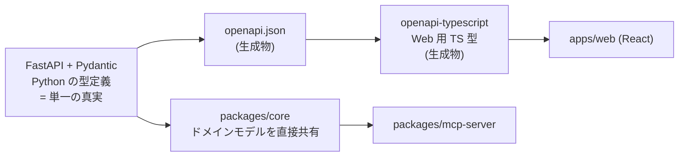

# ADR-0004: API 契約の戦略 — FastAPI/Pydantic スキーマファーストと Smithy 不採用

- ステータス: 承認済み
- 日付: 2026-08-28

## コンテキスト

本プロジェクトには型が越境する箇所が複数ある。

- **Core API(Python / FastAPI)↔ Web(TypeScript / React)** — 最も頻繁に変更され、不整合が起きやすい境界
- **Core API ↔ MCP Server(Python)** — 同じ言語であり、`packages/core` のドメインモデルを共有できる
- **MCP Server ↔ AI エージェント** — Model Context Protocol のツール定義(JSON Schema)が契約になる

AWS 版は **Smithy**(AWS の IDL)で API を定義し、そこから各言語のクライアント・サーバーコードを生成する構成を採っている。AWS 版のアーキテクチャを参考にする以上、Smithy を採用するかどうかは明示的に判断すべき論点である。

同時に、次の制約がある。

- 本プロジェクトは**個人が始める OSS** であり、コントリビューターの参入障壁を上げたくない
- 設計原則に **YAGNI** を掲げている(設計原則 6)
- Phase 0 の時点で API の形は固まっていない。**Phase 2 で承認フローを実装する段階で大きく変わる**ことが予想される

## 決定

**Smithy を採用しない。** 代わりに **FastAPI / Pydantic のスキーマファースト**を単一の真実の源とし、そこから下流の型を生成する。

1. **Pydantic モデルが契約の定義そのもの**である。別の IDL を持たない
2. FastAPI が **`openapi.json`** を生成する
3. **`openapi-typescript`** で Web 用の TypeScript 型を生成する
4. **生成物(`openapi.json`、TS 型)は手で編集しない**
5. Core API と MCP Server は同じ Python であり、`packages/core` のドメインモデルを**直接共有**する。この境界に生成は不要である

## 根拠

### 単一の真実の源が 1 つで済む

Smithy を導入すると、真実の源が「Smithy の定義」になり、Python 側は生成されたスタブを使う。あるいは Smithy と Pydantic の両方を手で維持することになる。前者は FastAPI / Pydantic のバリデーションとドキュメント生成の利点を薄め、後者は**二重管理そのもの**である。

Pydantic を真実の源にすれば、**API 実装のコードが契約の定義でもある**。ドリフトが構造的に起きない。

### FastAPI / Pydantic が既に必要なものを提供している

- **実行時バリデーション** — リクエスト・レスポンスの検証が型定義から自動で行われる
- **OpenAPI 3 の生成** — 標準形式であり、下流のツールが豊富
- **対話的なドキュメント**(Swagger UI / ReDoc)— OSS 利用者が API を試せる
- **`mypy --strict` との統合** — Python 側の型安全がそのまま契約の型安全になる

Smithy を追加して得られるものは、この上に**多言語クライアント生成**が乗るだけである。そして本プロジェクトが必要とするクライアントは TypeScript 1 つであり、それは `openapi-typescript` で足りる。

### コントリビューターの参入障壁を上げない

Smithy は AWS のエコシステムで広く使われているが、**それ以外の文脈では馴染みが薄い**。OSS のコントリビューターに対して「API を 1 つ追加するには Smithy の記法を学び、ビルドツールチェーン(Gradle / smithy-build)を通す必要がある」と要求するのは、個人が始める OSS にとって重い。

FastAPI と Pydantic は Python 開発者にとって既知である。Pull Request のハードルが低いことは、この段階のプロジェクトにとって型生成の網羅性より価値がある。

### YAGNI

Smithy の主な利点は、**多言語のクライアント SDK を公式に提供する**場合に発揮される。AWS がそうしているのは、AWS 自身が多数の言語向け SDK を出す組織だからである。

本プロジェクトが提供するのは、Web(TypeScript)と、MCP プロトコル経由のエージェント接続である。後者は **MCP の仕様(JSON Schema によるツール定義)が契約**であり、Smithy の出番はない。**現時点で必要のない汎用性のために、恒久的なビルド複雑性を負う判断はしない。**

将来、複数言語の公式 SDK を提供する必要が生じたら、その時点で `openapi.json` から各言語のクライアントを生成できる(OpenAPI Generator 等)。**選択肢は閉じていない。**

### 生成物を手で編集しない

型生成を採用する場合、最も壊れやすいのは「生成物を一度手で直してしまう」ことである。一度でも手が入ると、再生成が破壊的な操作になり、やがて再生成をやめる。そして契約とコードが乖離する。

これを避けるため、[CONTRIBUTING.md](../../CONTRIBUTING.md) に「生成物を手で編集しない」を明記し、CI で再生成の差分を検出する構成を採る。

## 検討した代替案

### Smithy(AWS 版と同じ)

**却下。** 上記「根拠」で詳述。要約すると、(a)真実の源が二重化するか、FastAPI / Pydantic の利点を捨てることになる、(b)必要なクライアントは TypeScript 1 つであり `openapi-typescript` で足りる、(c)コントリビューターの参入障壁が上がる、(d)YAGNI。

AWS 版のアーキテクチャを参考にしつつも、**Smithy への結合は Azure 版に持ち込まない**という判断である。これは [ADR-0008](0008-independent-implementation.md) で述べた「CDK / Smithy / Neptune への深い結合を持ち込まない」という独立実装の動機の具体例にあたる。

### OpenAPI 仕様を手書きし、そこから Python と TS の両方を生成する(設計ファースト)

**却下。** API の形を先に確定させ、実装を後から生成するアプローチ。契約が実装から独立するため、大規模チームや複数実装がある状況では有効である。

却下理由:
- **Phase 0 の時点で API の形が固まっていない。** Phase 2 の承認フロー実装で大きく変わることが予想される。設計ファーストは契約が安定している段階で効果を発揮するが、探索段階では変更コストを二重に払うことになる
- 生成された Python のスタブに実装を書き込む構成は、FastAPI のバリデーションとドキュメント生成の自然さを損なう
- 手書き YAML の OpenAPI は記述量が多く、レビューもしづらい

API が安定した段階(Phase 3 以降)で、**契約を凍結してこの方式に移行する余地は残す**。`openapi.json` が既に存在するため、移行の起点はある。

### gRPC / Protocol Buffers

**却下。** 型の厳密さとパフォーマンスの利点があるが、
- Web ブラウザからの直接呼び出しに gRPC-Web のプロキシ層が必要になる
- MCP は HTTP / JSON ベースのプロトコルであり、gRPC を挟む意味がない
- OSS 利用者が `curl` で API を試せなくなる。評価のしやすさは本プロジェクトにとって重要である

### 型生成をせず、Web 側で手書きの型を維持する

**却下。** 依存を増やさず最も単純である。Phase 1 の小さな API 表面なら現実的でもある。

却下理由: Phase 2 でオントロジーのリビジョン、差分、承認状態、SHACL 検証結果といった**構造の深いデータ**を Web に渡すことになる。この段階で手書きの型は必ず実体と乖離する。乖離は実行時エラーとして遅れて現れるため、発見が遅い。`openapi-typescript` の導入コストは低く、後から入れる理由がない。

### TypeScript 側を真実の源にする(tRPC 等)

**却下。** バックエンドが Python であるため成立しない。本プロジェクトのバックエンドは、rdflib / pyshacl / MCP Python SDK といった Python エコシステムに依存しており、この選択は動かせない。

## 結果(トレードオフ・影響)

### 受け入れるコスト

- **Python が契約の中心になる。** 将来 Python 以外でサービスを追加する場合(たとえば Java の推論サービスに HTTP API を持たせる場合)、その境界の契約は別途設計が必要になる。ただし [ADR-0005](0005-reasoner-boundary.md) の通り Java 推論器は ACA Job として非同期に動かし、HTTP API を持たない構成にしているため、当面この問題は生じない
- **多言語 SDK を公式提供する場合は追加作業が必要になる。** `openapi.json` からの生成で対応できるが、Smithy のような統合されたワークフローにはならない
- **生成ステップがビルドに入る。** `openapi.json` と TS 型の生成が CI とローカル開発の手順に加わる。生成漏れによる不整合を CI で検出する仕組みが必要
- **OpenAPI で表現しきれない契約がある。** Pydantic の複雑なバリデータ(相互依存する条件、カスタムバリデータ)は OpenAPI スキーマに完全には落ちない。この差分は実行時バリデーションで担保され、TypeScript 側の型では表現されない

### 得られるもの

- **契約と実装が乖離しない。** Pydantic モデルが両方を兼ねる
- **導入コストが低い。** FastAPI を選んだ時点でほぼ無料で得られる
- **コントリビューターの参入障壁が低い。** Python 開発者が知っている道具だけで API を追加できる
- **対話的な API ドキュメントが自動で得られる。** OSS 利用者の評価体験に直結する
- **選択肢が閉じない。** `openapi.json` を標準形式で出しているため、将来の設計ファースト移行や多言語生成への移行が可能

### 影響を受ける他の決定

- MCP Server のツール定義は **MCP の仕様(JSON Schema)** に従う。本 ADR の対象外だが、`packages/core` のドメインモデルを共有することで Core API との整合を保つ
- [CONTRIBUTING.md](../../CONTRIBUTING.md) — 「生成物を手で編集しない」を規約として明記する
