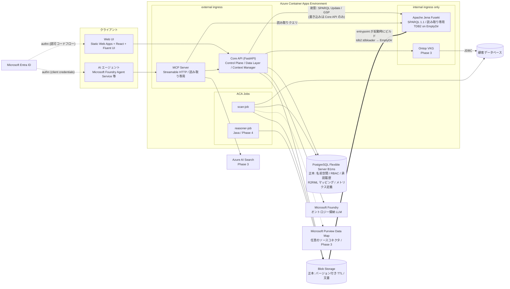
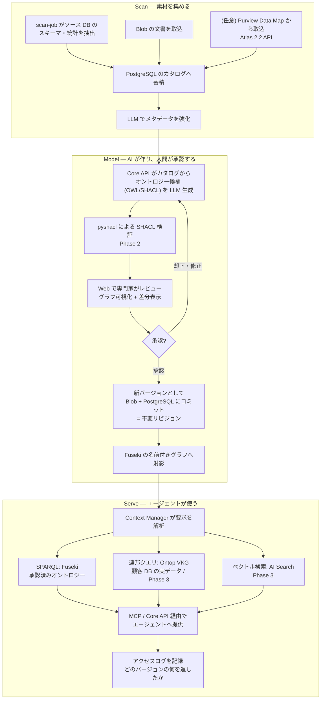
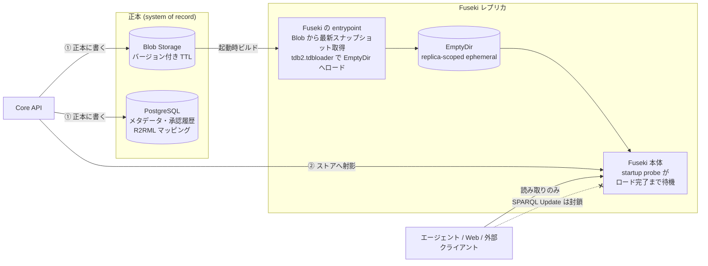
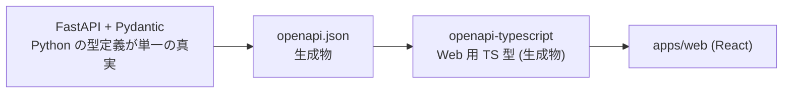

# アーキテクチャ

> **ステータス**: 本ドキュメントは **Phase 0** における設計を記述したものです。ここに書かれた構成の大部分はまだ実装されていません。実装状況はロードマップの Phase 表記([README](../README.md#ロードマップ))で判断してください。

## 目次

- [設計原則](#設計原則)
- [コンポーネント構成](#コンポーネント構成)
- [データフロー: Scan → Model → Serve](#データフロー-scan--model--serve)
- [グラフ永続化設計](#グラフ永続化設計)
- [Azure サービスマッピング](#azure-サービスマッピング)
- [バージョニングと監査](#バージョニングと監査)
- [認証・認可・セキュリティ](#認証認可セキュリティ)
- [API 契約](#api-契約)
- [リスクとトレードオフ](#リスクとトレードオフ)

---

## 設計原則

1. **azd ファースト** — リポジトリ自体を **Azure Developer CLI テンプレート**として構成します(ルート `azure.yaml`、`infra/` に Bicep、各サービスに `azd-service-name` タグ)。デプロイ手段は `azd up` を唯一の正とし、`azd down` で完全削除できることを保証します。

2. **トリプルストアは「再構築可能な射影」** — 正本(system of record)は **PostgreSQL + Blob 上のバージョン付き TTL** であり、トリプルストアは検索インデックスと同じ「いつでも作り直せる派生物」として扱います。これによりストアの永続化リスクが設計上消えます(詳細は[グラフ永続化設計](#グラフ永続化設計)、[ADR-0002](adr/0002-triple-store-as-rebuildable-projection.md))。

3. **SPARQL 1.1 Protocol をハード境界に** — アプリコードはストア実装に依存しません。`SPARQL_QUERY_ENDPOINT` / `SPARQL_UPDATE_ENDPOINT` / `SPARQL_GSP_ENDPOINT` を設定で差し替えられ、既存の GraphDB / Stardog / Amazon Neptune 等を「持ち込み」できます。

4. **Fuseki への書き込み口は Core API のみ** — エージェント・Web・外部クライアントには読み取りのみを提供し、内部エンドポイント経由の SPARQL Update / Graph Store Protocol による書き込みは Core API だけが行います。変更は必ず「正本に書く → ストアへ射影」の順です。データ保全とセキュリティ対策を同時に満たします。

5. **2 段構成** — `minimal`(評価用、`azd up` で完結)と `production`(VNet 統合・Private Endpoint)を Bicep パラメータ `deploymentTier` で切り替えます。

6. **YAGNI** — スキャフォールドは次フェーズで実装を始められる最小骨格のみに留めます。

---

## コンポーネント構成

### 各コンポーネントの責務

| コンポーネント | 責務 | 公開範囲 |
|---|---|---|
| **Core API** (FastAPI) | 名前空間 CRUD、オントロジーのリビジョン管理、承認フロー、LLM 呼び出し、Fuseki への射影、Context Manager によるクエリのオーケストレーション | external ingress(Entra ID 認証) |
| **MCP Server** | AI エージェント向けの読み取り専用ツール(`sparql_query` / `list_namespaces`、Phase 3 で `search_context`) | external ingress(Entra ID 認証) |
| **Fuseki** | 承認済みオントロジーの SPARQL 1.1 提供。**読み取り専用**。データは起動時に Blob から再構築 | **internal ingress のみ** |
| **Ontop VKG** (Phase 3) | R2RML マッピングに基づき、顧客 DB を仮想グラフとして連邦クエリ対象にする。実データは実体化しない | **internal ingress のみ** |
| **PostgreSQL** | **正本**: 名前空間、RBAC、承認履歴と監査証跡、R2RML マッピング、メトリクス定義 | VNet(`production`)/ ファイアウォール(`minimal`) |
| **Blob Storage** | **正本**: バージョン付き TTL(不変リビジョン)、取り込んだ文書 | Managed Identity 経由 |
| **ACA Jobs** | `scan-job`(スキーマ・統計の抽出)、`reasoner-job`(OWL 推論、Phase 4) | 非公開 |

Fuseki と Ontop が **internal ingress のみ**であることは、[認証・認可・セキュリティ](#認証認可セキュリティ)で述べる SPARQL 攻撃面対策の前提です。

---

## データフロー: Scan → Model → Serve

- **Scan** — `scan-job` がソース DB のスキーマ・統計を抽出し、Blob の文書を取り込んで PostgreSQL のカタログへ蓄積します。LLM でメタデータを強化します。任意で Microsoft Purview Data Map からの取り込みも行えます(依存はしません。[ADR-0007](adr/0007-no-purview-dependency.md))。
- **Model** — Core API がカタログからオントロジー候補(OWL/SHACL)を LLM 生成し、Web で専門家がレビュー・承認したうえで、**新バージョンとして Blob + PostgreSQL にコミット**し、Fuseki へ射影します。**LLM の出力が人間の承認を経ずに正本へ入ることはありません。**
- **Serve** — MCP Server / Core API が SPARQL(Fuseki)・連邦クエリ(Ontop)・ベクトル検索(AI Search)を **Context Manager 層**でオーケストレーションし、エージェントに提供します。

---

## グラフ永続化設計

これは本設計における最重要の論点です。判断の記録は [ADR-0002](adr/0002-triple-store-as-rebuildable-projection.md) および [ADR-0003](adr/0003-postgresql-as-system-of-record.md) にあります。

### 当初案の問題

Azure Container Apps の永続ストレージは **Azure Files のみ**です(公式ドキュメントが NetApp Files / Blob のマウント不可を明記しています)。一方 Apache Jena の TDB2 は **mmap とファイルロック**に依存するため、ネットワークファイルシステム上での安全性が保証されません。「単一レプリカ固定 + Azure Files + 夜間ダンプ」で凌ぐ設計は、最大リスクを運用で押さえ込む形になっていました。

### 改訂案: 射影 + レプリカローカルの一時ストレージ

ACA の **replica-scoped ephemeral storage (EmptyDir)** はレプリカの生存期間中は永続し、コンテナ再起動をまたいで保持されます。容量は 1 vCPU で 4 GiB、1 vCPU 超で 8 GiB であり、オントロジー規模のデータには十分です。

- **正本** — 承認済みオントロジーをバージョン付き TTL として Blob に、メタデータ・承認履歴・R2RML マッピングを PostgreSQL に保存します
- **起動時ビルド** — Fuseki コンテナの **entrypoint** が Blob から最新スナップショットを取得し `tdb2.tdbloader` で EmptyDir にロードしたうえで Fuseki を起動します。**startup probe** によりロード完了までトラフィックを流しません。init コンテナを使わない理由は [ADR-0002](adr/0002-triple-store-as-rebuildable-projection.md) の補記を参照(azd の provision→deploy 順で init のイメージタグが揃わないため)
- **書き込み** — Core API が正本に書いた後、Fuseki へ射影します。SPARQL Update 経由の直接書き込みは封じます

### 得られる効果

| 観点 | 当初案 | 改訂案 |
|---|---|---|
| 永続化リスク | TDB2 on ネットワーク FS(安全性未保証)= 最大リスク | **消滅**。ローカルディスク相当、失っても再構築可 |
| Azure Files Premium | 100 GiB 最小 = **月 $19** | **$0**(オプトイン設定として残す) |
| レプリカ数 | 単一固定(クラスタリング機構がないため) | Phase 1 は単一レプリカ。将来の読み取り水平スケールへの道が開ける(各レプリカが自分のコピーを持つ)が、**内部 ingress のロードバランスにより射影書き込みが 1 レプリカにしか届かず複製間が乖離するため、変更伝播の仕組みが別途必要**(オントロジー公開時にリビジョン再起動をトリガする等。承認は低頻度なので許容できる) |
| Phase 1 スパイク | 「Azure Files で TDB2 は壊れないか」= 不合格なら設計やり直し | 「再構築時間の実測と射影ループの検証」= 安価・低リスク |

Bicep パラメータ `graphPersistence: ephemeral | azureFiles` で切り替えられるようにし、「ストア自体を正本にしたい」利用者には Azure Files を、大規模には **AKS + Managed Disk** への昇格パスを案内します。

### 残る制約

**Fuseki に直接書き込まれた内容は、レプリカの再作成時に失われます。** これは設計上の制約であり、SPARQL Update を一切公開しないことで封じます(設計原則 4)。

### Fuseki を選ぶ理由(この設計下での再確認)

射影設計によりストア選択の可逆性は高くなりましたが、既定は Fuseki のままとします。理由は次の 2 点です。

1. 名前空間分離を **名前空間ごとの Fuseki データセット**で実現でき(admin API がある)、任意 SPARQL の書き換えという危険な実装を避けられる
2. OWL / SHACL 周辺の Jena エコシステムが厚い

Oxigraph は起動が速く再構築に有利なため、代替候補として [ADR-0001](adr/0001-rdf-store-selection.md) に残しています。

---

## Azure サービスマッピング

AWS 版 [Context Ontology Accelerator](https://github.com/aws/context-ontology-accelerator) の構成要素に対する、本プロジェクトでの対応です(本プロジェクトはフォークではなく独立実装です。[ADR-0008](adr/0008-independent-implementation.md))。

| AWS 版 | Azure minimal | 備考 |
|---|---|---|
| Neptune (RDF/SPARQL) | **Apache Jena Fuseki** on ACA(EmptyDir + 起動時再構築、読み取り専用・internal ingress) | 上記[グラフ永続化設計](#グラフ永続化設計)。`SPARQL_*_ENDPOINT` で外部ストア持ち込みも可 |
| OpenSearch Serverless | **Azure AI Search**(Phase 3 で追加。それまで未デプロイでコスト回避) | 統合ベクトル化・ハイブリッド検索 |
| Bedrock | **Microsoft Foundry**(Azure OpenAI 系、従量) | モデルのリージョン可用性に注意(R4) |
| API 群 | **Azure Container Apps** Consumption(API/MCP は scale-to-zero) | |
| Ontop VKG | Ontop コンテナ on ACA(internal、Phase 3) | 実データを実体化しない。これが射影設計を成立させる前提でもある(グラフに巨大な実データを載せない) |
| OWL 推論 (HermiT/ELK) | Java 推論コンテナを **ACA Job** で非同期実行(Phase 4) | 一方 **SHACL 検証は pyshacl(純 Python)** で Phase 2 に前倒しでき、Java 依存は Phase 4 まで不要 |
| MCP Server | **Python MCP SDK (Streamable HTTP)** on ACA + Entra ID | Foundry Agent Service からツールとして接続可 |
| 管理メタデータ(正本) | **PostgreSQL Flexible Server** B1ms + Entra 認証 | ローカル開発のみ SQLite(SQLAlchemy で吸収) |
| S3 | **Blob Storage**(バージョン付き TTL = 正本、文書) | |
| Glue Data Catalog | **Microsoft Purview Data Map**(Atlas 2.2 API)を**任意のソースコネクタ**として Phase 3 | 依存はしない(CU 課金が発生するため)。承認済み用語を Purview 用語集へ公開する双方向連携は将来スコープ([ADR-0007](adr/0007-no-purview-dependency.md)) |
| Step Functions | **ACA Jobs**(scan-job 等) | |
| Cognito/IAM | **Microsoft Entra ID** + Managed Identity | 名前空間 × ロールは PostgreSQL で管理し API で強制 |
| Web (Cloudscape) | **Static Web Apps** + React + **Fluent UI** + グラフ可視化(Cytoscape.js 等) | 可視化は Phase 2 の実依存 |
| ECR | **ACR Basic**、または公開イメージを **ghcr.io** に置き minimal では ACR 省略(−$5) | |
| CDK | **Bicep + azd**(Azure Verified Modules を可能な範囲で利用) | |

---

## バージョニングと監査

AWS 版の訴求は「説明可能・監査可能な意思決定」であり、本プロジェクトでもここを中核機能として設計します(実装は Phase 2。[ADR-0006](adr/0006-ontology-versioning-and-audit.md))。

- オントロジーは**不変リビジョン**(コンテンツハッシュ + semver)として Blob に保存します。バージョンごとに別の名前付きグラフへ射影し、エージェントは**バージョンを固定して参照**できます
- **監査証跡**: 誰が提案・誰が承認・いつ・差分(diff)・理由 を PostgreSQL に記録します。表現には W3C **PROV-O** を用いて、W3C 忠実路線と整合させます
- エージェントへ提供したコンテキストのアクセスログ(どのバージョンの何を返したか)を記録します

---

## 認証・認可・セキュリティ

### 認証

| 主体 | 方式 |
|---|---|
| 人間 | Entra ID 認可コードフロー |
| AI エージェント | Entra ID client credentials フロー |
| サービス間 | Managed Identity(PostgreSQL も Entra 認証でパスワードレス) |

ローカル開発に限り `AUTH_MODE=disabled` で認証をバイパスできます。**Azure にデプロイした環境では使用してはなりません**(R5 への対応)。

### 認可とネットワーク境界

- Fuseki / Ontop は **internal ingress のみ**で公開します。インターネットから直接到達できません
- **名前空間分離はデータセット単位**で行います。任意 SPARQL のクエリ書き換えによる分離は、迂回されやすいため採用しません
- 名前空間 × ロールの権限は PostgreSQL で管理し、API で強制します

### SPARQL の攻撃面対策(必須)

SPARQL は表現力が高いため、そのまま公開すると深刻な攻撃面になります。以下は**必須要件**として実装します。

1. **エージェント向けは読み取り専用**(SPARQL Update 禁止)
2. **クエリタイムアウト・結果件数上限**の強制
3. **`SERVICE` 句による SSRF 対策として、外部連邦先を禁止または allowlist 化**する。とくに Azure Instance Metadata Service(`169.254.169.254`)への到達を防ぎます。到達を許すと Managed Identity のアクセストークンを取得される恐れがあります
4. **名前空間をまたぐクエリの拒否**

報告手順および攻撃面の詳細は [SECURITY.md](../SECURITY.md) にまとめています。

---

## API 契約

**Smithy は不採用**です。FastAPI / Pydantic のスキーマファーストで `openapi.json` を生成し、`openapi-typescript` で Web 用の TypeScript 型を生成します。判断の記録は [ADR-0004](adr/0004-api-contract-strategy.md) にあります。

生成物は手で編集しません。

---

## リスクとトレードオフ

| ID | リスク | 対応 |
|---|---|---|
| **R1** | グラフ永続化 | 射影設計により**当初の最大リスクは解消**。残る論点は再構築時間(Phase 1 で実測)と、「Fuseki に直接書いた内容は失われる」という設計上の制約。後者は SPARQL Update を一切公開しないことで封じる(設計原則 4) |
| **R2** | ACA 課金の不確実性 | idle/active で 8 倍差。Phase 1 で実測し、README には実測後の数値を掲載する |
| **R3** | Java 推論 | ACA Job で非同期分離。HermiT(LGPL-3.0)は同梱せずビルド時取得し NOTICE に明記。ELK は Apache-2.0。**SHACL は pyshacl で完結するため Java 依存は Phase 4 まで発生しない**([ADR-0005](adr/0005-reasoner-boundary.md)) |
| **R4** | Foundry モデルのリージョン可用性 | Japan East で使えるモデルは限られる。モデル用リージョンをアプリ用と分離できる Bicep パラメータを用意し、README に明記する |
| **R5** | Entra テナント前提 | OSS 利用者に App 登録権限がない場合の障壁 → 必要権限を README に明記し、ローカル限定の認証オプトアウト dev モード(`AUTH_MODE=disabled`)を用意する |
| **R6** | Ontop ライセンス | コアは Apache-2.0 だが配布イメージ同梱のドライバは要確認 → 自前 Dockerfile で必要分のみ追加。Phase 1 でチェック |
| **R7** | LPG との分岐 | Microsoft Fabric Graph / Cosmos DB Gremlin は RDF 非対応(公式明記)。「なぜ Fabric でないのか」への回答を [ADR-0001](adr/0001-rdf-store-selection.md) に先回りで記述 |
| **R8** | プロジェクト名 | OSS 名の先頭に "Azure" を置くのは Microsoft の商標ガイドライン上グレー。ディレクトリ名は維持しつつ、公開時の名称は再考の余地あり(README の非公式表記は必須) |
| **R9** | Windows 開発 / Linux CI | `.gitattributes` で LF 強制、タスクは `just` + Python(シェル非依存)、devcontainer 提供、コンテナビルド検証は CI 側 |

---

## 関連ドキュメント

- [`cost-estimate.md`](cost-estimate.md) — 月額費用試算と単価の出典・計算式
- [`third-party-licenses.md`](third-party-licenses.md) — 第三者コンポーネントのライセンス
- [`adr/`](adr/) — アーキテクチャ決定記録(ADR-0001〜0008)
